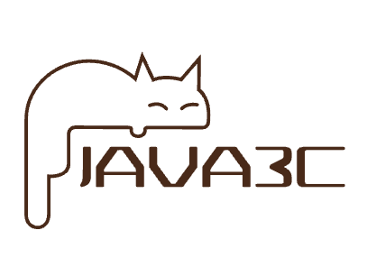

# 📚 Java开发、架构师升职加薪必备

### Github Page：https://rameosu.github.io/java3c

### 微信公众号：【程序员有意思】

| Java        | 操作系统    | 网络        | 算法                | 数据库      | UML         | 架构设计    | 设计模式    | 实用技巧    | 开发规范     | 中间件              |
| ----------- | ----------- | ----------- | ------------------- | ----------- | ----------- | ----------- | ----------- | ----------- | ------------ | ------------------- |
| [☕](#nav-1) | [💻](#nav-1) | [☁️](#nav-3) | [✏️](#nav-4) | [💾](#nav-5) | [📐](#nav-6) | [👑](#nav-7) | [🎯](#nav-8) | [🔧](#nav-9) | [📘](#nav-10) | [🚀](#nav-10) |

 

## 💸 涨薪秘籍专栏
- [【爆肝48小时】1.5W字长文讲解分布式系统](https://rameosu.github.io/java3c/#/SalaryIncrease/1.5W%E5%AD%97%E9%95%BF%E6%96%87%E8%AE%B2%E8%A7%A3%E5%88%86%E5%B8%83%E5%BC%8F%E7%B3%BB%E7%BB%9F)
- [阿里巴巴10个顶级开源项目](https://rameosu.github.io/java3c/#/SalaryIncrease/阿里巴巴10个顶级开源项目.md)

## ☕ Java
- [Java线程池源码解析](https://rameosu.github.io/java3c/#/Java/Java线程池源码解析.md)
- [如何撸一个mini线程池](https://rameosu.github.io/java3c/#/Java/如何撸一个mini线程池.md)
- [优雅的对象转换-MapStruct](https://rameosu.github.io/java3c/#/Java/优雅的对象转换-MapStruct.md)
- [Spring实用代码技巧](https://rameosu.github.io/java3c/#/Java/Spring/Spring实用代码技巧.md)
- [SpringBoot Starter开发利器：mica-auto](https://rameosu.github.io/java3c/#/Java/SpringBoot/mica-auto.md)
- [SpringBoot接入SkyWalking分布式链路追踪](https://rameosu.github.io/java3c/#/Java/SpringBoot/SpringBoot接入SkyWalking分布式链路追踪.md)
- [SpringBoot统一接口返回和全局异常处理](https://rameosu.github.io/java3c/#/Java/SpringBoot/SpringBoot统一接口返回和全局异常处理.md)

## 💻 操作系统

## ☁️ 网络

## ✏️ 算法

- [以五子棋为例硬撸稀疏数组](https://rameosu.github.io/java3c/#/Algorithm/以五子棋为例硬撸稀疏数组.md)
- [撸一撸限流算法](https://rameosu.github.io/java3c/#/Algorithm/撸一撸限流算法.md)

## 💾 数据库

## 📐 UML
- [设计模式（脑图版）](https://rameosu.github.io/java3c/#/UML/设计模式（脑图版）.md)
- [UML统一建模语言](https://rameosu.github.io/java3c/#/UML/UML统一建模语言.md)
- [UML类图](https://rameosu.github.io/java3c/#/UML/UML类图.md)
- [程序员画图神器-PlantUml](https://rameosu.github.io/java3c/#/UML/程序员画图神器-PlantUml.md)
- [系统架构设计核心要素（脑图版）](https://rameosu.github.io/java3c/#/UML/系统架构设计核心要素（脑图版）.md)

## 👑 架构设计
- [凤凰架构读书笔记-架构演进](https://rameosu.github.io/java3c/#/Architecture/凤凰架构读书笔记-架构演进.md)
- [凤凰架构读书笔记-演示工程](https://rameosu.github.io/java3c/#/Architecture/凤凰架构读书笔记-演示工程.md)
- [凤凰架构读书笔记-远程服务](https://rameosu.github.io/java3c/#/Architecture/凤凰架构读书笔记-远程服务.md)
- [凤凰架构读书笔记-事务处理](https://rameosu.github.io/java3c/#/Architecture/凤凰架构读书笔记-事务处理.md)
- [系统架构设计核心要素（大纲版）](https://rameosu.github.io/java3c/#/Architecture/系统架构设计核心要素（大纲版）.md)
- [服务限流的思路](https://rameosu.github.io/java3c/#/Architecture/服务限流的思路.md)
- [服务降级的思路](https://rameosu.github.io/java3c/#/Architecture/服务降级的思路.md)
- [SpringCloud整体架构](https://rameosu.github.io/java3c/#/Architecture/SpringCloud/SpringCloud整体架构.md)
- [DDD系列第一讲：Domain Primitive](https://rameosu.github.io/java3c/#/Architecture/DDD/DDD系列第一讲：Domain-Primitive.md)
- [DDD系列第二讲：应用架构](https://rameosu.github.io/java3c/#/Architecture/DDD/DDD系列第二讲：应用架构.md)
- [DDD系列第三讲：Repository模式](https://rameosu.github.io/java3c/#/Architecture/DDD/DDD系列第三讲：Repository模式.md)
- [DDD系列第四讲：领域层设计规范](https://rameosu.github.io/java3c/#/Architecture/DDD/DDD系列第四讲：领域层设计规范.md)
- [DDD系列第五讲：聊聊如何避免写流水账代码](https://rameosu.github.io/java3c/#/Architecture/DDD/DDD系列第五讲：聊聊如何避免写流水账代码.md)

## 🎯 设计模式

- [七大设计原则](https://rameosu.github.io/java3c/#/DesignPattern/七大设计原则.md)
- [23种设计模式](https://rameosu.github.io/java3c/#/DesignPattern/23种设计模式.md)
- [状态模式之订单实战](https://rameosu.github.io/java3c/#/DesignPattern/状态模式之订单实战.md)

## 🔧 实用技巧
- [如何用docsify改造你的Github-Pages](https://rameosu.github.io/java3c/#/Skill/如何用docsify改造你的Github-Pages.md)
- [docsify进阶使用](https://rameosu.github.io/java3c/#/Skill/docsify进阶使用.md)
- [Linux下安装MySQL8.0和重置密码](https://rameosu.github.io/java3c/#/Skill/Linux下安装MySQL8.0和重置密码.md)
- [IDEA插件集成](https://rameosu.github.io/java3c/#/Skill/IDEA插件集成.md)
- [Sentinel快速接入](https://rameosu.github.io/java3c/#/Skill/Sentinel快速接入.md)
- [Nacos快速接入](https://rameosu.github.io/java3c/#/Skill/Nacos快速接入.md)
- [Markdown表情符号大全](https://rameosu.github.io/java3c/#/Skill/Markdown表情符号大全.md)

## 📘 开发规范
- [阿里巴巴Java开发手册](https://rameosu.github.io/java3c/#/Specification/阿里巴巴Java开发手册.md)
- [MySQL数据库开发规范.md](https://rameosu.github.io/java3c/#/Specification/MySQL数据库开发规范.md)
- [写JAVA的好习惯](https://rameosu.github.io/java3c/#/Specification/写JAVA的好习惯.md)
- [写SQL的好习惯](https://rameosu.github.io/java3c/#/Specification/写SQL的好习惯.md)
- [写SQL的好习惯](https://rameosu.github.io/java3c/#/Specification/写SQL的好习惯.md)

## 🚀 中间件
- [如何用RabbitMQ批处理能力优化服务](https://rameosu.github.io/java3c/#/Middleware/MQ/如何用RabbitMQ批处理能力优化服务.md)
- [Redis事务](https://rameosu.github.io/java3c/#/Middleware/Redis/Redis事务.md)
- [Redis持久化](https://rameosu.github.io/java3c/#/Middleware/Redis/Redis持久化.md)
- [Redis分布式锁](https://rameosu.github.io/java3c/#/Middleware/Redis/Redis分布式锁.md)
- [Redis的典型应用场景](https://rameosu.github.io/java3c/#/Middleware/Redis/Redis的应用场景.md)
- [Redis热key的发现与解决](https://rameosu.github.io/java3c/#/Middleware/Redis/Redis热key的发现与解决.md)
- [Redis内存淘汰策略和过期键清除策略](https://rameosu.github.io/java3c/#/Middleware/Redis/Redis内存淘汰策略和过期键清除策略.md)
- [Redisson分布式锁的AOP实现](https://rameosu.github.io/java3c/#/Middleware/Redis/Redisson分布式锁的AOP实现.md)

## 👉获取学习资料

