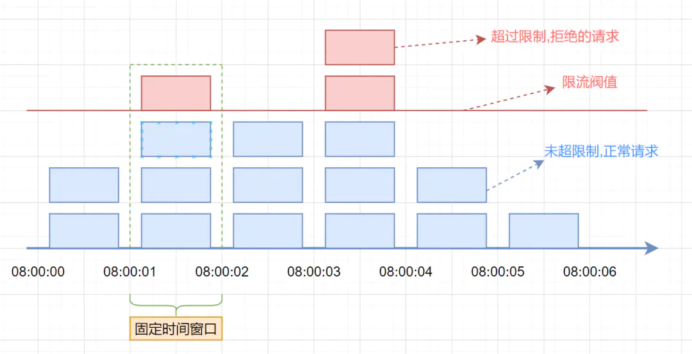
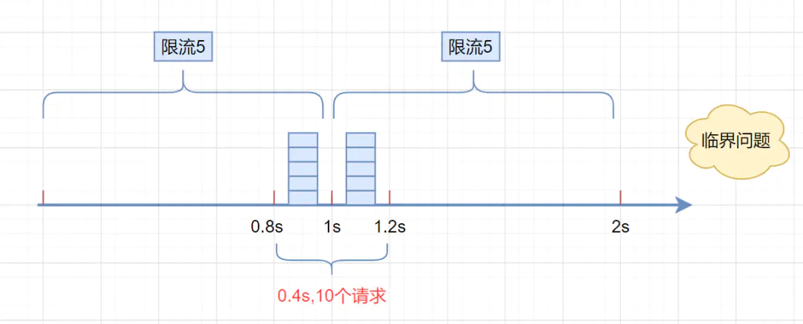
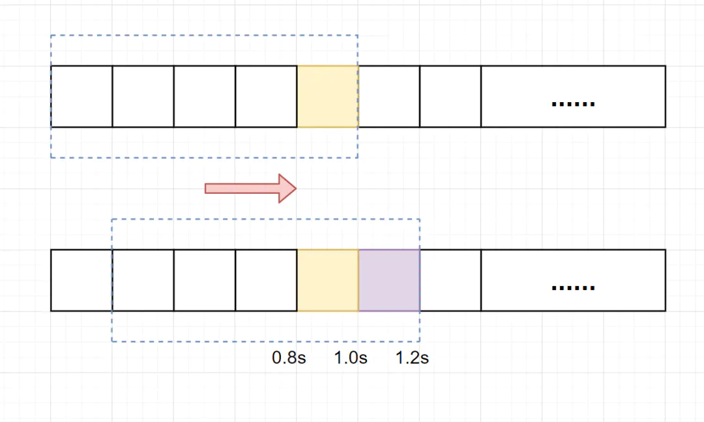
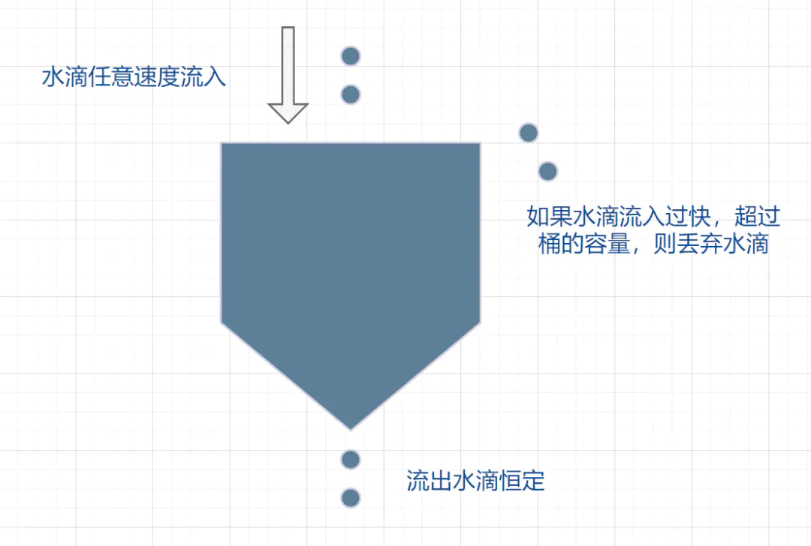
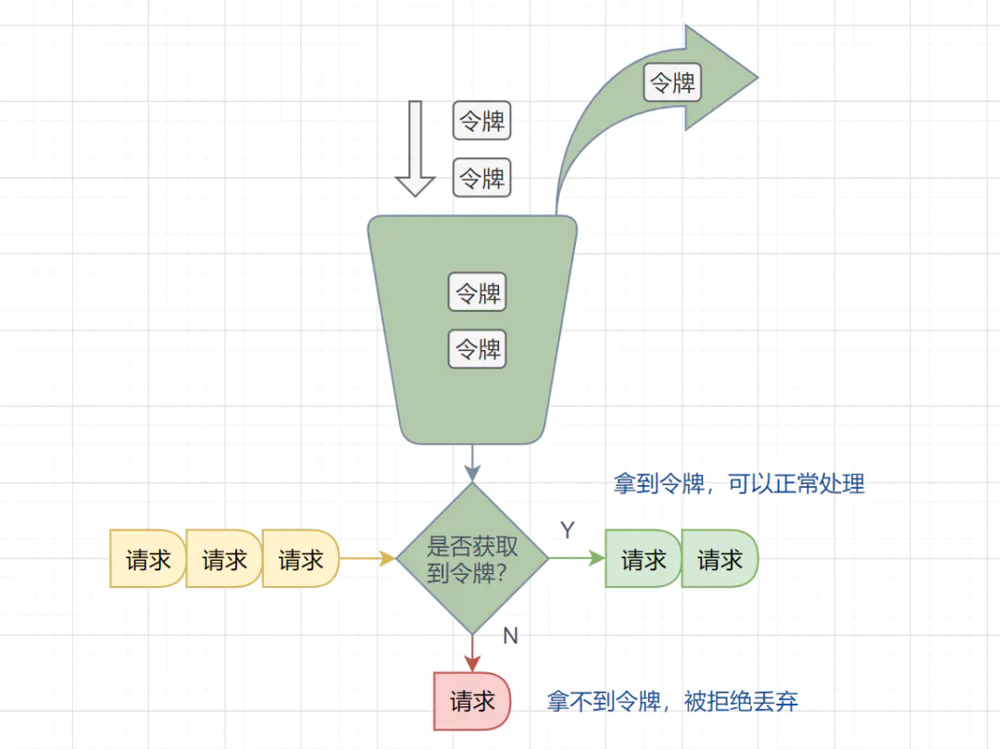

# 撸一撸限流算法

## 限流是什么？

限流，也称`流量控制`。是指系统在面临高并发，或者**大流量请求**的情况下，**限制新的请求对系统的访问**，从而**保证系统的稳定性**。限流会导致部分用户请求处理不及时或者被拒，这就影响了用户体验。所以一般需要在系统稳定和用户体验之间**平衡**一下。

举个栗子：

> 停车场停车，车位已满时，车辆只能在外面等待，出来一辆，才能放进去一辆。

## 常见的限流算法

### 固定窗口限流算法

#### 算法分析

首先维护一个计数器，将单位时间段当做一个窗口，计数器记录这个窗口接收请求的次数。

- 当次数少于限流阀值，就允许访问，并且计数器+1
- 当次数大于限流阀值，就拒绝访问。
- 当前的时间窗口过去之后，计数器清零。

假设单位时间是1秒，限流阀值为3。在单位时间1秒内，每来一个请求,计数器就加1，如果计数器累加的次数超过限流阀值3，后续的请求全部拒绝。等到1s结束后，计数器清0，重新开始计数。如下图：



#### 伪代码

```java
	/**
     * 限流工具初始化系统时间
     */
    private long currentTime = System.currentTimeMillis();

    /**
     * 固定时间访问次数阈值
     */
    private int LIMIT = 10;

    /**
     * 计数器更新间隔时间(ms)
     */
    private long INTERVAL = 1000;

    /**
     * 计数器当前访问次数，初始为0
     */
    private long reqCount = 0;

    /**
     * 限流-计数器算法(固定窗口)
     * 时间段内允许访问的数量是固定的
     */
    public boolean counterAlgorithm() {
        long now = System.currentTimeMillis();
        if (now < currentTime + INTERVAL) { // 在窗口期内
            reqCount++; // 计数器当前窗口期访问次数+1
            return reqCount <= LIMIT; // 小于窗口期内的访问次数限制，返回true，请求放行
        } else { // 不在窗口期内
            currentTime = now; // 重置窗口期开始时间
            reqCount = 0; // 访问次数清零
        }
        return false; // 请求拦截
    }
```

#### 优缺点

**临界问题**：假设限流阀值为5个请求，单位时间窗口是1s,如果我们在单位时间内的前0.8-1s和1-1.2s，分别并发5个请求。虽然都没有超过阀值，但是如果算0.8-1.2s,则并发数高达10，已经**超过单位时间1s不超过5阀值**的定义啦。



### 滑动窗口限流算法

滑动窗口限流解决固定窗口`临界值`的问题。它将单位时间周期分为n个小周期，分别记录每个小周期内接口的访问次数，并且**根据时间滑动删除过期的小周期**。



#### 算法分析

假设单位时间还是1s，滑动窗口算法把它划分为5个小周期，也就是滑动窗口（单位时间）被划分为5个小格子。每格表示0.2s。每过0.2s，时间窗口就会往右滑动一格。然后呢，每个小周期，都有自己独立的计数器，如果请求是0.83s到达的，0.8~1.0s对应的计数器就会加1。

> 当滑动窗口的格子周期划分的越多，那么滑动窗口的滚动就越平滑，限流的统计就会越精确。

#### 伪代码

```java
	/**
     * 单位时间划分的小周期（单位时间是1分钟，10s一个小格子窗口，一共6个格子）
     */
    private int SUB_CYCLE = 10;

    /**
     * 每分钟限流请求数
     */
    private int thresholdPerMin = 100;

    /**
     * 计数器, k-为当前窗口的开始时间值秒，value为当前窗口的计数
     */
    private final Map<Long, Integer> counters = new HashMap<>();

    /**
     * 滑动窗口时间算法实现
     */
    public boolean slidingWindowsTryAcquire() {
        long currentWindowTime = LocalDateTime.now().toEpochSecond(ZoneOffset.UTC) / SUB_CYCLE; // 获取当前时间在哪个小周期窗口
        int currentWindowNum = countCurrentWindow(currentWindowTime); // 当前窗口总请求数
        // 超过阀值限流
        if (currentWindowNum >= thresholdPerMin) {
            return false;
        }
        // 计数器+1
        Integer windowTime = counters.get(currentWindowTime);
        windowTime++;
        counters.put(currentWindowTime, windowTime);
        return true;
    }

    /**
     * 统计当前窗口的请求数
     */
    private int countCurrentWindow(long currentWindowTime) {
        // 计算窗口开始位置
        long startTime = currentWindowTime - SUB_CYCLE * (60 / SUB_CYCLE - 1);
        int count = 0;

        // 遍历存储的计数器
        Iterator<Map.Entry<Long, Integer>> iterator = counters.entrySet().iterator();
        while (iterator.hasNext()) {
            Map.Entry<Long, Integer> entry = iterator.next();
            // 删除无效过期的子窗口计数器
            if (entry.getKey() < startTime) {
                iterator.remove();
            } else {
                // 累加当前窗口的所有计数器之和
                count = count + entry.getValue();
            }
        }
        return count;
    }
```

#### 优缺点

滑动窗口算法虽然解决了**固定窗口的临界问题**，但是一旦到达限流后，请求都会直接暴力被拒绝。

### 漏桶算法

漏桶算法面对限流，就更加的柔性，不存在直接的粗暴拒绝。



#### 算法分析

它的原理很简单，可以认为就是**注水漏水**的过程。往漏桶中以任意速率流入水，以固定的速率流出水。当水超过桶的容量时，会被溢出，也就是被丢弃。因为桶容量是不变的，保证了整体的速率。

- 流入的水滴，可以看作是访问系统的请求，这个流入速率是不确定的。
- 桶的容量一般表示系统所能处理的请求数。
- 如果桶的容量满了，就达到限流的阀值，就会丢弃水滴（拒绝请求）
- 流出的水滴，是恒定过滤的，对应服务按照固定的速率处理请求。

#### 伪代码

```java
	/**
     * 限流工具初始化系统时间
     */
    private long currentTime = System.currentTimeMillis();
	
	/**
     * 漏桶当前水量
     */
    private long water = 0;

    /**
     * 漏桶流出速率
     */
    private long leakyRate = 1;

    /**
     * 漏桶容量
     */
    private long leakyCapacity = 100;

	/**
     * 限流-漏桶算法
     * 以固定速度流出，以任意速度流入，达到最大值则触发限流
     */
    public boolean leakyBucketAlgorithm() {
        long now = System.currentTimeMillis();
        water = Math.max(0, water - (now - currentTime) * leakyRate);
        currentTime = now;
        if (water <= leakyCapacity) {
            water++;
            return true;
        } else {
            return false;
        }
    }
```

#### 优缺点

在正常流量的时候，系统按照固定的速率处理请求，是我们想要的。但是**面对突发流量**的时候，漏桶算法还是循规蹈矩地处理请求，这就不是我们想看到的啦。流量变突发时，我们肯定**希望系统尽量快点处理请求**，提升用户体验嘛。

### 令牌桶算法

面对**突发流量**的时候，我们可以使用令牌桶算法限流。



#### 算法分析

- 有一个令牌管理员，根据限流大小，定速往令牌桶里放令牌。
- 如果令牌数量满了，超过令牌桶容量的限制，那就丢弃。
- 系统在接受到一个用户请求时，都会先去令牌桶要一个令牌。如果拿到令牌，那么就处理这个请求的业务逻辑；
- 如果拿不到令牌，就直接拒绝这个请求。

#### 伪代码

```java
	/**
     * 限流工具初始化系统时间
     */
    private long currentTime = System.currentTimeMillis();

	/**
     * 令牌生成速率
     */
    private long tokenRate = 1;

    /**
     * 令牌桶容量
     */
    private long tokenCapacity = 100;

    /**
     * 令牌桶当前令牌数
     */
    private long token = 0;

    /**
     * 限流-令牌桶算法
     * 以固定速度往桶内放入令牌，以任意速度拿出令牌，令牌为空则触发限流
     */
    public boolean tokenBucketAlgorithm() {
        long now = System.currentTimeMillis();
        token = Math.min(tokenCapacity, token + (now - currentTime) * tokenRate);
        currentTime = now;
        if (token < 1) {
            return false;
        } else {
            token--;
            return true;
        }
    }
```

#### 优缺点

如果令牌发放的策略正确，这个系统即不会被拖垮，也能提高机器的利用率。Guava的RateLimiter限流组件，就是基于**令牌桶算法**实现的。