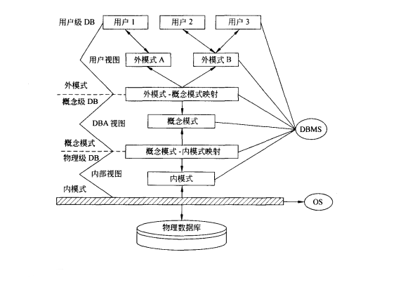

# 数据库模式

数据库模式和范式是数据库系中的两个重要概念，是进行数据库设计的基础。

## 1. 数据库的结构和模式

数据库技术中采用分级的方法将数据库的结构划分为多个层次。最著名的是美国`ANSI/SPARC`数据库系统研究组1975年提出的三级划分法。

### 1.1 三级抽象

数据库系统划分为三个抽象级：**用户级、概念级、物理级。**

#### 1.1.1 用户级数据库

用户级数据库对应于外模式，是最接近用户的一级数据库，使用户可以看到和使用的数据库，又称`用户视图`。

用户级数据库主要由外部记录组成，不同的用户视图可以互相重叠，用户的所有操作都是针对用户视图进行的。

#### 1.1.2 概念级数据库

概念级数据库对应于概念模式，介于用户级和物理级之间，是**所有用户视图的最小并集**，是数据库管理员可看到和使用的数据库，又称 `DBA`（DataBase Administrator，数据库管理员）视图。

概念级数据库由概念记录组成，一个数据库可由多个不同的用户视图，每个用户视图由数据库某一部分的抽象表示所组成。一个数据库应用系统只存在一个 DBA 视图，它把数据库作为一个整体的抽象表示。概念级模式把用户视图有机地结合成一个整体，综合平衡考虑所有用户要求，实现数据的一致性、最大限度降低数据冗余、准确地反映数据间的联系。

#### 1.1.3 物理级数据库

物理级数据库对应于内模式，是数据库的底层表示，它描述数据的实际存储组织，是最接近于物理存储的级，又称`内部视图`。

物理级数据库由内部记录组成，物理级数据库并不是真正的物理存储，而是接近于物理存储的级。

### 1.2 三级模式

数据库系统的三级模式为**外模式、概念模式、内模式**。

#### 1.2.1 外模式

外模式（子模式、用户模式）用以描述用户看到或使用的那部分数据的逻辑结构，用户根据外模式用数据操作语句或应用程序去操作数据库中的数据。外模式主要描述组成用户视图的各个记录的组成、相互关系、数据项的特征、数据的安全性和完整性约束条件。

外模式是数据库用户（包括程序员和最终用户）能够看见和使用的局部数据的逻辑结构和特征的描述，是数据库用户的数据视图，是与某一应用有关的数据的逻辑表示。**一个数据库可以有多个外模式。一个应用程序只能使用一个外模式。**

#### 1.2.2 概念模式

概念模式（模式、逻辑模式）用以描述整个数据库中数据库的逻辑结构，描述现实世界中的实体及其性质与联系，定义记录、数据项、数据的完整性约束条件及记录之间的联系，是数据项值的框架。

数据库系统概念模式通常还包含有访问控制、保密定义、完整性检查等方面的内容，以及概念/物理之间的映射。

概念模式是数据库中全体数据的逻辑结构和特性的描述，是所有用户的公共数据视图。**一个数据只有一个概念模式。**

#### 1.2.3 内模式

内模式是整个数据库的最底层表示，不同于物理层，它假设外存是一个无限的线性地址空间。

内模式定义的是存储记录的类型、存储域的表示以及存储记录的物理顺序，指引元、索引和存储路径等数据的存储组织。

#### 1.2.4 内模式、概念模式、外模式之间的关系

- 概念模式是数据库的中心与关键；
- 内模式依赖于概念模式，独立于外模式和存储设备；
- 外模式面向具体的应用，独立于内模式和存储设备；
- 应用程序依赖于外模式，独立于概念模式和内模式。

### 1.3 两级独立性

**数据库系统两级独立性是指物理独立性和逻辑独立性。**三个抽象级间通过两级映射（外模式-概念模式映射，概念模式-内模式映射）进行互相转换，使得数据库的三级形成一个统一的整体。

#### 1.3.1 物理独立性

物理独立性是指用户的应用程序与存储在磁盘上的数据库中的数据是相互独立的。当数据的物理存储改变时，应用程序不需要改变。

物理独立性存在于概念模式和内模式之间的映射转换，说明物理组织发生变化时应用程的独立程度。

#### 1.3.2 逻辑独立性

逻辑独立性是指用户的应用程序与数据库中的逻辑结构是相互独立的。当数据的逻辑结构改变时，应用程序不需要改变。

逻辑独立性存在于外模式和概念模式之间的映射转换，说明概念模式发生变化时应用程序的独立程度。

> 逻辑独立性比物理独立性更难实现。

## 2. 数据模型

数据模型主要有两大类，分别是**概念数据模型（实体-联系模型）**和**基本数据模型（结构数据模型）**。

### 2.1 概念数据模型

概念数据模型是按照用户的观点来对数据和信息建模，主要用于数据库设计。

概念模型主要用实体-联系方法（Entity-Relationship Approach）表示，所以也称 `E-R 模型`。

### 2.2 基本数据模型

基本数据模型是按照计算机系统的观点来对数据和信息建模，主要用于 `DBMS` 的实现。

**基本数据模型是数据库系统的核心和基础。**

基本数据模型通常由`数据结构`、`数据操作`和`完整性约束`三部分组成。其中数据结构是对系统静态特性的描述，数据操作是对系统动态特性的描述，完整性约束是一组完整性规则的集合。

常用的基本数据模型有层次模型、网状模型、关系模型和面向对象模型。

#### 2.2.1 层次模型

层次模型用树形结构表示实体类型及实体间的联系。

层次模型的优点是记录之间的联系通过指针来实现，查询效率较高。

层次模型的缺点是只能表示 1:n 联系，虽然有多种辅助手段实现 m:n 联系，但实现比较复杂，用户不易掌握。

由于层次顺序的严格和复杂，导致数据的查询和更新操作很复杂，应用程序的编写也比较复杂。

#### 2.2.2 网状模型

网状模型用有向图表示实体类型及实体间的联系。

网状模型的优点是记录之间的联系通过指针实现，m:n 联系也容易实现，查询效率高。

网状模型的缺点是编写应用程序的过程比较复杂，程序员必须熟悉数据库的逻辑结构。

#### 2.2.3 关系模型

关系模型用表格结构表达实体集，用外键表示实体间的联系。

关系模型优点有：

- 建立在严格的数学概念基础上；
- 概念（关系）单一，结构简单、清晰，用户易懂易用；
- 存取路径对用于透明，从而数据独立性、安全性好，简化数据库开发工作。

