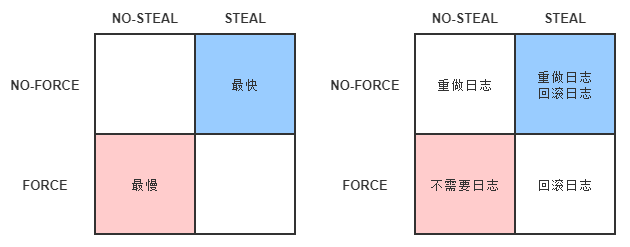

# 凤凰架构读书笔记-事务处理

## 事务处理

- **一致性**（Consistency）：保证系统中所有的数据都是符合期望的，且相互关联的数据之间不会产生矛盾。
- **原子性**（Atomic）：在同一个业务处理过程中，事务保证对多个数据的修改，要么同时成功，要么同时撤销。
- **隔离性**（Isolation）：在不同的业务处理过程中，事务保证了各自业务正在读、写的数据互相独立，不会彼此影响。
- **持久性**（Durability）：事务应当保证所有成功被提交的数据修改都能正确的被持久化，不丢失数据。

所有需要保证数据一致性的应用场景，包括但不限于：数据库、事务内存、缓存、消息队列、分布式存储，等到，都会用到事务。

- **内部一致性**：当一个服务只使用一个数据源时，通过 A、I、D 来获得一致性是最经典的做法，也是相对容易的。此时，多个并发事务所读写的数据能够被数据源感知是否存在冲突，并发事务的读写在时间线上的最终顺序是由数据源来确定的，这种事务间一致性被称为“内部一致性”。
- **外部一致性**：当一个服务使用到多个不同的数据源，甚至多个不同服务同时涉及多个不同的数据源时，问题就变得相对困难了许多。此时，并发执行甚至是先后执行的多个事务，在时间线上的顺序并不由任何一个数据源来决定，这种涉及多个数据源的事务间一致性被称为“外部一致性”。

### 本地事务

**本地事务**（Local Transaction）是指仅操作单一事务资源的、不需要全局事务管理器进行协调的事务。

本地事务是最基础的一种事务解决方案，只适用于单个服务使用单个数据源的场景。从应用角度看，它是直接依赖于数据源本身提供的事务能力来工作的，在程序代码层面，最多只能对事务接口做一层标准化的包装（如 JDBC 接口），并不能深入参与到事务的运作过程当中，事务的开启、终止、提交、回滚、嵌套、设置隔离级别，乃至与应用代码贴近的事务传播方式，全部都要依赖底层数据源的支持才能工作。

[ARIES](https://en.wikipedia.org/wiki/Algorithms_for_Recovery_and_Isolation_Exploiting_Semantics)理论（Algorithms for Recovery and Isolation Exploiting Semantics，ARIES），直接翻译过来是“基于语义的恢复与隔离算法”，现代数据库的基础理论。


#### 实现原子性和持久性

原子性保证了事务的多个操作要么都生效要么都不生效，不会存在中间状态；持久性保证了一旦事务生效，就不会再因为任何原因而导致其修改的内容被撤销或丢失。

数据必须要成功写入磁盘、磁带等持久化存储器后才能拥有持久性，只存储在内存中的数据，一旦遇到应用程序忽然崩溃，或者数据库、操作系统一侧的崩溃，甚至是机器突然断电宕机等情况就会丢失，这些意外情况都统称为`“崩溃”`（Crash）。

由于写入存在中间状态，所以可能发生以下情形。

- **未提交事务，写入后崩溃**：程序还没修改完三个数据，但数据库已经将其中一个或两个数据的变动写入磁盘，此时出现崩溃，一旦重启之后，数据库必须要有办法得知崩溃前发生过一次不完整的购物操作，将已经修改过的数据从磁盘中恢复成没有改过的样子，以保证原子性。
- **已提交事务，写入前崩溃**：程序已经修改完三个数据，但数据库还未将全部三个数据的变动都写入到磁盘，此时出现崩溃，一旦重启之后，数据库必须要有办法得知崩溃前发生过一次完整的购物操作，将还没来得及写入磁盘的那部分数据重新写入，以保证持久性。

由于写入中间状态与崩溃都是无法避免的，为了保证原子性和持久性，就只能在崩溃后采取恢复的补救措施，这种数据恢复操作被称为`“崩溃恢复”`（Crash Recovery，也有资料称作 Failure Recovery 或 Transaction Recovery）。

为了能够顺利地完成崩溃恢复，在磁盘中写入数据就不能像程序修改内存中变量值那样，直接改变某表某行某列的某个值，而是必须将修改数据这个操作所需的全部信息，包括修改什么数据、数据物理上位于哪个内存页和磁盘块中、从什么值改成什么值，等等，以日志的形式——即仅进行顺序追加的文件写入的形式（这是最高效的写入方式）先记录到磁盘中。

只有在日志记录全部都安全落盘，数据库在日志中看到代表事务成功提交的“提交记录”（Commit Record）后，才会根据日志上的信息对真正的数据进行修改，修改完成后，再在日志中加入一条“结束记录”（End Record）表示事务已完成持久化，这种事务实现方法被称为“Commit Logging”（提交日志）。

> 额外知识：Shadow Paging
>
> 通过日志实现事务的原子性和持久性是当今的主流方案，但并不是唯一的选择。除日志外，还有另外一种称为“[Shadow Paging](https://en.wikipedia.org/wiki/Shadow_paging)”（有中文资料翻译为“影子分页”）的事务实现机制，常用的轻量级数据库 SQLite Version 3 采用的事务机制就是 Shadow Paging。
>
> Shadow Paging 的大体思路是对数据的变动会写到硬盘的数据中，但并不是直接就地修改原先的数据，而是先将数据复制一份副本，保留原数据，修改副本数据。在事务过程中，被修改的数据会同时存在两份，一份是修改前的数据，一份是修改后的数据，这也是“影子”（Shadow）这个名字的由来。当事务成功提交，所有数据的修改都成功持久化之后，最后一步是去修改数据的引用指针，将引用从原数据改为新复制出来修改后的副本，最后的“修改指针”这个操作将被认为是原子操作，现代磁盘的写操作可以认为在硬件上保证了不会出现“改了半个值”的现象。所以 Shadow Paging 也可以保证原子性和持久性。Shadow Paging 实现事务要比 Commit Logging 更加简单，但涉及隔离性与并发锁时，Shadow Paging 实现的事务并发能力就相对有限，因此在高性能的数据库中应用不多。

Commit Logging 保障数据持久性、原子性的原理并不难理解：首先，日志一旦成功写入 Commit Record，那整个事务就是成功的，即使真正修改数据时崩溃了，重启后根据已经写入磁盘的日志信息恢复现场、继续修改数据即可，这保证了持久性；其次，如果日志没有成功写入 Commit Record 就发生崩溃，那整个事务就是失败的，系统重启后会看到一部分没有 Commit Record 的日志，那将这部分日志标记为回滚状态即可，整个事务就像完全没好有发生过一样，这保证了原子性。

Commit Logging 存在一个巨大的先天缺陷：所有对数据的真实修改都必须发生在事务提交以后，即日志写入了 Commit Record 之后。在此之前，即使磁盘 I/O 有足够空闲、即使某个事务修改的数据量非常庞大，占用了大量的内存缓冲区，无论有何种理由，都决不允许在事务提交之前就修改磁盘上的数据，这一点是 Commit Logging 成立的前提，却对提升数据库的性能十分不利。

ARIES 提出了“Write-Ahead Logging”的日志改进方案，所谓“提前写入”（Write-Ahead），就是允许在事务提交之前，提前写入变动数据的意思。

Write-Ahead Logging 先将何时写入变动数据，按照事务提交时点为界，划分为 FORCE 和 STEAL 两类情况。

- **FORCE**：当事务提交后，要求变动数据必须同时完成写入则称为 FORCE，如果不强制变动数据必须同时完成写入则称为 NO-FORCE。现实中绝大多数数据库采用的都是 NO-FORCE 策略，因为只要有了日志，变动数据随时可以持久化，从优化磁盘 I/O 性能考虑，没有必要强制数据写入立即进行。
- **STEAL**：在事务提交前，允许变动数据提前写入则称为 STEAL，不允许则称为 NO-STEAL。从优化磁盘 I/O 性能考虑，允许数据提前写入，有利于利用空闲 I/O 资源，也有利于节省数据库缓存区的内存。

Commit Logging 允许 NO-FORCE，但不允许 STEAL。因为假如事务提交前就有部分变动数据写入磁盘，那一旦事务要回滚，或者发生了崩溃，这些提前写入的变动数据就都成了错误。

Write-Ahead Logging 允许 NO-FORCE，也允许 STEAL，它给出的解决办法是增加了另一种被称为 Undo Log 的日志类型，当变动数据写入磁盘前，必须先记录 Undo Log，注明修改了哪个位置的数据、从什么值改成什么值，等等。以便在事务回滚或者崩溃恢复时根据 Undo Log 对提前写入的数据变动进行擦除。Undo Log 现在一般被翻译为“回滚日志”，此前记录的用于崩溃恢复时重演数据变动的日志就相应被命名为 Redo Log，一般翻译为“重做日志”。由于 Undo Log 的加入，Write-Ahead Logging 在崩溃恢复时会执行以下三个阶段的操作。

- **分析阶段**（Analysis）：该阶段从最后一次检查点（Checkpoint，可理解为在这个点之前所有应该持久化的变动都已安全落盘）开始扫描日志，找出所有没有 End Record 的事务，组成待恢复的事务集合，这个集合至少会包括 Transaction Table 和 Dirty Page Table 两个组成部分。
- **重做阶段**（Redo）：该阶段依据分析阶段中产生的待恢复的事务集合来重演历史（Repeat History），具体操作为：找出所有包含 Commit Record 的日志，将这些日志修改的数据写入磁盘，写入完成后在日志中增加一条 End Record，然后移除出待恢复事务集合。
- **回滚阶段**（Undo）：该阶段处理经过分析、重做阶段后剩余的恢复事务集合，此时剩下的都是需要回滚的事务，它们被称为 Loser，根据 Undo Log 中的信息，将已经提前写入磁盘的信息重新改写回去，以达到回滚这些 Loser 事务的目的。

重做阶段和回滚阶段的操作都应该设计为幂等的。

数据库按照是否允许 FORCE 和 STEAL 可以产生共计四种组合，从优化磁盘 I/O 的角度看，NO-FORCE 加 STEAL 组合的性能无疑是最高的；从算法实现与日志的角度看 NO-FORCE 加 STEAL 组合的复杂度无疑也是最高的。这四种组合与 Undo Log、Redo Log 之间的具体关系如图 3-1 所示。




#### 实现隔离性

隔离性保证了每个事务各自读、写的数据互相独立，不会彼此影响。

现代数据库均提供了以下三种锁。

- **写锁**（Write Lock，也叫作排他锁，eXclusive Lock，简写为 X-Lock）：如果数据有加写锁，就只有持有写锁的事务才能对数据进行写入操作，数据加持着写锁时，其他事务不能写入数据，也不能施加读锁。

- **读锁**（Read Lock，也叫作共享锁，Shared Lock，简写为 S-Lock）：多个事务可以对同一个数据添加多个读锁，数据被加上读锁后就不能再被加上写锁，所以其他事务不能对该数据进行写入，但仍然可以读取。对于持有读锁的事务，如果该数据只有它自己一个事务加了读锁，允许直接将其升级为写锁，然后写入数据。

- **范围锁**（Range Lock）：对于某个范围直接加排他锁，在这个范围内的数据不能被写入。

  ```sql
  SELECT * FROM books WHERE price < 100 FOR UPDATE;
  ```

  加了范围锁后，不仅无法修改该范围内已有的数据，也不能在该范围内新增或删除任何数据，后者是一组排他锁的集合无法做到的。

事务隔离级别按从高到低：

- **可串行化**（Serializable）：[ANSI/ISO SQL-92](https://en.wikipedia.org/wiki/SQL-92)中定义的最高等级的隔离级别便是`可串行化`（Serializable）。[并发控制理论](https://en.wikipedia.org/wiki/Concurrency_control)（Concurrency Control）决定了隔离程度与并发能力是相互抵触的，隔离程度越高，并发访问时的吞吐量就越低。
- **可重复度**（Repeatable Read）：对事务所涉及的数据加读锁和写锁，且一直持有至事务结束，但不再加范围锁。`可重复读`比`可串行化`弱化的地方在于[幻读问题](https://en.wikipedia.org/wiki/Isolation_(database_systems)#Phantom_reads)（Phantom Reads），它是指在事务执行过程中，两个完全相同的范围查询得到了不同的结果集。原因是`可重复读`没有范围锁来禁止在该范围内插入新的数据。
- **读已提交**（Read Committed）：对事务涉及的数据加的写锁会一直持续到事务结束，但加的读锁在查询操作完成后就马上会释放。`读已提交`比`可重复读`弱化的地方在于[不可重复读问题](https://en.wikipedia.org/wiki/Isolation_(database_systems)#Non-repeatable_reads)（Non-Repeatable Reads），它是指在事务执行过程中，对同一行数据的两次查询得到了不同的结果。原因是`读已提交`的隔离级别缺乏贯穿整个事务周期的读锁，无法禁止读取过的数据发生变化。
- **读未提交**（Read Uncommitted）：对事务涉及的数据只加写锁，会一直持续到事务结束，但完全不加读锁。`读未提交`比`读已提交`弱化的地方在于[脏读问题](https://en.wikipedia.org/wiki/Isolation_(database_systems)#Dirty_reads)（Dirty Reads），它是指在事务执行过程中，一个事务读取到了另一个事务未提交的数据。

“[多版本并发控制](https://en.wikipedia.org/wiki/Multiversion_concurrency_control)”（Multi-Version Concurrency Control，MVCC）是一种读取优化策略，它的“无锁”是特指读取时不需要加锁。MVCC 的基本思路是对数据库的任何修改都不会直接覆盖之前的数据，而是产生一个新版副本与老版本共存，以此达到读取时可以完全不加锁的目的。

将版本理解为数据库中每一行记录都存在两个看不见的字段：CREATE_VERSION 和 DELETE_VERSION，这两个字段记录的值都是事务 ID，事务 ID 是一个全局严格递增的数值，然后根据以下规则写入数据。

- 插入数据时：CREATE_VERSION 记录插入数据的事务 ID，DELETE_VERSION 为空。
- 删除数据时：DELETE_VERSION 记录删除数据的事务 ID，CREATE_VERSION 为空。
- 修改数据时：将修改数据视为“删除旧数据，插入新数据”的组合，即先将原有数据复制一份，原有数据的 DELETE_VERSION 记录修改数据的事务 ID，CREATE_VERSION 为空。复制出来的新数据的 CREATE_VERSION 记录修改数据的事务 ID，DELETE_VERSION 为空。

此时，如有另外一个事务要读取这些发生了变化的数据，将根据隔离级别来决定到底应该读取哪个版本的数据。

- 隔离级别是`可重复读`：总是读取 CREATE_VERSION 小于或等于当前事务 ID 的记录，在这个前提下，如果数据仍有多个版本，则取最新（事务 ID 最大）的。
- 隔离级别是`读已提交`：总是取最新的版本即可，即最近被 Commit 的那个版本的数据记录。

另外两个隔离级别都没有必要用到 MVCC，因为`读未提交`直接修改原始数据即可，其他事务查看数据的时候立刻可以看到，根本无须版本字段。`可串行化`本来的语义就是要阻塞其他事务的读取操作，而 MVCC 是做读取时无锁优化的，自然就不会放到一起用。

MVCC 是只针对“读+写”场景的优化，如果是两个事务同时修改数据，即“写+写”的情况，那就没有多少优化的空间了，此时加锁几乎是唯一可行的解决方案，稍微有点讨论余地的是加锁的策略是“乐观加锁”（Optimistic Locking）还是“悲观加锁”（Pessimistic Locking）。


### 全局事务

全局事务（Global Transaction），也称为外部事务（External Transaction），单个服务使用多个数据源场景的事务解决方案。


### 共享事务

### 分布式事务

