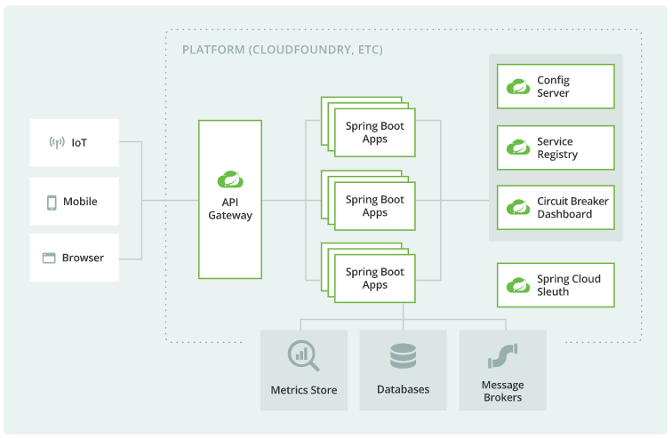

# SpringCloud整体架构

## 简介

SpringCloud对常见的`分布式系统`模式提供了简单易用的`编程模型`，帮助开发者构建弹性、可靠、协调的应用程序。 SpringCloud是在`SpringBoot`的基础上构建的，使开发者可以轻松入门并快速提高工作效率。 Spring Cloud 为开发者提供了快速构建分布式系统中一些常见模式的`工具`（例如**配置管理**、**服务发现**、**断路器**、**智能路由**、**微代理**、**控制总线**、**一次性令牌**、**全局锁**、**领导选举**、**分布式会话**、**集群状态**）。

## 目标

> 协调任何服务，简化分布式系统开发。

## 特性

> SpringCloud专注于为典型用例和可扩展性机制提供良好的开箱即用体验以覆盖其他用例。

- **分布式/版本化配置**
- **服务注册和发现**
- **路由**
- **服务之间的调用**
- **负载均衡**
- **断路器**
- **全局锁**
- **领导选举和集群状态**
- **分布式消息传递**

## 架构图

## 版本命名

SpringCloud是一个由许多子项目组成的综合项目，各子项目有不同的发布节奏。 为了管理SpringCloud与各子项目的版本依赖关系，发布了一个清单，其中包括了某个SpringCloud版本对应的子项目版本。 为了避免SpringCloud版本号与子项目版本号混淆，`SpringCloud版本采用了名称而非版本号的命名`，这些版本的名字采用了伦敦地铁站的名字，根据字母表的顺序来对应版本时间顺序，例如Angel是第一个版本, Brixton是第二个版本。 **当SpringCloud的发布内容积累到临界点或者一个重大BUG被解决后，会发布一个"service releases"版本，简称SRX版本**，比如Greenwich.SR2就是SpringCloud发布的Greenwich版本的第2个SRX版本。

## SpringCloud和SpringBoot版本对照

| SpringCloud Version                                          | SpringBoot Version                    |
| :----------------------------------------------------------- | :------------------------------------ |
| [2020.0.x](https://github.com/spring-cloud/spring-cloud-release/wiki/Spring-Cloud-2020.0-Release-Notes) aka Ilford | 2.4.x, 2.5.x (Starting with 2020.0.3) |
| [Hoxton](https://github.com/spring-cloud/spring-cloud-release/wiki/Spring-Cloud-Hoxton-Release-Notes) | 2.2.x, 2.3.x (Starting with SR5)      |
| [Greenwich](https://github.com/spring-projects/spring-cloud/wiki/Spring-Cloud-Greenwich-Release-Notes) | 2.1.x                                 |
| [Finchley](https://github.com/spring-projects/spring-cloud/wiki/Spring-Cloud-Finchley-Release-Notes) | 2.0.x                                 |
| [Edgware](https://github.com/spring-projects/spring-cloud/wiki/Spring-Cloud-Edgware-Release-Notes) | 1.5.x                                 |
| [Dalston](https://github.com/spring-projects/spring-cloud/wiki/Spring-Cloud-Dalston-Release-Notes) | 1.5.x                                 |

> SpringCloud Dalston、Edgware、Finchley 和 Greenwich 都已停止更新，不再受支持。

也可以访问：https://start.spring.io/actuator/info 了解最新的信息

## SpringCloud主要项目

### [Spring Cloud Config](https://spring.io/projects/spring-cloud-config)

集中配置管理工具，分布式系统中统一的外部配置管理，默认使用Git来存储配置，可以支持客户端配置的刷新及加密、解密操作。

### [Spring Cloud Netflix](https://spring.io/projects/spring-cloud-netflix)

Netflix OSS 开源组件集成，包括Eureka、Hystrix、Ribbon、Feign、Zuul等核心组件。

- **Eureka**：服务治理组件，包括服务端的注册中心和客户端的服务发现机制
- **Ribbon**：负载均衡的服务调用组件，具有多种负载均衡调用策略
- **Hystrix**：服务容错组件，实现了断路器模式，为依赖服务的出错和延迟提供了容错能力
- **Feign**：基于Ribbon和Hystrix的声明式服务调用组件
- **Zuul**：API网关组件，对请求提供路由及过滤功能

### [Spring Cloud Bus](https://spring.io/projects/spring-cloud-bus)

用于传播集群状态变化的消息总线，使用轻量级消息代理链接分布式系统中的节点，可以用来动态刷新集群中的服务配置。

### [Spring Cloud Cloudfoundry](https://spring.io/projects/spring-cloud-cloudfoundry)

应用程序与 Pivotal Cloud Foundry 集成。提供服务发现实现，还可以轻松实现 SSO 和 OAuth2 保护资源。

### [Spring Cloud Open Service Broker](https://spring.io/projects/spring-cloud-open-service-broker)

是一个用于构建实现Open Service Broker API的Spring Boot应用程序的框架，能够在支持Open Service Broker API的平台上为托管服务快速创建服务代理。

Open Service Broker API项目允许开发人员为云本地平台（如Cloud Foundry，Kubernetes和OpenShift）中运行的应用程序提供服务。 

### [Spring Cloud Cluster](https://github.com/spring-cloud/spring-cloud-cluster)

提供Leadership选举，集群状态的一致存储，全局锁和一次性令牌，如：Zookeeper, Redis, Hazelcast, Consul等常见状态模式的抽象和实现。

### [Spring Cloud Consul](https://spring.io/projects/spring-cloud-consul)

基于Hashicorp Consul的服务治理组件。

### [Spring Cloud Security](https://spring.io/projects/spring-cloud-security)

安全工具包，对Zuul代理中的负载均衡OAuth2客户端及登录认证进行支持。

### [Spring Cloud Sleuth](https://spring.io/projects/spring-cloud-sleuth)

SpringCloud应用程序的分布式请求链路跟踪，支持使用Zipkin、HTrace和基于日志（例如ELK）的跟踪。

### [Spring Cloud Data Flow](https://spring.io/projects/spring-cloud-dataflow)

- 用于构建数据集成和实时数据处理管道的工具包
- 用于开发和执行大数据处理，其模式包括ETL(Extract-Transform-Load)，批量运算和持续运算的**统一编程模型**和**托管服务**
- 原生云**可编配**的服务
- 开发者可以为像数据抽取，实时分析，和数据导入/导出这种常见用例创建和编配数据通道（data pipelines）
- 基于原生云对 spring XD的重新设计，该项目目标是**简化大数据应用的开发**
- 基于微服务的分布式流处理和批处理数据通道提供了一系列模型和最佳实践
- 简化了应用程序的开发和部署, 将精力集中到**数据处理**的用例上

### [Spring Cloud Stream](https://spring.io/projects/spring-cloud-stream)

轻量级事件驱动微服务框架，可以使用简单的声明式模型来发送及接收消息，主要实现为Apache Kafka及RabbitMQ。

### [Spring Cloud Stream Applications](https://spring.io/projects/spring-cloud-stream-applications)

开箱即用的 Spring Boot 应用程序，使用 Spring Cloud Stream 中的绑定器提供与外部中间件系统（如 Apache Kafka、RabbitMQ 等）的抽象集成。

### [Spring Cloud Task](https://spring.io/projects/spring-cloud-task)

用于快速构建短暂、有限数据处理任务的微服务框架，用于向应用中添加功能性和非功能性的特性。

### [Spring Cloud Task App Starters](https://spring.io/projects/spring-cloud-task-app-starters)

Spring Cloud Task Application Starters是Spring Boot应用程序，可能是任何进程，包括不能永久运行的Spring Batch作业，并且它们在某些时候结束/停止。 Spring Cloud Task Applications可与Spring Cloud Data Flow一起使用，以创建，部署和编排`短期数据微服务`。

Spring Cloud Task Application Starters是独立的可执行应用程序，可用于`按需用例`，例如数据库迁移，机器学习和计划操作。 这些应用程序可以在各种运行时平台上独立运行，包括：Cloud Foundry，Apache Yarn，Apache Mesos，Kubernetes，Docker，甚至可以在您的笔记本电脑上运行。

### [Spring Cloud Zookeeper](https://spring.io/projects/spring-cloud-zookeeper)

基于Apache Zookeeper的服务治理组件。

### [Spring Cloud Connectors](https://github.com/spring-cloud/spring-cloud-connectors)

使各种平台中的 PaaS （Platform as a Service：平台即服务）应用程序可以轻松连接到后端服务，如数据库和消息代理。

### [Spring Cloud Starters](https://github.com/spring-cloud/spring-cloud-starters)

Spring Boot 风格的启动项目，以简化 Spring Cloud 消费者的依赖管理。

### [Spring Cloud CLI](https://github.com/spring-cloud/spring-cloud-cli)

Spring Boot CLI 插件，用于在 Groovy 中快速创建 Spring Cloud 组件应用程序。

### [Spring Cloud Contract](https://spring.io/projects/spring-cloud-contract)

Spring Cloud Contract 是一个包含解决方案的伞形项目，可帮助用户成功实现消费者驱动合同的方式。

### [Spring Cloud Gateway](https://spring.io/projects/spring-cloud-gateway)

基于响应式（Project Reactor）的API网关组件，对请求提供路由及过滤功能。

### [Spring Cloud OpenFeign](https://spring.io/projects/spring-cloud-openfeign)

基于Ribbon和Hystrix的声明式服务调用组件，可以动态创建基于Spring MVC注解的接口实现用于服务调用，在SpringCloud 2.0中已经取代Feign成为了一等公民。

### [Spring Cloud Pipelines](https://spring.io/projects/spring-cloud-pipelines)

Spring Cloud Pipelines 提供了一个自用的部署管道，其中包含确保您的应用程序可以以零停机时间的方式部署并轻松回滚出现问题的步骤。

支持的CI/CD（持续集成、持续交付）系统：Concourse、Jenkins。

### [Spring Cloud Function](https://github.com/spring-cloud/spring-cloud-function)

Spring Cloud Function 是基于 Spring Boot 的函数计算框架，它抽象出所有传输细节和基础架构，允许开发人员保留所有熟悉的工具和流程，并专注于业务逻辑。它支持跨无服务器提供商的统一编程模型，以及独立运行（本地或在 PaaS 中）的能力。

