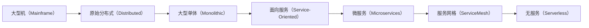

# 凤凰架构读书笔记

## 架构演进

### 架构演进流程图



### 原始分布式时代

> UNIX 的分布式设计哲学
>
> Simplicity of both the interface and the implementation are more important than any other attributes of the system — including correctness, consistency, and completeness
>
> 保持接口与实现的简单性，比系统的任何其他属性，包括准确性、一致性和完整性，都来得更加重要。
>
> ​																																							—— [Richard P. Gabriel](https://en.wikipedia.org/wiki/Richard_P._Gabriel)，[The Rise of 'Worse is Better'](https://en.wikipedia.org/wiki/Worse_is_better)，1991


[开放软件基金会](https://zh.wikipedia.org/wiki/開放軟體基金會)（Open Software Foundation，OSF，也即后来的“国际开放标准组织”）

[分布式运算环境](https://en.wikipedia.org/wiki/Distributed_Computing_Environment)（Distributed Computing Environment，DCE）

[简单优先原则](https://en.wikipedia.org/wiki/KISS_principle)（keep it simple,stupid，KISS principle）


> 原始分布式时代的教训
>
> Just because something **can** be distributed doesn’t mean it **should** be distributed. Trying to make a distributed call act like a local call always ends in tears
>
> 某个功能**能够**进行分布式，并不意味着它就**应该**进行分布式，强行追求透明的分布式操作，只会自寻苦果
>
> ​																						—— [Kyle Brown](https://en.wikipedia.org/wiki/Kyle_Brown_(computer_scientist))，IBM Fellow，[Beyond Buzzwords: A Brief History of Microservices Patterns](https://developer.ibm.com/technologies/microservices/articles/cl-evolution-microservices-patterns/)，2016


### 单体系统时代

> 单体架构（Monolithic）
>
> “单体”只是表明系统中主要的过程调用都是进程内调用，不会发生进程间通信，仅此而已。

单体架构易于开发、易于测试、易于部署，且系统中各个功能、模块、方法的调用过程都是进程内调用，不会发生[进程间通信](https://zh.wikipedia.org/wiki/行程間通訊)（Inter-Process Communication，IPC）。

单体系统的不足必须基于软件的性能需求超过了单机，软件的开发人员规模明显超过了“[2 Pizza Team](https://wiki.mbalib.com/wiki/两个披萨原则)”范畴的前提下才有讨论的价值。


> Monolithic Application
>
> Monolith means composed all in one piece. The Monolithic application describes a single-tiered software application in which different components combined into a single program from a single platform.
>
> 单体意味着自包含。单体应用描述了一种由同一技术平台的不同组件构成的单层软件。
>
> ​																																																—— [Monolithic Application](https://en.wikipedia.org/wiki/Monolithic_application)，Wikipedia

- 纵向角度：**分层架构（Layered Architecture）**


- 横向角度：按照技术、功能、职责等维度，将软件拆分为各个模块，以便代码重用和管理。

单体系统真正的缺陷不在于如何拆分，而在于拆分之后的`隔离`与`自治能力`的欠缺。

譬如：内存泄漏、线程爆炸、阻塞、死循环等问题，都会影响整个程序，而不单单是某一个功能或模块。如果消耗的是层次更高的公共资源，如端口号、数据库连接池泄露，将会波及整台机器，甚至集群中其他的单体副本。

从可维护性来说，单体架构也不占优势，由于代码都在同一个进程，难于阻断错误传播，无法单独停止、更新、升级，做灰度发布、A/B测试也更复杂。


### SOA时代

> SOA 架构（Service-Oriented Architecture）
>
> 面向服务的架构是一次具体地、系统性地成功解决分布式服务主要问题的架构模式。


**三种代表性架构模式**

- [烟囱式架构](https://en.wikipedia.org/wiki/Information_silo)（Information Silo Architecture）：信息烟囱又名信息孤岛（Information Island），使用这种架构的系统被称为孤岛式信息系统或者买烟囱式信息系统。是一种完全不与其他相关信息系统进行互相操作或者协调工作的设计模式。

- [微内核架构](https://en.wikipedia.org/wiki/Microkernel)（Microkernel Architecture）：微内核架构也被称为插件式架构（plug-in Architecture）。将公共服务、资源、数据集中成为一个被所有业务系统共同依赖的核心（Kernel，也称Core System），具体的业务系统以插件模块（plug-in Modules）的形式存在，提供可拓展、天然隔离、灵活的功能特性。

  微内核架构的局限和使用前提是它假设系统中各个插件模块之间是互不认识，不可预知系统将安装哪些模块，这些插件可访问内核中的公共资源，但不会直接交互。

  

  ​			

- [事件驱动架构](https://en.wikipedia.org/wiki/Event-driven_architecture)（Event-Driven Architecture）：子系统间建立一套事件队列管道（Event Queues），系统外部的消息通过事件的形式发送到管道中，并被订阅消费。事件的消费者高度解耦，但能通过事件管道进行通信。


SOA 的概念最早由 Gartner 公司在 1994 年提出，[Open CSA](http://www.oasis-opencsa.org/)组织（Open Composite Services Architecture），这便是 SOA 的官方管理机构。

SOA针对分布式服务中服务间松耦合、注册、发现、隔离、治理、编排的问题，进行了更具体、更系统的探索。

- `“更具体”`体现在尽管 SOA 本身还是属抽象概念，而不是特指某一种具体的技术，但它比单体架构和前面所列举的三种架构模式的操作性要更强，已经不能简单视其为一种架构风格，而是可以称为一套软件设计的基础平台了。它拥有领导制定技术标准的组织 Open CSA；有清晰软件设计的指导原则，譬如服务的封装性、自治、松耦合、可重用、可组合、无状态，等等；明确了采用 SOAP 作为远程调用的协议，依靠 SOAP 协议族（WSDL、UDDI 和一大票 WS-*协议）来完成服务的发布、发现和治理；利用一个被称为[企业服务总线](https://zh.wikipedia.org/zh-hans/企业服务总线)（Enterprise Service Bus，ESB）的消息管道来实现各个子系统之间的通信交互，令各服务间在 ESB 调度下无须相互依赖却能相互通信，既带来了服务松耦合的好处，也为以后可以进一步实施[业务流程编排](https://zh.wikipedia.org/wiki/业务流程管理)（Business Process Management，BPM）提供了基础；使用[服务数据对象](https://zh.wikipedia.org/wiki/服务数据对象)（Service Data Object，SDO）来访问和表示数据，使用[服务组件架构](https://zh.wikipedia.org/wiki/服务组件架构)（Service Component Architecture，SCA）来定义服务封装的形式和服务运行的容器，等等。
- `“更系统”`指的是 SOA 的宏大理想，它的终极目标是希望总结出一套自上而下的软件研发方法论，希望做到企业只需要跟着 SOA 的思路，就能够一揽子解决掉软件开发过程中的全部问题，譬如该如何挖掘需求、如何将需求分解为业务能力、如何编排已有服务、如何开发测试部署新的功能，等等。这里面技术问题确实是重点和难点，但也仅仅是其中的一个方面，SOA 不仅关注技术，还关注研发过程中涉及到的需求、管理、流程和组织。

`SOAP 协议`被逐渐边缘化的本质原因：过于严格的规范定义带来过度的复杂性。它可以实现多个异构大型系统之间的复杂集成交互，却很难作为一种具有广泛普适性的软件架构风格来推广。


### 微服务时代

> 微服务架构（Microservices）
>
> 微服务是一种通过多个小型服务组合来构建单个应用的架构风格，这些服务围绕业务能力而非特定的技术标准来构建。各个服务可以采用不同的编程语言，不同的数据存储技术，运行在不同的进程之中。服务采取轻量级的通信机制和自动化的部署机制实现通信与运维。

`微服务`由 Peter Rodgers 博士在 2005 年度的云计算博览会（Web Services Edge 2005）上首次使用，当时的说法是“Micro-Web-Service”，指的是一种专注于单一职责的、语言无关的、细粒度 Web 服务（Granular Web Services）。

**微服务的九个核心的业务与技术特征：**

- **围绕业务能力构建**（Organized around Business Capability）。强调了康威定律的重要性，有怎样结构、规模、能力的团队，就会产生出对应结构、规模、能力的产品。
- **分散治理**（Decentralized Governance）。表达“谁家孩子谁来管”的意思，服务对应的开发团队有直接对服务运行质量负责的责任，也应该有着不受外界干预地掌控服务各个方面的权力，譬如选择与其他服务异构的技术来实现自己的服务。
- **通过服务来实现独立自治的组件**（Componentization via Services）。服务是进程外组件，通过远程调用来提供功能。
- **产品化思维**（Products not Projects）。避免把软件研发视作要去完成某种功能，而是视作一种持续改进、提升的过程。
- **数据去中心化**（Decentralized Data Management）。微服务明确地提倡数据应该按领域分散管理、更新、维护、存储，在单体服务中，一个系统的各个功能模块通常会使用同一个数据库。同一个数据实体在不同服务的视角里，它的抽象形态往往也是不同的。
- **强终端弱管道**（Smart Endpoint and Dumb Pipe）。弱管道（Dumb Pipe）几乎算是直接指名道姓地反对 SOAP 和 ESB 的那一堆复杂的通信机制。微服务提倡类似于经典 UNIX 过滤器那样简单直接的通信方式，RESTful 风格的通信在微服务中会是更加合适的选择。
- **容错性设计**（Design for Failure）。要求在微服务的设计中，有自动的机制对其依赖的服务能够进行快速故障检测，在持续出错的时候进行隔离，在服务恢复的时候重新联通。所以“断路器”这类设施，对实际生产环境的微服务来说并不是可选的外围组件，而是一个必须的支撑点，如果没有容错性的设计，系统很容易就会被因为一两个服务的崩溃所带来的雪崩效应淹没。
- **演进式设计**（Evolutionary Design）。容错性设计承认服务会出错，演进式设计则是承认服务会被报废淘汰。
- **基础设施自动化**（Infrastructure Automation）。基础设施自动化，如 CI/CD 的长足发展，显著减少了构建、发布、运维工作的复杂性。

`微服务`追求的是更加自由的架构风格，摒弃了几乎所有 SOA 里可以抛弃的约束和规定，提倡以“实践标准”代替“规范标准”。

服务的`注册发现`、`跟踪治理`、`负载均衡`、`故障隔离`、`认证授权`、`伸缩扩展`、`传输通信`、`事务处理`，等等，这些问题，在微服务中不再会有统一的解决方案。

> 技术架构者的第一职责就是做决策权衡


### 后微服务时代

> 后微服务时代（Cloud Native）
>
> 从软件层面独力应对微服务架构问题，发展到软、硬一体，合力应对架构问题的时代，此即为“后微服务时代”。

​																			传统 Spring Cloud 与 Kubernetes 提供的解决方案对比

|          | Kubernetes              | Spring Cloud              |
| -------- | ----------------------- | ------------------------- |
| 弹性伸缩 | Autoscaling             | N/A                       |
| 服务发现 | KubeDNS / CoreDNS       | Spring Cloud Eureka       |
| 配置中心 | ConfigMap / Secret      | Spring Cloud Config       |
| 服务网关 | Ingress Controller      | Spring Cloud Zuul/Gateway |
| 负载均衡 | Load Balancer           | Spring Cloud Ribbon       |
| 服务安全 | RBAC API                | Spring Cloud Security     |
| 跟踪监控 | Metrics API / Dashboard | Spring Cloud Turbine      |
| 降级熔断 | N/A                     | Spring Cloud Hystrix      |

当虚拟化的基础设施从单个服务的容器扩展至由多个容器构成的服务集群、通信网络和存储设施时，软件与硬件的界限便已经模糊。一旦虚拟化的硬件能够跟上软件的灵活性，那些与业务无关的技术性问题便有可能从软件层面剥离，悄无声息地解决于硬件基础设施之内，让软件得以只专注业务，真正“围绕业务能力构建”团队与产品。

虚拟化的基础设施只能针对容器管理，粒度相对粗犷，而诸如断路器、服务的监控、认证、授权、安全、负载均衡等都需要细化管理，为了解决这类问题，出现了“[服务网格](https://en.wikipedia.org/wiki/Service_mesh)”（Service Mesh）的“边车代理模式”（Sidecar Proxy）。这个代理除了实现正常的服务间通信外（称为数据平面通信），还接收来自控制器的指令（称为控制平面通信），根据控制平面中的配置，对数据平面通信的内容进行分析处理，以实现熔断、认证、度量、监控、负载均衡等各种附加功能。这样便实现了既不需要在应用层面加入额外的处理代码，也提供了几乎不亚于程序代码的精细管理能力。


### 无服务时代

> 无服务架构（Serverless）
>
> 如果说微服务架构是分布式系统这条路的极致，那无服务架构，也许就是“不分布式”的云端系统这条路的起点。

无服务只涉及两块内容：`后端设施`（Backend）和`函数`（Function）。

- **后端设施**是指数据库、消息队列、日志、缓存，等等这一类用于支撑业务逻辑运行，但本身无业务含义的技术组件，这些后端设施都运行在云上，无服务中称其`“后端即服务”`（Backend as a Service，BaaS）。

- **函数**是指业务逻辑代码，其运行在云端，不必考虑算力和容量问题，无服务中称其为`“函数即服务”`（Function as a Service，FaaS）。

无服务的愿景是让开发者只需要纯粹地关注业务，不需要考虑技术组件，后端的技术组件是现成的，可以直接取用，没有采购、版权和选型的烦恼；不需要考虑如何部署，部署过程完全是托管到云端的，工作由云端自动完成；不需要考虑算力，有整个数据中心支撑，算力可以认为是无限的；也不需要操心运维，维护系统持续平稳运行是云计算服务商的责任而不再是开发者的责任。


## 技术演示工程

### 前端工程

#### 运行程序

- 通过Docker容器运行：

  ```bash
  $ docker run -d -p 80:80 --name bookstore icyfenix/bookstore:frontend
  ```

  然后在浏览器访问：[http://localhost](http://localhost/)

- 通过Git源码，以开发者模式运行：

  ```bash
   # 克隆获取源码
   $ git clone https://github.com/fenixsoft/fenix-bookstore-frontend.git
  
   # 进入工程根目录
   $ cd fenix-bookstore-frontend
  
   # 安装工程依赖
   $ npm install
  
   # 以开发模式运行，地址为localhost:8080
   $ npm run dev
  ```

  然后在浏览器访问：[http://localhost:8080](http://localhost:8080/)

#### 构建产品

当你将程序用于正式部署时，一般不应部署开发阶段的程序，而是要进行产品化（Production）与精简化（Minification），你可以通过以下命令，由 node.js 驱动 webpack 来自动完成：

```bash
# 编译前端代码
$ npm run build
```

或者使用--report 参数，同时输出依赖分析报告：

```bash
# 编译前端代码并生成报告
$ npm run build --report
```

编译结果存放在/dist 目录中，应将其拷贝至 Web 服务器的根目录使用。


### 单体架构：Spring Boot

#### 运行程序

- 通过 Docker 容器方式运行：

  ```bash
  $ docker run -d -p 8080:8080 --name bookstore icyfenix/bookstore:monolithic
  ```

  然后在浏览器访问：[http://localhost:8080](http://localhost:8080/)，系统预置了一个用户（`user:icyfenix，pw:123456`）

- 通过 Git 上的源码，以 Maven 运行：

  ```bash
  # 克隆获取源码
  $ git clone https://github.com/fenixsoft/monolithic_arch_springboot.git
  
  # 进入工程根目录
  $ cd monolithic_arch_springboot
  
  # 编译打包
  # 采用Maven Wrapper，此方式只需要机器安装有JDK 8或以上版本即可，无需包括Maven在内的其他任何依赖
  # 如在Windows下应使用mvnw.cmd package代替以下命令
  $ ./mvnw package
  
  # 运行程序，地址为localhost:8080
  $ java -jar target/bookstore-1.0.0-Monolithic-SNAPSHOT.jar
  ```

#### 工程结构

采用MVVM前后端分离模式，后端参考DDD的分层模式和设计原则


- Resource：对应DDD中的User Interface层（用户界面层/表示层），负责向用户显示信息和解释用户发出的指令，用户也就是前端服务的消费者，以RESTful中的核心概念“资源”（Resource）来命名。
- Application：应用层，负责定义软件本身对外暴露的能力，即软件本身可以完成哪些任务，并负责对内协调领域对象来解决问题。根据DDD的原则，应用层应尽量简单，不包含任何业务规则和逻辑，而只为下一层的领域对象协调任务，分配工作，使他们互相协作，在代码上的表现为Application层一般不会存在条件判断语句。在许多项目中，Application层都会被选为包裹事务（代码进入此层开启事务，退出提交或回滚事务）的载体。
- Domain：领域层/模型层，负责业务逻辑的实现，即表达业务概念，处理业务状态信息及业务规则行为，此层是项目的核心。
- Infrastructure：基础设施层，向其他层提供通用的能力，譬如持久化、远程通信、工具集等。


## 架构师视角

### 访问远程服务

远程服务将计算机程序的工作范围从单机扩展到网络，从本地延伸至远程，是构建分布式系统的首要基础。

#### 远程服务调用

[远程服务调用](https://en.wikipedia.org/wiki/Remote_procedure_call)（Remote Procedure Call，RPC）。

##### 进程间通信

[进程间通信](https://en.wikipedia.org/wiki/Inter-process_communication)（Inter-Process Communication，IPC）。

- **管道**（Pipe）或者**具名管道**（Named Pipe）：管道类似于两个进程间的桥梁，可通过管道在进程间传递少量的字符流或字节流。管道典型的应用就是命令行中的`|`操作符，譬如：

  ```sh
  ps -ef | grep java
  ```

- **信号**（Signal）：信号用于通知目标进程有某种事件发生，除了用于进程间通信外，进程还可以发送信号给进程自身。信号的典型应用是`kill`命令，譬如：

  ```sh
  kill -9 pid
  ```

- **信号量**（Semaphore）：信号量用于两个进程之间同步协作手段，它相当于操作系统提供的一个特殊变量，程序可以在上面进行`wait()`和`notify()`操作。

- **消息队列**（Message Queue）：以上三种方式只适合传递传递少量信息，POSIX 标准中定义了消息队列用于进程间数据量较多的通信。进程可以向队列添加消息，被赋予读权限的进程则可以从队列消费消息。消息队列克服了信号承载信息量少，管道只能用于无格式字节流以及缓冲区大小受限等缺点，但实时性相对受限。

- **共享内存**（Shared Memory）：允许多个进程访问同一块公共的内存空间，这是效率最高的进程间通信形式。原本每个进程的内存地址空间都是相互隔离的，但操作系统提供了让进程主动创建、映射、分离、控制某一块内存的程序接口。当一块内存被多进程共享时，各个进程往往会与其它通信机制，譬如信号量结合使用，来达到进程间同步及互斥的协调操作。

- **套接字接口**（Socket）：以上两种方式只适合单机多进程间的通信，套接字接口是更为普适的进程间通信机制，可用于不同机器之间的进程通信。


##### 通信的成本

[通过网络进行分布式运算的八宗罪](https://en.wikipedia.org/wiki/Fallacies_of_distributed_computing)（8 Fallacies of Distributed Computing）：

1. The network is reliable —— 网络是可靠的。
2. Latency is zero —— 延迟是不存在的。
3. Bandwidth is infinite —— 带宽是无限的。
4. The network is secure —— 网络是安全的。
5. Topology doesn't change —— 拓扑结构是一成不变的。
6. There is one administrator —— 总会有一个管理员。
7. Transport cost is zero —— 不必考虑传输成本。
8. The network is homogeneous —— 网络是同质化的。


##### 三个基本问题

- **如何表示数据：**数据包括了传递给方法的参数，以及方法执行后的返回值。即数据的`序列化`与`反序列化`。

  每种 RPC 协议都应该要有对应的序列化协议，譬如：

  - ONC RPC 的[External Data Representation](https://en.wikipedia.org/wiki/External_Data_Representation) （XDR）
  - CORBA 的[Common Data Representation](https://en.wikipedia.org/wiki/Common_Data_Representation)（CDR）
  - Java RMI 的[Java Object Serialization Stream Protocol](https://docs.oracle.com/javase/8/docs/platform/serialization/spec/protocol.html#a10258)
  - gRPC 的[Protocol Buffers](https://developers.google.com/protocol-buffers)
  - Web Service 的[XML Serialization](https://docs.microsoft.com/en-us/dotnet/standard/serialization/xml-serialization-with-xml-web-services)
  - 众多轻量级 RPC 支持的[JSON Serialization](https://tools.ietf.org/html/rfc7159)
  - ……

- **如何传递数据：**指如何通过网络，在两个服务的 Endpoint 之间相互操作、交换数据。这里“交换数据”通常指的是应用层协议，实际传输一般是基于标准的 TCP、UDP 等标准的传输层协议来完成的。两个服务交互不是只扔个序列化数据流来表示参数和结果就行的，许多在此之外信息，譬如异常、超时、安全、认证、授权、事务，等等，都可能产生双方需要交换信息的需求。

  “[Wire Protocol](https://en.wikipedia.org/wiki/Wire_protocol)”来用于表示这种两个 Endpoint 之间交换这类数据的行为，常见的 Wire Protocol 有：

  - Java RMI 的[Java Remote Message Protocol](https://docs.oracle.com/javase/8/docs/platform/rmi/spec/rmi-protocol3.html)（JRMP，也支持[RMI-IIOP](https://zh.wikipedia.org/w/index.php?title=RMI-IIOP&action=edit&redlink=1)）
  - CORBA 的[Internet Inter ORB Protocol](https://en.wikipedia.org/wiki/General_Inter-ORB_Protocol)（IIOP，是 GIOP 协议在 IP 协议上的实现版本）
  - DDS 的[Real Time Publish Subscribe Protocol](https://en.wikipedia.org/wiki/Data_Distribution_Service)（RTPS）
  - Web Service 的[Simple Object Access Protocol](https://en.wikipedia.org/wiki/SOAP)（SOAP）
  - 如果要求足够简单，双方都是 HTTP Endpoint，直接使用 HTTP 协议也是可以的（如 JSON-RPC）
  - ……

- **如何确定方法：**[接口描述语言](https://en.wikipedia.org/wiki/Interface_description_language)（Interface Description Language，IDL），成为此后许多 RPC 参考或依赖的基础（如 CORBA 的 OMG IDL）

  - Android 的[Android Interface Definition Language](https://developer.android.com/guide/components/aidl)（AIDL）
  - CORBA 的[OMG Interface Definition Language](https://www.omg.org/spec/IDL)（OMG IDL）
  - Web Service 的[Web Service Description Language](https://zh.wikipedia.org/wiki/WSDL)（WSDL）
  - JSON-RPC 的[JSON Web Service Protocol](https://en.wikipedia.org/wiki/JSON-WSP)（JSON-WSP）
  - ……

##### 统一的RPC

1991 年，[对象管理组织](https://zh.wikipedia.org/wiki/对象管理组织)（Object Management Group，OMG）发布了跨进程的、面向异构语言的、支持面向对象的服务调用协议：CORBA 1.0（Common Object Request Broker Architecture）。是一套由国际标准组织牵头，由多家软件提供商共同参与的分布式规范。

1998 年，XML 1.0 发布，并成为[万维网联盟](https://en.wikipedia.org/wiki/World_Wide_Web_Consortium)（World Wide Web Consortium，W3C）的推荐标准。1999 年末，SOAP 1.0（Simple Object Access Protocol）规范的发布，它代表着一种被称为“Web Service”的全新的 RPC 协议的诞生。Web Service 的一大缺点是它那过于严格的数据和接口定义所带来的性能问题。

简单、普适、高性能这三点，似乎真的难以同时满足。


##### 分裂的RPC

- 朝着**面向对象**发展，不满足于 RPC 将面向过程的编码方式带到分布式，希望在分布式系统中也能够进行跨进程的面向对象编程，代表为 RMI、.NET Remoting，之前的 CORBA 和 DCOM 也可以归入这类，这条线有一个别名叫做[分布式对象](https://en.wikipedia.org/wiki/Distributed_object)（Distributed Object）。
- 朝着**性能**发展，代表为 gRPC 和 Thrift。决定 RPC 性能的主要就两个因素：`序列化效率`和`信息密度`。序列化效率很好理解，序列化输出结果的容量越小，速度越快，效率自然越高；信息密度则取决于协议中有效荷载（Payload）所占总传输数据的比例大小，使用传输协议的层次越高，信息密度就越低，SOAP 使用 XML 拙劣的性能表现就是前车之鉴。gRPC 和 Thrift 都有自己优秀的专有序列化器，而传输协议方面，gRPC 是基于 HTTP/2 的，支持多路复用和 Header 压缩，Thrift 则直接基于传输层的 TCP 协议来实现，省去了额外应用层协议的开销。
- 朝着**简化**发展，代表为 JSON-RPC，说要选功能最强、速度最快的 RPC 可能会很有争议，但选功能弱的、速度慢的，JSON-RPC 肯定会候选人中之一。牺牲了功能和效率，换来的是协议的简单轻便，接口与格式都更为通用，尤其适合用于 Web 浏览器这类一般不会有额外协议支持、额外客户端支持的应用场合。
- ……

最近几年，RPC 框架有明显的朝着更高层次（不仅仅负责调用远程服务，还管理远程服务）与插件化方向发展的趋势，不再追求独立地解决 RPC 的全部三个问题（表示数据、传递数据、表示方法），而是将一部分功能设计成扩展点，让用户自己去选择。框架聚焦于提供核心的、更高层次的能力，譬如提供负载均衡、服务注册、可观察性等方面的支持。


#### REST设计风格

REST 与 RPC 在思想上差异的核心是`抽象的目标`不一样，即`面向资源`的编程思想与`面向过程`的编程思想两者之间的区别。

REST 并不是一种远程服务调用协议，协议都带有一定的规范性和强制性，至少有一个规约文档，但是REST并没有定义这些内容。REST是一种风格而不是规范、协议。

REST，即“表征状态转移”的缩写，“REST”（**Re**presentational **S**tate **T**ransfer）实际上是“HTT”（**H**yper**t**ext **T**ransfer）的进一步抽象，两者就如同接口与实现类的关系一般。

##### 理解REST

> Hypertext
>
> By now the word "hypertext" has become generally accepted for branching and responding text, but the corresponding word "hypermedia", meaning complexes of branching and responding graphics, movies and sound – as well as text – is much less used.
>
> 现在，"超文本 "一词已被普遍接受，它指的是能够进行分支判断和差异响应的文本，相应地， "超媒体 "一词指的是能够进行分支判断和差异响应的图形、电影和声音（也包括文本）的复合体。

以上定义描述的“超文本（或超媒体，Hypermedia）”是一种“能够对操作进行判断和响应的文本（或声音、图像等）”。

下面通过阅读文章的例子来理解什么是“表征”以及 REST 中其他关键概念。

- **资源**（Resource）：你现在正在阅读一篇名为《REST 设计风格》的文章，这篇文章的内容（其蕴含的信息、数据）本身，称之为“资源”。
- **表征**（Representation）：指信息与用户交互时的表示形式，这与我们软件分层架构中常说的“表示层”（Presentation Layer）的语义其实是一致的。譬如：服务端向浏览器返回的HTML、PDF、Markdown、RSS等形式的版本，它们是同一个资源多种表征。 
- **状态**（State）：在特定语境中才能产生的上下文信息即被称为“状态”。我们所说的有`状态（Stateful）`抑或是`无状态（Stateless）`，都是只相对于服务端来说的，服务端自己记住用户状态称为`有状态`；客户端记住状态，请求时明确告知服务端，称为`无状态`。
- **转移**（Transfer）：无论状态是由服务端还是客户端来提供的，“取下一篇文章”这个行为逻辑必然只能由服务端来提供，因为只有服务端拥有该资源及其表征形式。服务器通过某种方式，把“用户当前阅读的文章”转变成“下一篇文章”，这就被称为“表征状态转移”。
- **统一接口**（Uniform Interface）：HTTP 协议中已经提前约定好了一套“统一接口”，它包括：GET、HEAD、POST、PUT、DELETE、TRACE、OPTIONS 七种基本操作，任何一个支持 HTTP 协议的服务器都会遵守这套规定，对特定的 URI 采取这些操作，服务器就会触发相应的表征状态转移。
- **超文本驱动**（Hypertext Driven）：浏览器作为所有网站的通用的客户端，任何网站的导航（状态转移）行为都不可能是预置于浏览器代码之中，而是由服务器发出的请求响应信息（超文本）来驱动的。
- **自描述消息**（Self-Descriptive Messages）：由于资源的表征可能存在多种不同形态，在消息中应当有明确的信息来告知客户端该消息的类型以及应如何处理这条消息。一种被广泛采用的自描述方法是在名为“Content-Type”的 HTTP Header 中标识出[互联网媒体类型](https://en.wikipedia.org/wiki/Media_type)（MIME type），譬如“Content-Type : application/json; charset=utf-8”，则说明该资源会以 JSON 的格式来返回，请使用 UTF-8 字符集进行处理。


##### RESTful的系统

Fielding 认为，一套理想的、完全满足 REST 风格的系统应该满足以下六大原则。

1. **服务端与客户端分离**（Client-Server）

   将用户界面所关注的逻辑和数据存储所关注的逻辑分离开来，有助于提高用户界面的跨平台的可移植性。

2. **无状态**（Stateless）

   无状态是 REST 的一条核心原则，REST 希望服务器不要去负责维护状态，每一次从客户端发送的请求中，应包括所有的必要的上下文信息，会话信息也由客户端负责保存维护，服务端依据客户端传递的状态来执行业务处理逻辑，驱动整个应用的状态变迁。

3. **可缓存**（Cacheability）

   无状态服务虽然提升了系统的可见性、可靠性和可伸缩性，但降低了系统的网络性。“降低网络性”的通俗解释是某个功能如果使用有状态的设计只需要一次（或少量）请求就能完成，使用无状态的设计则可能会需要多次请求，或者在请求中带有额外冗余的信息。为了缓解这个矛盾，REST 希望软件系统能够如同万维网一样，允许客户端和中间的通讯传递者（譬如代理）将部分服务端的应答缓存起来。

4. **分层系统**（Layered System）

   指客户端一般不需要知道是否直接连接到了最终的服务器，抑或连接到路径上的中间服务器。中间服务器可以通过负载均衡和共享缓存的机制提高系统的可扩展性，这样也便于缓存、伸缩和安全策略的部署。该原则的典型的应用是内容分发网络（Content Distribution Network，CDN）。

5. **统一接口**（Uniform Interface）

   REST 希望开发者面向资源编程，希望软件系统设计的重点放在抽象系统该有哪些资源上，而不是抽象系统该有哪些行为（服务）上。面向资源编程的`抽象程度`通常更高。抽象程度高意味着坏处是往往距离人类的思维方式更远，而好处是往往通用程度会更好。

6. **按需代码**（[Code-On-Demand](https://en.wikipedia.org/wiki/Code_on_demand)）

   指任何按照客户端（譬如浏览器）的请求，将可执行的软件程序从服务器发送到客户端的技术，按需代码赋予了客户端无需事先知道所有来自服务端的信息应该如何处理、如何运行的宽容度。

##### RESTful的好处

- 降低的服务接口的学习成本。

  统一接口（Uniform Interface）是 REST 的重要标志，将对资源的标准操作都映射到了标准的 HTTP 方法上去，这些方法对于每个资源的用法都是一致的，语义都是类似的，不需要刻意去学习。

- 资源天然具有集合与层次结构。

  以资源为中心抽象的接口，由于资源是名词，天然就可以产生集合与层次结构。

- REST 绑定于 HTTP 协议。

  REST 复用 HTTP 协议中已经定义的概念和相关基础支持来解决问题。


##### RMM成熟度

《[RESTful Web APIs](https://book.douban.com/subject/22139962/)》和《[RESTful Web Services](https://book.douban.com/subject/2054201/)》的作者 Leonard Richardson 曾提出过一个衡量“服务有多么 REST”的 Richardson `成熟度模型`（[Richardson Maturity Model](https://martinfowler.com/articles/richardsonMaturityModel.html)），便于那些原本不使用 REST 的系统，能够逐步地导入 REST。Richardson 将服务接口“REST 的程度”从低到高，分为 0 至 3 级：

1. The Swamp of [Plain Old XML](https://en.wikipedia.org/wiki/Plain_Old_XML)：完全不 REST。另外，关于 Plain Old XML 这说法，SOAP 表示[感觉有被冒犯到](https://baike.baidu.com/item/感觉有被冒犯到)。
2. Resources：开始引入资源的概念。
3. HTTP Verbs：引入统一接口，映射到 HTTP 协议的方法上。
4. Hypermedia Controls：超媒体控制在本文里面的说法是“超文本驱动”，在 Fielding 论文里的说法是“Hypertext As The Engine Of Application State，HATEOAS”，其实都是指同一件事情。


##### 不足与争议

- **面向资源的编程思想只适合做 CRUD，面向过程、面向对象编程才能处理真正复杂的业务逻辑**

  用户是可以使用自定义方法的，按 Google 推荐的 REST API 风格，[自定义方法](https://cloud.google.com/apis/design/custom_methods)应该放在资源路径末尾，嵌入冒号加自定义动词的后缀。譬如，我可以把删除操作映射到标准 DELETE 方法上，如果此外还要提供一个恢复删除的 API，那它可能会被设计为：

  ```
  POST /user/user_id/cart/book_id:undelete
  ```

​		如果你不想使用自定义方法，那就设计一个回收站的资源，在那里保留着还能被恢复的商品，将恢复删除视为对该资源某个`状态值`的修改，映射到 PUT 或者 		PATCH 方法上，这也是一种完全可行的设计。

- **REST 与 HTTP 完全绑定，不适合应用于要求高性能传输的场景中**

  对于需要直接控制传输，如二进制细节、编码形式、报文格式、连接方式等细节的场景中，REST 确实不合适，这些场景往往存在于服务集群的内部节点之间

- **REST 不利于事务支持**

- **REST 没有传输可靠性支持**

  应对传输可靠性最简单粗暴的做法是把消息再重发一遍。这种简单处理能够成立的前提是服务应具有[幂等性](https://zh.wikipedia.org/wiki/冪等)（Idempotency），即服务被重复执行多次的效果与执行一次是相等的。

- **REST 缺乏对资源进行“部分”和“批量”的处理能力**


### 事务处理

- **一致性**（Consistency）：保证系统中所有的数据都是符合期望的，且相互关联的数据之间不会产生矛盾。
- **原子性**（Atomic）：在同一个业务处理过程中，事务保证对多个数据的修改，要么同时成功，要么同时撤销。
- **隔离性**（Isolation）：在不同的业务处理过程中，事务保证了各自业务正在读、写的数据互相独立，不会彼此影响。
- **持久性**（Durability）：事务应当保证所有成功被提交的数据修改都能正确的被持久化，不丢失数据。

所有需要保证数据一致性的应用场景，包括但不限于：数据库、事务内存、缓存、消息队列、分布式存储，等到，都会用到事务。

- **内部一致性**：当一个服务只使用一个数据源时，通过 A、I、D 来获得一致性是最经典的做法，也是相对容易的。此时，多个并发事务所读写的数据能够被数据源感知是否存在冲突，并发事务的读写在时间线上的最终顺序是由数据源来确定的，这种事务间一致性被称为“内部一致性”。
- **外部一致性**：当一个服务使用到多个不同的数据源，甚至多个不同服务同时涉及多个不同的数据源时，问题就变得相对困难了许多。此时，并发执行甚至是先后执行的多个事务，在时间线上的顺序并不由任何一个数据源来决定，这种涉及多个数据源的事务间一致性被称为“外部一致性”。

#### 本地事务

**本地事务**（Local Transaction）是指仅操作单一事务资源的、不需要全局事务管理器进行协调的事务。

本地事务是最基础的一种事务解决方案，只适用于单个服务使用单个数据源的场景。从应用角度看，它是直接依赖于数据源本身提供的事务能力来工作的，在程序代码层面，最多只能对事务接口做一层标准化的包装（如 JDBC 接口），并不能深入参与到事务的运作过程当中，事务的开启、终止、提交、回滚、嵌套、设置隔离级别，乃至与应用代码贴近的事务传播方式，全部都要依赖底层数据源的支持才能工作。

[ARIES](https://en.wikipedia.org/wiki/Algorithms_for_Recovery_and_Isolation_Exploiting_Semantics)理论（Algorithms for Recovery and Isolation Exploiting Semantics，ARIES），直接翻译过来是“基于语义的恢复与隔离算法”，现代数据库的基础理论。


##### 实现原子性和持久性

原子性保证了事务的多个操作要么都生效要么都不生效，不会存在中间状态；持久性保证了一旦事务生效，就不会再因为任何原因而导致其修改的内容被撤销或丢失。

数据必须要成功写入磁盘、磁带等持久化存储器后才能拥有持久性，只存储在内存中的数据，一旦遇到应用程序忽然崩溃，或者数据库、操作系统一侧的崩溃，甚至是机器突然断电宕机等情况就会丢失，这些意外情况都统称为`“崩溃”`（Crash）。

由于写入存在中间状态，所以可能发生以下情形。

- **未提交事务，写入后崩溃**：程序还没修改完三个数据，但数据库已经将其中一个或两个数据的变动写入磁盘，此时出现崩溃，一旦重启之后，数据库必须要有办法得知崩溃前发生过一次不完整的购物操作，将已经修改过的数据从磁盘中恢复成没有改过的样子，以保证原子性。
- **已提交事务，写入前崩溃**：程序已经修改完三个数据，但数据库还未将全部三个数据的变动都写入到磁盘，此时出现崩溃，一旦重启之后，数据库必须要有办法得知崩溃前发生过一次完整的购物操作，将还没来得及写入磁盘的那部分数据重新写入，以保证持久性。

由于写入中间状态与崩溃都是无法避免的，为了保证原子性和持久性，就只能在崩溃后采取恢复的补救措施，这种数据恢复操作被称为`“崩溃恢复”`（Crash Recovery，也有资料称作 Failure Recovery 或 Transaction Recovery）。

为了能够顺利地完成崩溃恢复，在磁盘中写入数据就不能像程序修改内存中变量值那样，直接改变某表某行某列的某个值，而是必须将修改数据这个操作所需的全部信息，包括修改什么数据、数据物理上位于哪个内存页和磁盘块中、从什么值改成什么值，等等，以日志的形式——即仅进行顺序追加的文件写入的形式（这是最高效的写入方式）先记录到磁盘中。

只有在日志记录全部都安全落盘，数据库在日志中看到代表事务成功提交的“提交记录”（Commit Record）后，才会根据日志上的信息对真正的数据进行修改，修改完成后，再在日志中加入一条“结束记录”（End Record）表示事务已完成持久化，这种事务实现方法被称为“Commit Logging”（提交日志）。

> 额外知识：Shadow Paging
>
> 通过日志实现事务的原子性和持久性是当今的主流方案，但并不是唯一的选择。除日志外，还有另外一种称为“[Shadow Paging](https://en.wikipedia.org/wiki/Shadow_paging)”（有中文资料翻译为“影子分页”）的事务实现机制，常用的轻量级数据库 SQLite Version 3 采用的事务机制就是 Shadow Paging。
>
> Shadow Paging 的大体思路是对数据的变动会写到硬盘的数据中，但并不是直接就地修改原先的数据，而是先将数据复制一份副本，保留原数据，修改副本数据。在事务过程中，被修改的数据会同时存在两份，一份是修改前的数据，一份是修改后的数据，这也是“影子”（Shadow）这个名字的由来。当事务成功提交，所有数据的修改都成功持久化之后，最后一步是去修改数据的引用指针，将引用从原数据改为新复制出来修改后的副本，最后的“修改指针”这个操作将被认为是原子操作，现代磁盘的写操作可以认为在硬件上保证了不会出现“改了半个值”的现象。所以 Shadow Paging 也可以保证原子性和持久性。Shadow Paging 实现事务要比 Commit Logging 更加简单，但涉及隔离性与并发锁时，Shadow Paging 实现的事务并发能力就相对有限，因此在高性能的数据库中应用不多。

Commit Logging 保障数据持久性、原子性的原理并不难理解：首先，日志一旦成功写入 Commit Record，那整个事务就是成功的，即使真正修改数据时崩溃了，重启后根据已经写入磁盘的日志信息恢复现场、继续修改数据即可，这保证了持久性；其次，如果日志没有成功写入 Commit Record 就发生崩溃，那整个事务就是失败的，系统重启后会看到一部分没有 Commit Record 的日志，那将这部分日志标记为回滚状态即可，整个事务就像完全没好有发生过一样，这保证了原子性。

Commit Logging 存在一个巨大的先天缺陷：所有对数据的真实修改都必须发生在事务提交以后，即日志写入了 Commit Record 之后。在此之前，即使磁盘 I/O 有足够空闲、即使某个事务修改的数据量非常庞大，占用了大量的内存缓冲区，无论有何种理由，都决不允许在事务提交之前就修改磁盘上的数据，这一点是 Commit Logging 成立的前提，却对提升数据库的性能十分不利。

ARIES 提出了“Write-Ahead Logging”的日志改进方案，所谓“提前写入”（Write-Ahead），就是允许在事务提交之前，提前写入变动数据的意思。

Write-Ahead Logging 先将何时写入变动数据，按照事务提交时点为界，划分为 FORCE 和 STEAL 两类情况。

- **FORCE**：当事务提交后，要求变动数据必须同时完成写入则称为 FORCE，如果不强制变动数据必须同时完成写入则称为 NO-FORCE。现实中绝大多数数据库采用的都是 NO-FORCE 策略，因为只要有了日志，变动数据随时可以持久化，从优化磁盘 I/O 性能考虑，没有必要强制数据写入立即进行。
- **STEAL**：在事务提交前，允许变动数据提前写入则称为 STEAL，不允许则称为 NO-STEAL。从优化磁盘 I/O 性能考虑，允许数据提前写入，有利于利用空闲 I/O 资源，也有利于节省数据库缓存区的内存。

Commit Logging 允许 NO-FORCE，但不允许 STEAL。因为假如事务提交前就有部分变动数据写入磁盘，那一旦事务要回滚，或者发生了崩溃，这些提前写入的变动数据就都成了错误。

Write-Ahead Logging 允许 NO-FORCE，也允许 STEAL，它给出的解决办法是增加了另一种被称为 Undo Log 的日志类型，当变动数据写入磁盘前，必须先记录 Undo Log，注明修改了哪个位置的数据、从什么值改成什么值，等等。以便在事务回滚或者崩溃恢复时根据 Undo Log 对提前写入的数据变动进行擦除。Undo Log 现在一般被翻译为“回滚日志”，此前记录的用于崩溃恢复时重演数据变动的日志就相应被命名为 Redo Log，一般翻译为“重做日志”。由于 Undo Log 的加入，Write-Ahead Logging 在崩溃恢复时会执行以下三个阶段的操作。

- **分析阶段**（Analysis）：该阶段从最后一次检查点（Checkpoint，可理解为在这个点之前所有应该持久化的变动都已安全落盘）开始扫描日志，找出所有没有 End Record 的事务，组成待恢复的事务集合，这个集合至少会包括 Transaction Table 和 Dirty Page Table 两个组成部分。
- **重做阶段**（Redo）：该阶段依据分析阶段中产生的待恢复的事务集合来重演历史（Repeat History），具体操作为：找出所有包含 Commit Record 的日志，将这些日志修改的数据写入磁盘，写入完成后在日志中增加一条 End Record，然后移除出待恢复事务集合。
- **回滚阶段**（Undo）：该阶段处理经过分析、重做阶段后剩余的恢复事务集合，此时剩下的都是需要回滚的事务，它们被称为 Loser，根据 Undo Log 中的信息，将已经提前写入磁盘的信息重新改写回去，以达到回滚这些 Loser 事务的目的。

重做阶段和回滚阶段的操作都应该设计为幂等的。

数据库按照是否允许 FORCE 和 STEAL 可以产生共计四种组合，从优化磁盘 I/O 的角度看，NO-FORCE 加 STEAL 组合的性能无疑是最高的；从算法实现与日志的角度看 NO-FORCE 加 STEAL 组合的复杂度无疑也是最高的。这四种组合与 Undo Log、Redo Log 之间的具体关系如图 3-1 所示。

![force-steal](data:image/png;base64,iVBORw0KGgoAAAANSUhEUgAAAnYAAAD3CAMAAACn+emfAAAAGXRFWHRTb2Z0d2FyZQBBZG9iZSBJbWFnZVJlYWR5ccllPAAAAyFpVFh0WE1MOmNvbS5hZG9iZS54bXAAAAAAADw/eHBhY2tldCBiZWdpbj0i77u/IiBpZD0iVzVNME1wQ2VoaUh6cmVTek5UY3prYzlkIj8+IDx4OnhtcG1ldGEgeG1sbnM6eD0iYWRvYmU6bnM6bWV0YS8iIHg6eG1wdGs9IkFkb2JlIFhNUCBDb3JlIDUuNS1jMDE0IDc5LjE1MTQ4MSwgMjAxMy8wMy8xMy0xMjowOToxNSAgICAgICAgIj4gPHJkZjpSREYgeG1sbnM6cmRmPSJodHRwOi8vd3d3LnczLm9yZy8xOTk5LzAyLzIyLXJkZi1zeW50YXgtbnMjIj4gPHJkZjpEZXNjcmlwdGlvbiByZGY6YWJvdXQ9IiIgeG1sbnM6eG1wPSJodHRwOi8vbnMuYWRvYmUuY29tL3hhcC8xLjAvIiB4bWxuczp4bXBNTT0iaHR0cDovL25zLmFkb2JlLmNvbS94YXAvMS4wL21tLyIgeG1sbnM6c3RSZWY9Imh0dHA6Ly9ucy5hZG9iZS5jb20veGFwLzEuMC9zVHlwZS9SZXNvdXJjZVJlZiMiIHhtcDpDcmVhdG9yVG9vbD0iQWRvYmUgUGhvdG9zaG9wIENDIChXaW5kb3dzKSIgeG1wTU06SW5zdGFuY2VJRD0ieG1wLmlpZDpDNkVCQjZENkRDQjExMUVBQjJFNUFDQzNEQ0I4MEI1RiIgeG1wTU06RG9jdW1lbnRJRD0ieG1wLmRpZDpDNkVCQjZEN0RDQjExMUVBQjJFNUFDQzNEQ0I4MEI1RiI+IDx4bXBNTTpEZXJpdmVkRnJvbSBzdFJlZjppbnN0YW5jZUlEPSJ4bXAuaWlkOkM2RUJCNkQ0RENCMTExRUFCMkU1QUNDM0RDQjgwQjVGIiBzdFJlZjpkb2N1bWVudElEPSJ4bXAuZGlkOkM2RUJCNkQ1RENCMTExRUFCMkU1QUNDM0RDQjgwQjVGIi8+IDwvcmRmOkRlc2NyaXB0aW9uPiA8L3JkZjpSREY+IDwveDp4bXBtZXRhPiA8P3hwYWNrZXQgZW5kPSJyIj8+k8yiTAAAADNQTFRFkpKSS0tL3t7eXl5eenp67+/v9/f3sLCwzMzMp6en39/fxsbGhoaGMjIymcz//8zM////7dxksgAACUhJREFUeNrs3YmaojgUhmEEEXqmj8X9X+1kIZKwKFAJEeY79XSpWGXr329WmbHoKOrwKoiAgh0FO4qCHQU7ioIdBTuKgh0FO4qCHQU7CnYUdR125a2q1V97K7vucReR4QkU6lbbtWKqqgtz2f/c/dH1v7S9WvO3xH/cPHWN/DKwk8Y+07pST7q8mWeuqpH2cTcvoPC+978yOrLtLyzUYzfRHzcbuyvkl4OdepZF/0e3paZ/Jq8nP355jRTey97eWJskj5uP3QXyy8FOddnqmZrG2qk2W7gxwj370ct73Kt/zM/ujS38h4n1uPnYXSC/DOz+qqFAPVPdeZvY+lFC52mv9i/PzCHMOFLYQ/ti0zMg+4txHzcbuyvkl4FdoeYjf6exqWt6xjptVY2ZKDf7edi5dvzHzcTuCvnlYKdfhzdIuNjcdHn08lRfXtuZ824e/ZIr+uNmYneB/LKwG6bFZsaqm2njTV/Dl6cHD7ti38+jrqaxxXjcTOzOn18Wdqp/NhsArrnYV6ZuNTOduV286+/7YivUY9oBKe7jZmR3/vzysKur6XanbrMmtWDqKv/avSgd72syu31qUiR43IzsTp8fb45RGQp2FOwo2FEU7CjYURTsKNhRFOwo2FFUenZymcrzz3PV/GAHuyuyO+Kf5pm88rG7Zn6wgx3sYAc7YoMd7GAHO9jBDnawgx3syA92sIMd7MgPdrCDHexgR2ywgx3sYEdssIMd7GAHO/KDHexgBzvygx3sYAc72BEb7GAHO9gRG+xgBzvYwY78YAc72MGO/GAHO9jBDnbEBjvYwQ52xAY72MEOdrAjP9jBDnawO2t++n933V9TX8/lnxXYwS5GfjKQm7B7/R/YYQe7+PkFrHx2/qX3OQCwg93v8hthEn3gOdyaYUlvB7sIg6z35ykSDLOwg13Kud1r5HSDrMzd92GMhR3s9vV2bpBd7O3YQIFdkt7OfTHIbmEXjgOyvql+LbvhI+REfXXLPytRVrLL7GS0zt3ErpCm68qbPtSqF3QrX8d1Ffo+ddm+jtwf/VV1pa6GQ9/KbpJXZHZH5jf61MKA3fRTDSVObyeDrHl2T9nFrqptbI0OpzAJ6eN9gK2OtdHfzBF983FXv1JXVV1X48S+vrd7Pwnexe7Y/AJWPjv/8vNnk27o7RaWFE6j7GSnmqSOzbZYE4kXW5+MvmWO6NuNa9JnYBc2zw/Dwi52h+U3wiT6QDfcmmEZYd8u2E8Zs3zfhj+wu5U6ssa2U5dJH5tprPqifcVWu2S/n10Yomu6sdkdlp94f8xPecNsJHZHnQpQ3P5IoWPrc+rTG93U6blBYgirn5s039vbydyIEZfdgfmFI6cbZGXuvk+f/52fXVnIn5nYxEyQ/dj6jPzYvn2QlfC9nY87nHvYHZdf0Nu5QXaxt+u+u7cr9VprGCTC1voaJExrVc2zHaYvZ2AX7LInWckemN+4t3Nfpxxky2FabKfEjajV2fyUuNXrthMtKURkxE7Wu1vL7tD8JNg/WWIno3Xu79glON9Oh6EaYeFW+dMNgMLfACjUzRNtoIh7Ozspu6Pym/R2MsiaZ9dt3kAZLcKewbo23vl2JoxGptud7tqw3WlXYnZ3yt/udGPGl65kg95uyzC7mt2R+YW93cKSwmmUHeyCKxJsnXC+3fpBwqcmwcXZ3hyb7NsF+yljlm8XsmvZPYN3InhPllMBUp0KMEyIJ5tQsINdQnZBH+cPspxvB7sD2HlbnZxvB7uDB1lhbge75OwmE7kE59vBDnbvNlBEninOt4Md7N5sF0vwX47FO98OdrB7P8iGJ95FOt8OdrDLcCoAscEOdrCDHbHBDnawgx3syA92sIMd7MgPdrCDHexgR2ywgx3sYEdssIMd7GAHO/KDHexgBzvygx3sYAc72BEb7GAHO9gRG+xgBzvYwQ52sIMd7GBHfrCDHexgBztigx3sYAc7YoMd7GAHO9jBDnawg93wkq5SudhdMz/Ywe6K7H6S1zEDUS5218wPdrCDHexgR2ywgx3sYAc72MEOdrCDHfnBDnawgx35wQ52sIMd7IgNdrCDHeyIDXawgx3sYEd+sIMd7GBHfrCDHexgBztigx3sYAc7YoMd7GAHO9iRH+xgBzvYkR/sYAc72MGO2GAHO9jBjthgBzvYwQ525Ac72MEOduQHO9jBDnawIzbYwQ52sCM22MEOdrCDHfmdj13/eWjuVn8Adp8yeH2S3Lqkfp+f7LhnA7vCvBh17+NuL/sj94e62qort7Krq+HQb9kFsYi9emZ2qfLzPrNwgml035TkRnbBxyPKcDu4LzI7FYuuulKplDf1zRxppem6RlqdYmvuS9Lbyel7u7T5ySJC+ZlwlAWun9kFV2S49O4LDb4RvI2dvdRpmWs6qfLWdEOkkdgF36/Q2yXNz0Mm7tukf5NJH7e1txtd6eHJhF303q5Ppq6KITbTWKOyC5uiDXLDjOWL2aXJTxZuiddm47CzHZjvT7ouPbvyVriAXoOEa8hubtL8vreTMJzh6+zskuQn4o+ytpHOLDDe3VrNLujj/EE2GFU/fsb4piXFrfRjcxl5scUaZE0cr6nwJXq7dPlJ2EoXO0J528dtZae+BUuKNX3c7wdZ01pV82z7GXFkdsMA8bN+UnemQTZefv7EdzQ7Ga1kUwyycsjcbjQlbqWquwRLCpuUx06uspKNnZ8M5OYw+ffIaLkmP/Pd5OolhTU3s5J9cZRY7OrKBOU2AAq9BRV/A0Vsnlfat0uZnyxtF4vM9HKf9gdWb6CIdAtLCglWuRHYeduddiWmIwu3O1WuMVayo0F2dWf33eyS5Le0dg1jG4+4MtrX27pdLN4YGy4ivOnf2d6TFa8pSt9sT7ykSJrfhN3wtoQnT2bfxfj5zSAr3eK+3duFLKcCXOs9WU4FgB35wQ52sIMd+cEOdrCDHeyIDXawgx3siA12sIMd7GBHfrCDHexgR36wgx3sYAc7YoMd7GAHO2KDHexgBzvYkR/sYAc72JEf7GAHO9jBjthgBzvYwY7YYAc72MEOduQHO9jBDnbkBzvYwQ52sCM22MEOdrAjNtjBDnawgx3sYAc72MGO/GAHO9jBDnZp/7qrVC5218wPdrC7HjuKmivYUbCjYEdRsKNgR1Gwo2BHUbCjYEdRsKNgR/1v6j8BBgBwlHBpFQqO/AAAAABJRU5ErkJggg==)


##### 实现隔离性

隔离性保证了每个事务各自读、写的数据互相独立，不会彼此影响。

现代数据库均提供了以下三种锁。

- **写锁**（Write Lock，也叫作排他锁，eXclusive Lock，简写为 X-Lock）：如果数据有加写锁，就只有持有写锁的事务才能对数据进行写入操作，数据加持着写锁时，其他事务不能写入数据，也不能施加读锁。

- **读锁**（Read Lock，也叫作共享锁，Shared Lock，简写为 S-Lock）：多个事务可以对同一个数据添加多个读锁，数据被加上读锁后就不能再被加上写锁，所以其他事务不能对该数据进行写入，但仍然可以读取。对于持有读锁的事务，如果该数据只有它自己一个事务加了读锁，允许直接将其升级为写锁，然后写入数据。

- **范围锁**（Range Lock）：对于某个范围直接加排他锁，在这个范围内的数据不能被写入。

  ```sql
  SELECT * FROM books WHERE price < 100 FOR UPDATE;
  ```

  加了范围锁后，不仅无法修改该范围内已有的数据，也不能在该范围内新增或删除任何数据，后者是一组排他锁的集合无法做到的。

事务隔离级别按从高到低：

- **可串行化**（Serializable）：[ANSI/ISO SQL-92](https://en.wikipedia.org/wiki/SQL-92)中定义的最高等级的隔离级别便是`可串行化`（Serializable）。[并发控制理论](https://en.wikipedia.org/wiki/Concurrency_control)（Concurrency Control）决定了隔离程度与并发能力是相互抵触的，隔离程度越高，并发访问时的吞吐量就越低。
- **可重复度**（Repeatable Read）：对事务所涉及的数据加读锁和写锁，且一直持有至事务结束，但不再加范围锁。`可重复读`比`可串行化`弱化的地方在于[幻读问题](https://en.wikipedia.org/wiki/Isolation_(database_systems)#Phantom_reads)（Phantom Reads），它是指在事务执行过程中，两个完全相同的范围查询得到了不同的结果集。原因是`可重复读`没有范围锁来禁止在该范围内插入新的数据。
- **读已提交**（Read Committed）：对事务涉及的数据加的写锁会一直持续到事务结束，但加的读锁在查询操作完成后就马上会释放。`读已提交`比`可重复读`弱化的地方在于[不可重复读问题](https://en.wikipedia.org/wiki/Isolation_(database_systems)#Non-repeatable_reads)（Non-Repeatable Reads），它是指在事务执行过程中，对同一行数据的两次查询得到了不同的结果。原因是`读已提交`的隔离级别缺乏贯穿整个事务周期的读锁，无法禁止读取过的数据发生变化。
- **读未提交**（Read Uncommitted）：对事务涉及的数据只加写锁，会一直持续到事务结束，但完全不加读锁。`读未提交`比`读已提交`弱化的地方在于[脏读问题](https://en.wikipedia.org/wiki/Isolation_(database_systems)#Dirty_reads)（Dirty Reads），它是指在事务执行过程中，一个事务读取到了另一个事务未提交的数据。

“[多版本并发控制](https://en.wikipedia.org/wiki/Multiversion_concurrency_control)”（Multi-Version Concurrency Control，MVCC）是一种读取优化策略，它的“无锁”是特指读取时不需要加锁。MVCC 的基本思路是对数据库的任何修改都不会直接覆盖之前的数据，而是产生一个新版副本与老版本共存，以此达到读取时可以完全不加锁的目的。

将版本理解为数据库中每一行记录都存在两个看不见的字段：CREATE_VERSION 和 DELETE_VERSION，这两个字段记录的值都是事务 ID，事务 ID 是一个全局严格递增的数值，然后根据以下规则写入数据。

- 插入数据时：CREATE_VERSION 记录插入数据的事务 ID，DELETE_VERSION 为空。
- 删除数据时：DELETE_VERSION 记录删除数据的事务 ID，CREATE_VERSION 为空。
- 修改数据时：将修改数据视为“删除旧数据，插入新数据”的组合，即先将原有数据复制一份，原有数据的 DELETE_VERSION 记录修改数据的事务 ID，CREATE_VERSION 为空。复制出来的新数据的 CREATE_VERSION 记录修改数据的事务 ID，DELETE_VERSION 为空。

此时，如有另外一个事务要读取这些发生了变化的数据，将根据隔离级别来决定到底应该读取哪个版本的数据。

- 隔离级别是`可重复读`：总是读取 CREATE_VERSION 小于或等于当前事务 ID 的记录，在这个前提下，如果数据仍有多个版本，则取最新（事务 ID 最大）的。
- 隔离级别是`读已提交`：总是取最新的版本即可，即最近被 Commit 的那个版本的数据记录。

另外两个隔离级别都没有必要用到 MVCC，因为`读未提交`直接修改原始数据即可，其他事务查看数据的时候立刻可以看到，根本无须版本字段。`可串行化`本来的语义就是要阻塞其他事务的读取操作，而 MVCC 是做读取时无锁优化的，自然就不会放到一起用。

MVCC 是只针对“读+写”场景的优化，如果是两个事务同时修改数据，即“写+写”的情况，那就没有多少优化的空间了，此时加锁几乎是唯一可行的解决方案，稍微有点讨论余地的是加锁的策略是“乐观加锁”（Optimistic Locking）还是“悲观加锁”（Pessimistic Locking）。


#### 全局事务

全局事务（Global Transaction），也称为外部事务（External Transaction），单个服务使用多个数据源场景的事务解决方案。


#### 共享事务

#### 分布式事务


### 透明多级分流系统

#### 客户端缓存

#### 域名解析

#### 传输链路

#### 内容分发网络

#### 负载均衡

#### 服务端缓存


### 架构安全性

#### 认证

#### 授权

#### 凭证

#### 保密

#### 传输

#### 验证


## 分布式基石

### 分布式共识算法

#### Paxos

#### Multi Paxos

#### Gossip协议


### 从类库到服务

### 流量治理

### 可靠通讯

### 可观测性


## 不可变设施


## 技术方法论


