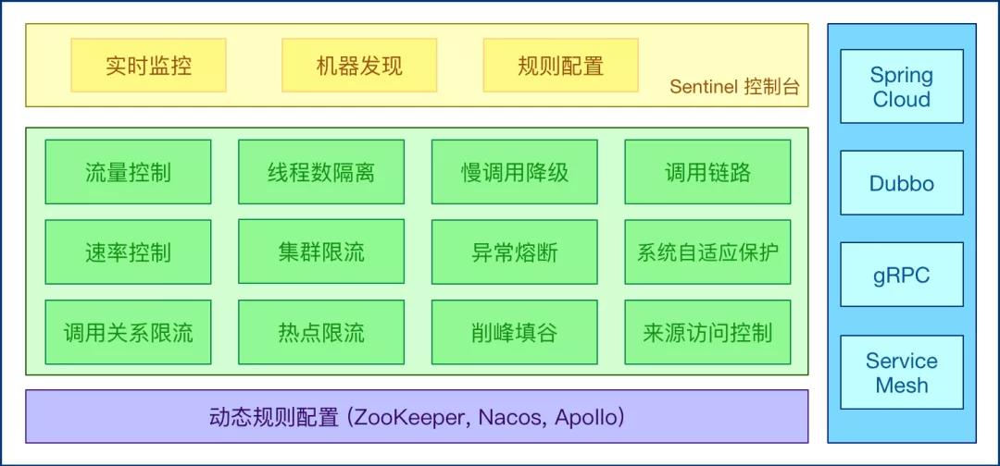

# 服务限流的思路

在上一篇[《撸一撸限流算法》](../Algorithm/撸一撸限流算法.md)中，着重以伪代码实例讲解限流的几种主流算法，这一篇主要在理论上讲解限流的几种思路。

对系统服务进行限流，一般有如下几个模式：

## 容器限流

### Tomcat 限流

tomcat限流的方式就是通过tomcat的配置文件，设置最大线程数，当请求的并发大于最大线程数时，请求就会排队执行，相当于实现了限流的目的。

在tomcat目录文件conf/server.xml下配置：

```xml
<Connector port="8080" protocol="HTTP/1.1"
          connectionTimeout="20000"
          maxThreads="150"
          redirectPort="8443" />
```

这里的`maxThreads`即是最大并发线程数。

### Nginx 限流

nginx的限流与tomcat的限流类似，也是通过配置文件实现。

主要是两种方式：

- **控制速率**
- **控制并发连接数**

#### 控制速率

在 `nginx.conf` 配置文件的 http 模块中添加限流配置：

> 格式：limit_req_zone key zone rate

```xml
http {
    limit_req_zone $binary_remote_addr zone=myRateLimit:10m rate=10r/s;
}
```

配置 **server**，使用 **limit_req** 指令应用限流。

```xml
server {
    location / {
		limit_req zone=myRateLimit;
        proxy_pass http://my_upstream;
    }
}
```

- **key** ：定义限流对象，binary_remote_addr 是一种key，表示基于 remote_addr(客户端IP) 来做限流，binary_ 的目的是压缩内存占用量。
- **zone**：定义共享内存区来存储访问信息， myRateLimit:10m 表示一个大小为10M，名字为myRateLimit的内存区域。1M能存储16000 IP地址的访问信息，10M	可以存储16W IP地址访问信息。
- **rate**： 用于设置最大访问速率，rate=10r/s 表示每秒最多处理10个请求。Nginx 实际上以毫秒为粒度来跟踪请求信息，因此 10r/s 实际上是限制：每100毫秒处理一	个请求。这意味着，自上一个请求处理完后，若后续100毫秒内又有请求到达，将拒绝处理该请求。

#### 控制并发连接数

利用 **limit_conn_zone** 和 **limit_conn** 两个指令即可。

 Nginx 官方例子：

```xml
limit_conn_zone $binary_remote_addr zone=perip:10m;
limit_conn_zone $server_name zone=perserver:10m;

server {
    ...
    limit_conn perip 10;
    limit_conn perserver 100;
}
```

**limit_conn perip 10** 作用的 key 是 **$binary_remote_addr**，表示限制单个IP同时最多能持有10个连接。

**limit_conn perserver 100** 作用的 key 是 **$server_name**，表示虚拟主机(server) 同时能处理并发连接的总数。

## 服务端限流

#### 限流算法

服务端限流常用的限流算法有4种：

- 固定窗口算法
- 滑动窗口算法
- 漏桶算法
- 令牌桶算法

在另一篇文章[《撸一撸限流算法》](../Algorithm/撸一撸限流算法.md)中有图码详解。

#### 具体的实现

##### Google Guava 类库的 RateLimiter

基于**令牌桶算法**实现，适用于单体架构。

```java
// 每秒2个的速率提交任务
final RateLimiter rateLimiter = RateLimiter.create(2.0);
void submitTasks(List tasks, Executor executor) {
    for (Runnable task : tasks) {
        rateLimiter.acquire(); // 令牌用完了则等待
        executor.execute(task);
    }
}
```

##### redis + Lua

Lua脚本大致逻辑如下：

```shell
-- 获取调用脚本时传入的第一个key值（用作限流的 key）
local key = KEYS[1]
-- 获取调用脚本时传入的第一个参数值（限流大小）
local limit = tonumber(ARGV[1])

-- 获取当前流量大小
local curentLimit = tonumber(redis.call('get', key) or "0")

-- 是否超出限流
if curentLimit + 1 > limit then
-- 返回(拒绝)
return 0
else
-- 没有超出 value + 1
redis.call("INCRBY", key, 1)
-- 设置过期时间
redis.call("EXPIRE", key, 2)
-- 返回(放行)
return 1
end
```

##### 网关层限流：

比如Zuul、Spring Cloud Gateway等，而像spring cloud - gateway网关限流底层实现原理，就是基于Redis + Lua，通过内置Lua限流脚本的方式。


##### 阿里巴巴sentinel

启动sentinel务端，在sentinel的控制台针对你的`接口资源`配置相应的规则即可，非常简单。


## 服务熔断

系统在设计之初就把熔断措施考虑进去。当系统出现问题时，如果短时间内无法修复，系统要自动做出判断，**开启熔断开关**，拒绝流量访问，避免大流量对后端的过载请求。

系统也应该能够动态监测后端程序的修复情况，当程序已恢复稳定时，可以关闭熔断开关，恢复正常服务。常见的熔断组件有`Hystrix`以及阿里的`Sentinel`，两种互有优缺点，可以根据业务的实际情况进行选择。



## 服务降级

将系统的所有功能服务进行一个**分级**，当系统出现问题需要紧急限流时，可将不是那么重要的功能进行降级处理，停止服务，这样可以释放出更多的资源供给核心功能的去用。

> 例如在电商平台中，如果突发流量激增，可临时将商品评论、积分等非核心功能进行降级，停止这些服务，释放出机器和CPU等资源来保障用户正常下单，而这些降级的功能服务可以等整个系统恢复正常后，再来启动，进行补单/补偿处理。除了功能降级以外，还可以采用不直接操作数据库，而全部读缓存、写缓存的方式作为临时降级方案。

## 延迟处理

这个模式需要在系统的前端设置一个`流量缓冲池`，将所有的请求全部缓冲进这个池子，不立即处理。然后后端真正的业务处理程序从这个池子中取出请求依次处理，常见的可以用`队列模式`来实现。这就相当于用异步的方式去减少了后端的处理压力，但是当流量较大时，后端的处理能力有限，缓冲池里的请求可能处理不及时，会有一定程度延迟。漏桶算法以及令牌桶算法就是这个思路。

## 特权处理

这个模式需要将用户进行**分类**，通过预设的分类，让系统优先处理需要高保障的用户群体，其它用户群的请求就会延迟处理或者直接不处理。

## 缓存、降级、限流的区别

### 缓存

**缓存**，是用来增加系统吞吐量，提升访问速度提供高并发。

### 降级

**降级**，是在系统某些服务组件不可用的时候、流量暴增、资源耗尽等情况下，暂时屏蔽掉出问题的服务，继续提供降级服务，给用户尽可能的友好提示，返回`兜底数据`，不会影响整体业务流程，待问题解决再重新上线服务。

### 限流

**限流**，是指在使用缓存和降级无效的场景。比如当达到阈值后限制接口调用频率，访问次数，库存个数等，在出现服务不可用之前，提前把服务降级。**只服务好一部分用户。**

