# 构建高性能Web站点

高性能架构肯定不仅仅指的是响应速度，还包括了能处理高的并发量，有高的吞吐量，一个好的高性能架构设计少不了理论的支撑，也少不了具体的套路。

## 理论

在解决高并发、海量数据处理、高可靠性等一系列问题和挑战的过程中，大型的互联网公司有很多被验证行之有效的解决方案，这些解决方案被更多的网站重复验证，形成了一套可靠的理论指导，在正确的理论基础上去打造高性能架构可以避免少走很多弯路。

> 由于一个高性能的Web网站可以优化的点太多，实现的技术也五花八门，写一本书都不够讲，所以理论部分用思维导图来代替，列出了抽象层次较高一些的点。

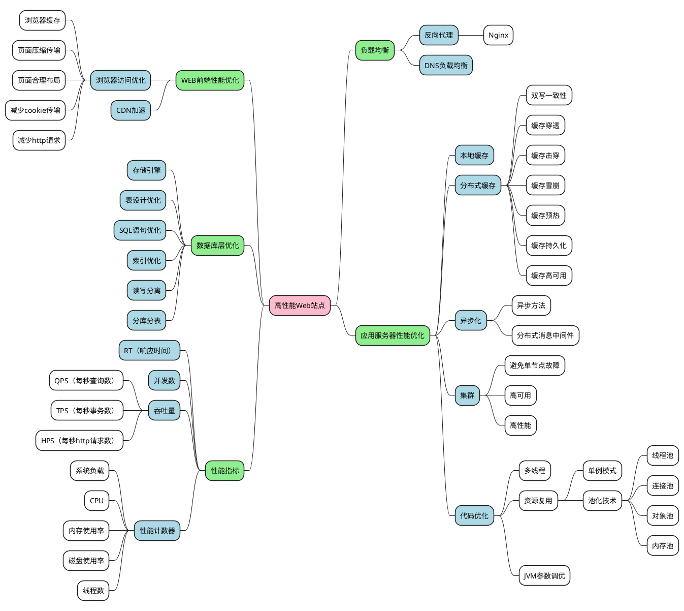

## 实践

正确使用架构方案可以更好地利用业界和前人的思想与实践，用更少的时间开发出更好的系统，使设计者的水平也达到更高的境界，使用者应该对自己的遇到的问题深刻分析后，再采取相应的解决方案，不恰当地使用模式只会画虎不成反类犬，不但没有解决原来的老问题，反而带来了更棘手的新问题，好的架构设计需要建立在对问题深刻理解之上的创造与创新。

### 1、初始阶段的网站架构

大型网站都是从小型网站发展而来，网站架构也是一样，是从小型网站架构逐步演化而来。小型网站最开始没有太多人访问，只需要一台服务器就绰绰有余，这时的网站架构如下图所示：

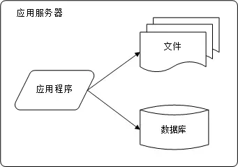

应用程序、数据库、文件等所有资源都在一台服务器上。

### 2、应用服务和数据服务分离

随着网站业务的发展，一台服务器逐渐不能满足需求：越来越多的用户访问导致性能越来越差，越来越多的数据导致存储空间不足。这时就需要将应用和数据分离。

应用和数据分离后整个网站使用3台服务器：**应用服务器**、**文件服务器**和**数据库服务器**。这 3 台服务器对硬件资源的要求各不相同：

> 应用服务器需要处理大量的业务逻辑，因此需要更快更强大的CPU；
> 数据库服务器需要快速磁盘检索和数据缓存，因此需要更快的磁盘和更大的内存；
> 文件服务器需要存储大量用户上传的文件，因此需要更大的硬盘。

此时，网站系统的架构如下图所示：

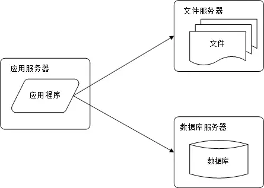

应用和数据分离后，不同特性的服务器承担不同的服务角色，网站的并发处理能力和数据存储空间得到了很大改善，支持网站业务进一步发展。但是随着用户逐渐增多，网站又一次面临挑战：数据库压力太大导致访问延迟，进而影响整个网站的性能，用户体验受到影响。这时需要对网站架构进一步优化。

### 3、使用缓存改善网站性能

网站访问的特点和现实世界的财富分配一样遵循二八定律：80% 的业务访问集中在20% 的数据上。既然大部分业务访问集中在一小部分数据上，那么如果把这一小部分数据缓存在内存中，就可以减少数据库的访问压力，提高整个网站的数据访问速度，改善数据库的写入性能了。 

网站使用的缓存可以分为两种：缓存在应用服务器上的**本地缓存**和缓存在专门的分布式缓存服务器上的**远程缓存**。

> 本地缓存的访问速度更快一些，但是受应用服务器内存限制，其缓存数据量有限，而且会出现和应用程序争用内存的情况。
> 远程分布式缓存可以使用集群的方式，部署大内存的服务器作为专门的缓存服务器，可以在理论上做到不受内存容量限制的缓存服务。

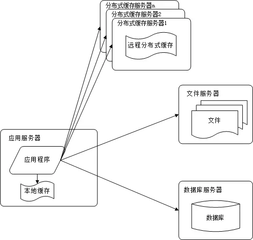

使用缓存后，数据访问压力得到有效缓解，但是单一应用服务器能够处理的请求连接有限，在网站访问高峰期，应
用服务器成为整个网站的瓶颈。

### 4、使用应用服务器集群改善网站的并发处理能力

使用集群是网站解决高并发、海量数据问题的常用手段。

当一台服务器的处理能力、存储空间不足时，不要企图去更换更强大的服务器，对大型网站而言，不管多么强大的服务器，都满足不了网站持续增长的业务需求。这种情况下，更恰当的做法是增加一台服务器分担原有服务器的访问及存储压力。 

**对网站架构而言，只要能通过增加一台服务器的方式改善负载压力，就可以以同样的方式持续增加服务器不断改善系统性能，从而实现系统的可伸缩性。**

应用服务器实现集群是网站可伸缩架构设计中较为简单成熟的一种，如下图所示：

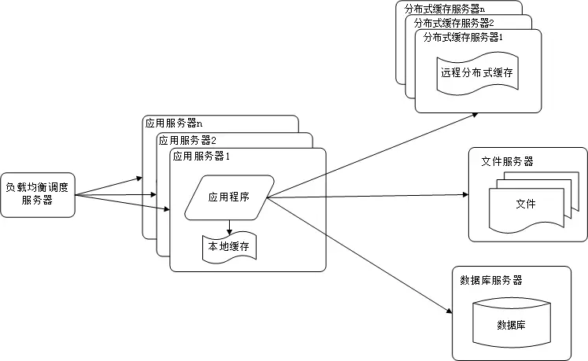

通过负载均衡调度服务器，可以将来自用户浏览器的访问请求分发到应用服务器集群中的任何一台服务器上，如果有更多用户，就在集群中加入更多的应用服务器，使应用服务器的压力不再成为整个网站的瓶颈。

### 5、数据库读写分离

网站在使用缓存后，使对大部分数据读操作访问都可以不通过数据库就能完成，但是仍有一部分读操作（缓存访问不命中、缓存过期）和全部的写操作都需要访问数据库，在网站的用户达到一定规模后，数据库因为负载压力过高而成为网站的瓶颈。

目前大部分的主流数据库都提供**主从热备**功能，通过配置两台数据库主从关系，可以将一台数据库服务器的数据更新同步到另一台服务器上。

网站利用数据库的这一功能，实现数据库读写分离，从而改善数据库负载压力。如下图所示：

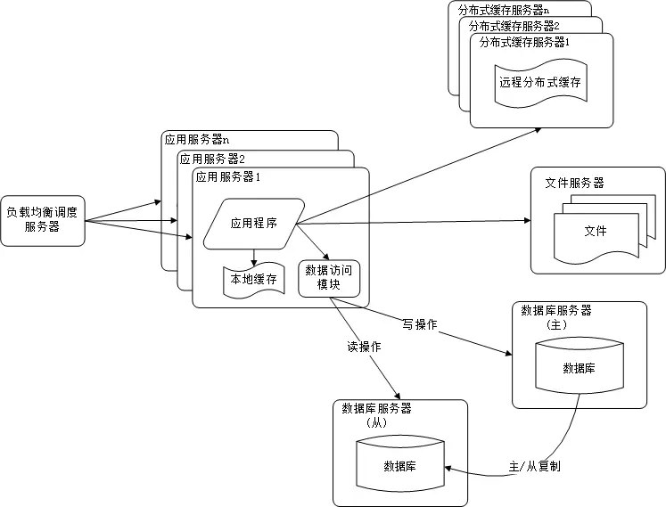

应用服务器在写数据的时候，访问主数据库，主数据库通过主从复制机制将数据更新同步到从数据库，这样当应用服务器读数据的时候，就可以通过从数据库获得数据。为了便于应用程序访问读写分离后的数据库，通常在应用服务器端使用专门的数据访问模块，使数据库读写分离对应用透明。

### 6、使用反向代理和 CDN 加速网站响应

随着网站业务不断发展，用户规模越来越大，由于中国复杂的网络环境，不同地区的用户访问网站时，速度差别也极大。有研究表明，网站访问延迟和用户流失率正相关，网站访问越慢，用户越容易失去耐心而离开。为了提供更好的用户体验，留住用户，网站需要加速网站访问速度。

主要手段有使用 **CDN** 和**方向代理**。如下图所示：

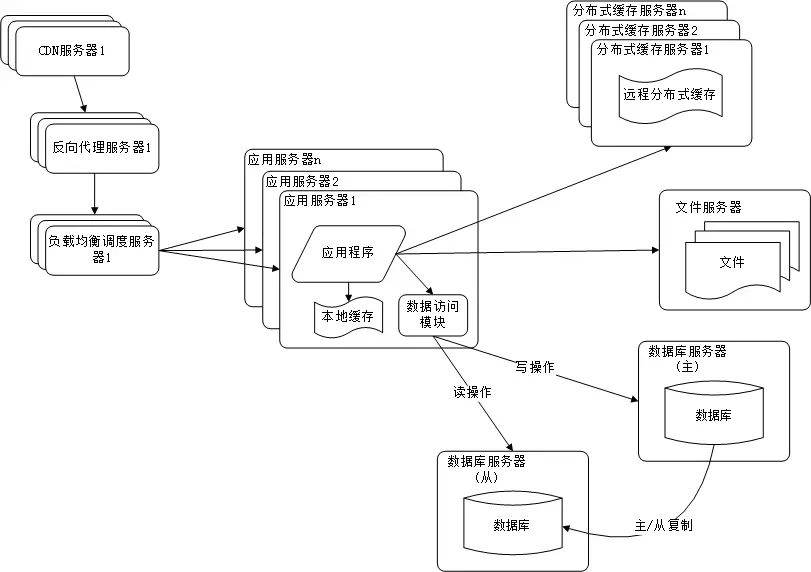

**CDN 和反向代理的基本原理都是缓存。**

> CDN 部署在网络提供商的机房，使用户在请求网站服务时，可以从距离自己最近的网络提供商机房获取数据反向代理则部署在网站的中心机房，当用户请求到达中心机房后，首先访问的服务器是反向代理服务器，如果反向代理服务器中缓存着用户请求的资源，就将其直接返回给用户

使用 CDN 和反向代理的目的都是尽早返回数据给用户，一方面加快用户访问速度，另一方面也减轻后端服务器的负载压力。

### 7、使用分布式文件系统和分布式数据库系统

任何强大的单一服务器都满足不了大型网站持续增长的业务需求。数据库经过读写分离后，从一台服务器拆分成两台服务器，但是随着网站业务的发展依然不能满足需求，这时需要使用分布式数据库。文件系统也一样，需要使用分布式文件系统。

如下图所示：

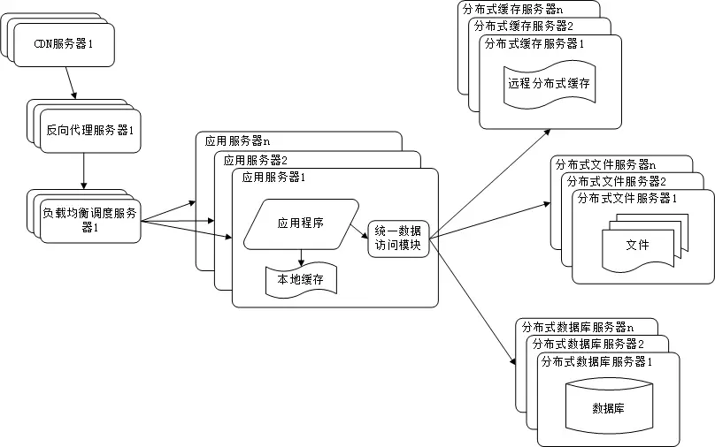

**分布式数据库是网站数据库拆分的最后手段**，只有在单表数据规模非常庞大的时候才使用。不到不得已时，网站更常用的数据库拆分手段是**业务分库**，将不同业务的数据部署在不同的物理服务器上。

### 8、使用 NoSQL 和搜索引擎

随着网站业务越来越复杂，对数据存储和检索的需求也越来越复杂，网站需要采用一些非关系数据库技术如NoSQL 和非数据库查询技术如搜索引擎。

如下图所示：

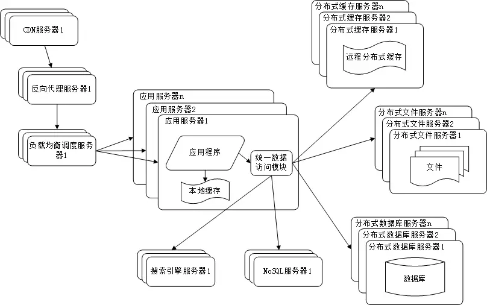

NoSQL 和搜索引擎都是源自互联网的技术手段，对可伸缩的分布式特性具有更好的支持。应用服务器则通过一个统一数据访问模块访问各种数据，减轻应用程序管理诸多数据源的麻烦。

### 9、业务拆分

大型网站为了应对日益复杂的业务场景，通过使用分而治之的手段将整个网站业务分成不同的产品线。如大型购物交易网站都会将首页、商铺、订单、买家、卖家等拆分成不同的产品线，分归不同的业务团队负责。

具体到技术上，也会根据产品线划分，将一个网站拆分成许多不同的应用，每个应用独立部署。应用之间可以通过一个超链接建立关系（在首页上的导航链接每个都指向不同的应用地址），也可以通过消息队列进行数据分发，当然最多的还是通过访问同一个数据存储系统来构成一个关联的完整系统。

如下图所示：

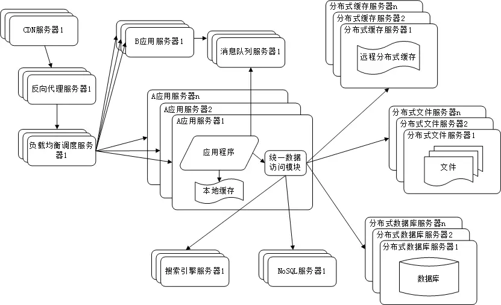

### 10、分布式微服务

随着业务拆分越来越小，存储系统越来越庞大，应用系统的整体复杂度呈指数级增加，部署维护越来越困难。由于所有应用要和所有数据库系统连接，在数万台服务器规模的网站中，这些连接的数目是服务器规模的平方，导致数据库连接资源不足，拒绝服务。

既然每一个应用系统都需要执行许多相同的业务操作，比如用户管理、商品管理等，那么可以将这些共用的业务提取出来，独立部署。由这些可复用的业务连接数据库，提供共用业务服务，而应用系统只需要管理用户界面，通过分布式服务调用共用业务服务完成具体业务操作。

如下图所示：

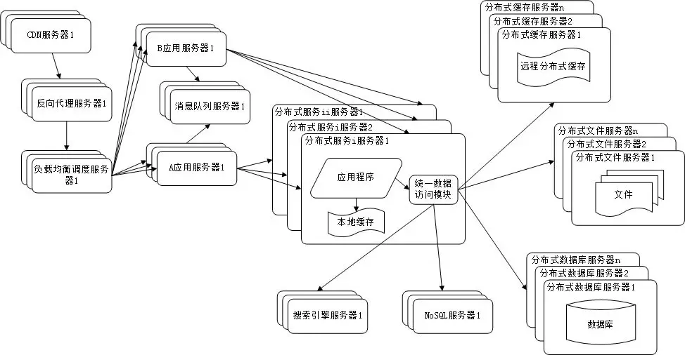

## 总结

通过打造高性能架构的基石后端服务架构，可以看出来打造高性能Web应用有赖于大量的技术的，我们的产品的整体性能是所有这些组成部分性能的表现之和。

网站性能对最终用户而言是一种主观感受，性能优化的最终目的就是改善用户的体验，使他们感觉网站很快。离开这个目的，追求技术上的所谓高性能，是舍本逐末，没有多大意义。而用户体验的快或是慢，可以通过技术手段改善，也可以通过优化交互体验改善。

即使在技术层面，性能优化也需要全面考虑，综合权衡：性能提升一倍，但服务器数量也需要增加一倍；或者响应时间缩短，同时数据一致性也下降，这样的优化是否可以接受？这类问题的答案不是技术团队能回答的。归根结底，技术是为业务服务的，技术选型和架构决策依赖业务规划乃至企业战略规划，离开业务发展的支撑和驱动，技术走不远，甚至还会迷路。 当然也没有任何一个网站从出生第一天具备了超级高的访问量，网站的性能问题都是在成长的过程的逐步暴露出来的，不同的阶段会面临对应的问题，分析自己的产品和业务特征、现在具体面临的问题、因将来需要面临的挑战，然后应用合理方式去设计架构，正确使用理论可以更好地利用业界和前人的思想与实践，用更少的时间开发出更好的系统，使设计者的水平也达到更高的境界。但是每种理论模式受其适用场景限制，对系统的要求和约束也很多，不恰当地使用模式只会画虎不成反类犬，不但没有解决原来的老问题，反而带来了更棘手的新问题，好的架构设计绝对不是模仿，不是生搬硬套某个模式，一定是对问题深刻理解之上的创造与创新。

**由于本文主题是高性能的Web架构，着重于从如何打造快速响应、应对高并发、高吞吐、让用户感受到非常快的体验的角度来进行阐述的，实际上，对于一个好的 Web 架构来说，除了高性能这个指标外，还必须兼顾高可用、可伸缩、可拓展、安全等多个方面，由于主题以及篇幅有限，虽文中也有提及但不展开详谈**，有兴趣的同学可以自行研究，期望本文的介绍能给对设计高性能架构感兴趣的同行学者提供一定的参考。

