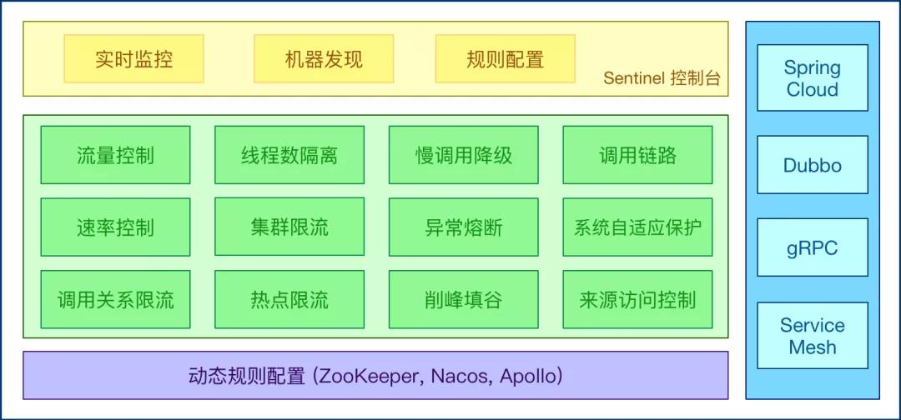

# 限流的思路

在上一篇[《撸一撸限流算法》](../Algorithm/撸一撸限流算法.md)中，着重以伪代码实例讲解限流的几种主流算法，这一篇主要在理论上讲解限流的几种思路。

对系统服务进行限流，一般有如下几个模式：

## 熔断

系统在设计之初就把熔断措施考虑进去。当系统出现问题时，如果短时间内无法修复，系统要自动做出判断，**开启熔断开关**，拒绝流量访问，避免大流量对后端的过载请求。

系统也应该能够动态监测后端程序的修复情况，当程序已恢复稳定时，可以关闭熔断开关，恢复正常服务。常见的熔断组件有`Hystrix`以及阿里的`Sentinel`，两种互有优缺点，可以根据业务的实际情况进行选择。

## 服务降级

将系统的所有功能服务进行一个**分级**，当系统出现问题需要紧急限流时，可将不是那么重要的功能进行降级处理，停止服务，这样可以释放出更多的资源供给核心功能的去用。

> 例如在电商平台中，如果突发流量激增，可临时将商品评论、积分等非核心功能进行降级，停止这些服务，释放出机器和CPU等资源来保障用户正常下单，而这些降级的功能服务可以等整个系统恢复正常后，再来启动，进行补单/补偿处理。除了功能降级以外，还可以采用不直接操作数据库，而全部读缓存、写缓存的方式作为临时降级方案。

## 延迟处理

这个模式需要在系统的前端设置一个`流量缓冲池`，将所有的请求全部缓冲进这个池子，不立即处理。然后后端真正的业务处理程序从这个池子中取出请求依次处理，常见的可以用`队列模式`来实现。这就相当于用异步的方式去减少了后端的处理压力，但是当流量较大时，后端的处理能力有限，缓冲池里的请求可能处理不及时，会有一定程度延迟。漏桶算法以及令牌桶算法就是这个思路。

## 特权处理

这个模式需要将用户进行**分类**，通过预设的分类，让系统优先处理需要高保障的用户群体，其它用户群的请求就会延迟处理或者直接不处理。

## 缓存、降级、限流的区别

### 缓存

**缓存**，是用来增加系统吞吐量，提升访问速度提供高并发。

### 降级

**降级**，是在系统某些服务组件不可用的时候、流量暴增、资源耗尽等情况下，暂时屏蔽掉出问题的服务，继续提供降级服务，给用户尽可能的友好提示，返回`兜底数据`，不会影响整体业务流程，待问题解决再重新上线服务。

### 限流

**限流**，是指在使用缓存和降级无效的场景。比如当达到阈值后限制接口调用频率，访问次数，库存个数等，在出现服务不可用之前，提前把服务降级。**只服务好一部分用户。**

