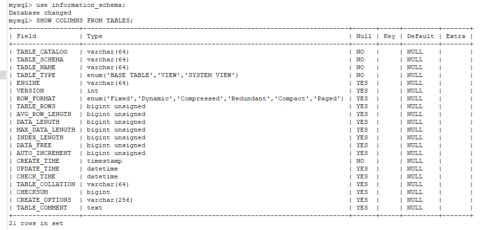
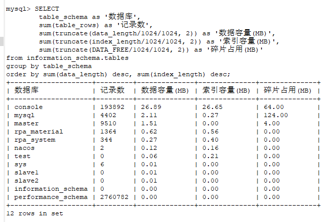
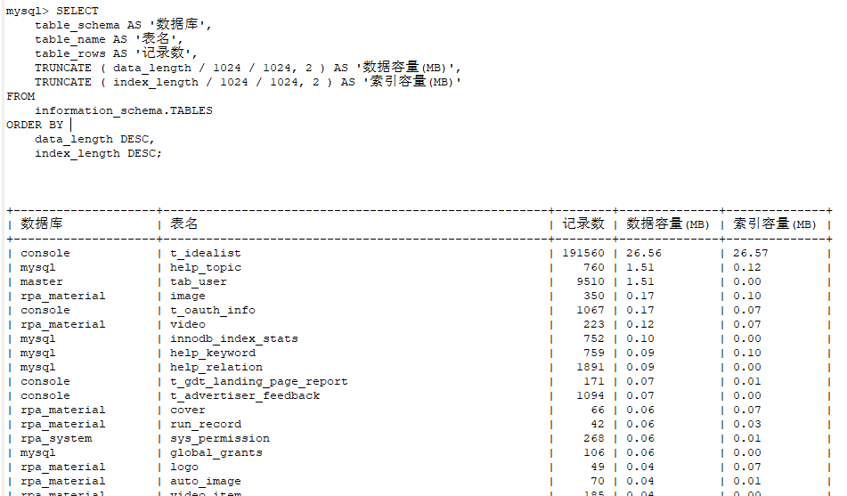
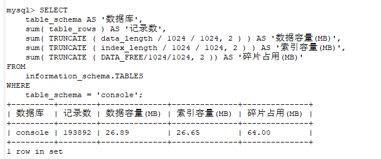
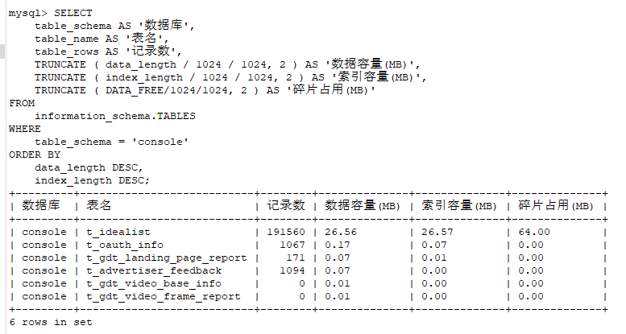
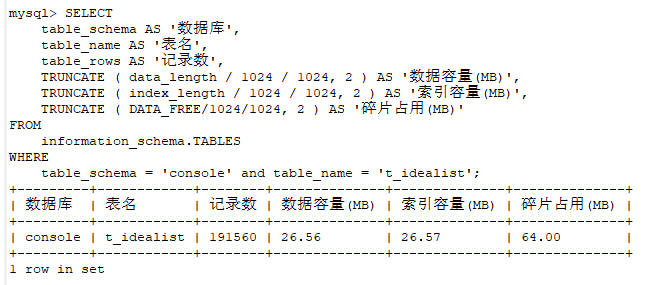

# MySQL查看数据库容量

在每个 MySQL 实例中，都有一个独立的 `information_schema` 库，它是自带的默认库，记录着这个 MySQL 实例中所有数据库的元数据、统计信息、以及有关 MySQL 的访问权限信息。这其中就包括了所有数据库、表、索引的详细信息。

用到的`information_schema` 库中 `Table` 表里的字段：

- `TABLE_SCHEMA` : 数据库名
- `TABLE_NAME`：表名
- `ENGINE`：所使用的存储引擎
- `TABLES_ROWS`：记录数
- `DATA_LENGTH`：数据容量大小
- `INDEX_LENGTH`：索引容量大小

更多有关 `information_schema` 的信息，大家可在查看 [MySQL 手册](https://dev.mysql.com/doc/refman/8.0/en/information-schema.html) 深入了解。

有关 `information_schema.TABLES` 更多字段信息，可以使用以下命令查看更多：

```sql
use information_schema;
SHOW COLUMNS FROM TABLES;
```



需要特别注意的是：

> `data_length` 、`index_length` 、`DATA_FREE` 等字段，所存储的容量信息单位是字节，所以我们要除以 2 个 1024 把字节转化为可读性更强的 MB

## 1、查看 MySQL「所有库」的容量大小

```sql
SELECT 
    table_schema as '数据库',
    sum(table_rows) as '记录数',
    sum(truncate(data_length/1024/1024, 2)) as '数据容量(MB)',
    sum(truncate(index_length/1024/1024, 2)) as '索引容量(MB)',
    sum(truncate(DATA_FREE/1024/1024, 2)) as '碎片占用(MB)'
from information_schema.tables
group by table_schema
order by sum(data_length) desc, sum(index_length) desc;
```



## 2. 查看 MySQL「所有库」中「所有表」的容量大小

```sql
SELECT 
    table_schema AS '数据库', 
    table_name AS '表名', 
    table_rows AS '记录数', 
    TRUNCATE ( data_length / 1024 / 1024, 2 ) AS '数据容量(MB)', 
    TRUNCATE ( index_length / 1024 / 1024, 2 ) AS '索引容量(MB)',
    TRUNCATE ( DATA_FREE/1024/1024, 2 ) AS '碎片占用(MB)'
FROM 
    information_schema.TABLES  
ORDER BY 
    data_length DESC, 
    index_length DESC;
```



## 3. 查看 MySQL「指定库」的容量大小

```sql
SELECT 
    table_schema AS '数据库', 
    sum( table_rows ) AS '记录数', 
    sum( TRUNCATE ( data_length / 1024 / 1024, 2 ) ) AS '数据容量(MB)', 
    sum( TRUNCATE ( index_length / 1024 / 1024, 2 ) ) AS '索引容量(MB)',
    sum( TRUNCATE ( DATA_FREE/1024/1024, 2 )) AS '碎片占用(MB)'
FROM 
    information_schema.TABLES  
WHERE 
    table_schema = 'console'; 
```



## 4. 查看 MySQL「指定库」中「所有表」的容量大小

```sql
SELECT 
    table_schema AS '数据库', 
    table_name AS '表名', 
    table_rows AS '记录数', 
    TRUNCATE ( data_length / 1024 / 1024, 2 ) AS '数据容量(MB)', 
    TRUNCATE ( index_length / 1024 / 1024, 2 ) AS '索引容量(MB)',  
    TRUNCATE ( DATA_FREE/1024/1024, 2 ) AS '碎片占用(MB)'
FROM 
    information_schema.TABLES  
WHERE 
    table_schema = 'console'  
ORDER BY 
    data_length DESC, 
    index_length DESC; 
```



## 5. 查看 MySQL「指定库」中「指定表」的容量大小

```sql
SELECT 
    table_schema AS '数据库', 
    table_name AS '表名', 
    table_rows AS '记录数', 
    TRUNCATE ( data_length / 1024 / 1024, 2 ) AS '数据容量(MB)', 
    TRUNCATE ( index_length / 1024 / 1024, 2 ) AS '索引容量(MB)',  
    TRUNCATE ( DATA_FREE/1024/1024, 2 ) AS '碎片占用(MB)'
FROM 
    information_schema.TABLES  
WHERE 
    table_schema = 'console' and table_name = 't_idealist';
```



