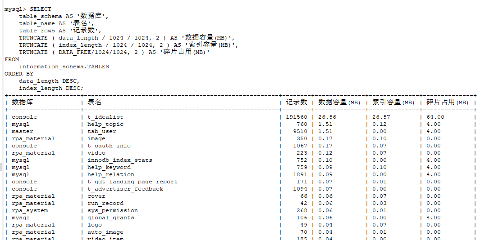

# MySQL查看数据库容量

## 1、查看所有数据库容量大小

```sql
SELECT 
    table_schema AS '数据库', 
    sum( table_rows ) AS '记录数', 
    sum( TRUNCATE ( data_length / 1024 / 1024, 2 ) ) AS '数据容量(MB)', 
    sum( TRUNCATE ( index_length / 1024 / 1024, 2 ) ) AS '索引容量(MB)'  
FROM 
    information_schema.TABLES  
GROUP BY 
    table_schema  
ORDER BY 
    sum( data_length ) DESC, 
    sum( index_length ) DESC; 
```


## 2. 查看所有数据库各表容量大小

```sql
SELECT 
    table_schema AS '数据库', 
    table_name AS '表名', 
    table_rows AS '记录数', 
    TRUNCATE ( data_length / 1024 / 1024, 2 ) AS '数据容量(MB)', 
    TRUNCATE ( index_length / 1024 / 1024, 2 ) AS '索引容量(MB)'  
FROM 
    information_schema.TABLES  
ORDER BY 
    data_length DESC, 
    index_length DESC;
```



## 3. 查看指定数据库容量大小

```sql
SELECT 
    table_schema AS '数据库', 
    sum( table_rows ) AS '记录数', 
    sum( TRUNCATE ( data_length / 1024 / 1024, 2 ) ) AS '数据容量(MB)', 
    sum( TRUNCATE ( index_length / 1024 / 1024, 2 ) ) AS '索引容量(MB)'  
FROM 
    information_schema.TABLES  
WHERE 
    table_schema = 'mysql'; 
```

## 4. 查看指定数据库各表容量大小

```sql
SELECT 
    table_schema AS '数据库', 
    table_name AS '表名', 
    table_rows AS '记录数', 
    TRUNCATE ( data_length / 1024 / 1024, 2 ) AS '数据容量(MB)', 
    TRUNCATE ( index_length / 1024 / 1024, 2 ) AS '索引容量(MB)'  
FROM 
    information_schema.TABLES  
WHERE 
    table_schema = 'mysql'  
ORDER BY 
    data_length DESC, 
    index_length DESC; 
```

