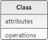
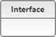
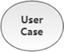
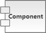
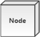
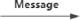
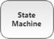
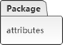

# UML统一建模语言

**UML（Unified Modeling Language，统一建模语言）**是用来设计软件蓝图的可视化建模语言，是一种为面向对象系统的产品进行说明、可视化和编制文档的标准语言，独立于任何一种具体的程序设计语言。

1997 年 UML 被`国际对象管理组织（OMG）`采纳为面向对象的建模语言的国际标准。

> 它的特点是简单、统一、图形化、能表达软件设计中的动态与静态信息。

## 应用场景

UML 能为软件开发的所有阶段提供`模型化`和`可视化`支持。而且融入了软件工程领域的新思想、新方法和新技术，使软件设计人员沟通更简明，进一步缩短了设计时间，减少开发成本。

UML 具有很宽的应用领域。其中最常用的是建立软件系统的模型，但它同样可以用于描述非软件领域的系统，如机械系统、企业机构或业务过程，以及处理复杂数据的信息系统、具有实时要求的工业系统或工业过程等。总之，**UML 可以对任何具有静态结构和动态行为的系统进行建模，而且使用于从需求规格描述直至系统完成后的测试和维护等系统开发的各个阶段。**

UML 模型大多以图表的方式表现出来，一份典型的建模图表通常包含几个块或框、连接线和作为模型附加信息的文本。这些虽简单却非常重要，在 UML 规则中相互联系和扩展。

在这里大家可能会疑问，UML 明明是一种图形，为什么说是语言呢？

语言是包括`文字`和`图形`的，有很多内容文字是无法表达的。你见过建筑设计图纸吗？里面还不是很多图形，光用文字能表达清楚建筑设计吗？在建筑界，有一套标准来描述设计，同样道理，在软件开发界，我们也需要一套标准来帮助我们做好软件开发的工作。UML 就是其中的一种标准，注意这可不是唯一标准，只是 UML 是大家比较推崇的一种标准而已。**UML 并不是强制性标准**，没有规定在软件开发中一定要用 UML，但是我们需要包括 UML 在内的各种标准，来提高我们软件开发的水平。

## 基本构件

UML 建模的核心是`模型`，**模型是现实的简化、真实系统的抽象。**UML 提供了系统的设计蓝图。当给软件系统建模时，需要采用通用的符号语言，这种描述模型所使用的语言被称为建模语言。在 UML 中，所有的描述由事物、关系和图这些构件组成。下图完整地描述了所有构件的关系。

## 事物

事物是抽象化的最终结果，分为结构事物、行为事物、分组事物和注释事物。

#### 1. 结构事物

结构事物是模型中的静态部分，用以呈现概念或实体的表现元素，如下表所示。

| 事物                   | 解释                                                         | 图例                         |
| ---------------------- | ------------------------------------------------------------ | ---------------------------- |
| 类（Class）            | 具有相同属性、方法、关系和语义的对象集合                     |  |
| 接口（Interface）      | 指一个类或构件的一个服务的操作集合，它仅仅定义了一组操作的规范，并没有给出这组操作的具体实现 |  |
| 用例（User Case）      | 指对一组动作序列的描述，系统执行这些动作将产生一个对特定的参与者（Actor）有价值且可观察的结果 |  |
| 协作（Collaboration）  | 定义元素之间的相互作用                                       |  |
| 组件（Component）      | 描述物理系统的一部分                                         |  |
| 活动类（Active Class） | 指对象有一个或多个进程或线程。活动类和类很相象，只是它的对象代表的元素的行为和其他元素是同时存在的 |  |
| 节点（Node）           | 定义为运行时存在的物理元素                                   |  |

#### 2. 行为事物

行为事物指 UML 模型中的动态部分，如下表所示。

| 事物                    | 解释                       | 用例                          |
| ----------------------- | -------------------------- | ----------------------------- |
| 交互（Interaction）     | 包括一组元素之间的消息交换 |   |
| 状态机（State Machine） | 由一系列对象的状态组成     |  |

#### 3. 分组事物

目前只有一种分组事物，即包。包纯碎是概念上的，只存在于开发阶段，结构事物、行为事物甚至分组事物都有可能放在一个包中，如下表所示。

| 事物          | 解释                | 用例                          |
| ------------- | ------------------- | ----------------------------- |
| 包（Package） | UML中唯一的组织机制 |  |

#### 4. 注释事物

注释事物是解释 UML 模型元素的部分，如下表所示。

| 事物         | 解释                  | 用例                          |
| ------------ | --------------------- | ----------------------------- |
| 注释（Note） | 用于解析说明 UML 元素 |  |

## 图

UML2.0 一共有 `13` 种图（UML1.5 定义了 9 种，UML2.0 增加了 4 种），分别是**类图、对象图、构件图、部署图、活动图、状态图、用例图、时序图、协作图** 9 种，以及**包图、组合结构图、时间图、交互概览图** 4 种。

| 图名称                                      | 解释                                                         |
| ------------------------------------------- | ------------------------------------------------------------ |
| 类图（Class Diagrams）                      | 用于定义系统中的类                                           |
| 对象图（Object Diagrams）                   | 类图的一个实例，描述了系统在具体时间点上所包含的对象及各个对象之间的关系 |
| 构件图（Component Diagrams）                | 一种特殊的 UML 图，描述系统的静态实现视图                    |
| 部署图（Deployment Diagrams）               | 定义系统中软硬件的物理体系结构                               |
| 活动图（Activity Diagrams）                 | 用来描述满足用例要求所要进行的活动及活动间的约束关系         |
| 状态图（State Chart Diagrams）              | 用来描述类的对象的所有可能的状态和时间发生时，状态的转移条件 |
| 用例图（Usecase Diagrams）                  | 用来描述用户的需求，从用户的角度描述系统的功能，并指出各功能的执行者，强调谁在使用系统、系统为执行者完成哪些功能 |
| 时序图（Sequence Diagrams）                 | 描述对象之间的交互顺序，着重体现对象间消息传递的时间顺序，强调对象之间消息的发送顺序，同时显示对象之间的交互过程 |
| 协作图（Collaboration Diagrams）            | 描述对象之间的合作关系，更侧重向用户对象说明哪些对象有消息的传递 |
| 包图（Package Diagrams）                    | 对构成系统的模型元素进行分组整理的图                         |
| 组合结构图（Composite Structure Diagrams）  | 表示类或者构建内部结构的图                                   |
| 时间图（Timing Diagrams）                   | 用来显示随时间变化，一个或多个元素的值或状态的更改，也显示时间控制事件之间的交互及管理它们的时间和期限约束 |
| 交互概览图（Interaction Overview Diagrams） | 用活动图来表示多个交互之间的控制关系的图                     |

