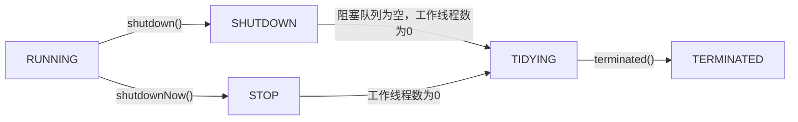

# Java线程池源码解析
## 绕不开的线程池

只看`ThreadPoolExecutor`的英文语义就能知道这是一个与线程池有关的类。  

关于线程池，搞过开发的肯定都知道，也都能或多或少讲出相关知识；尽管如此，作者在还是想要不厌其烦的给大家加深加深记忆😀😀

线程池是一种`池化技术`，Java中类似的池化技术有很多，  
常见的有：
- 数据库连接池
- redis连接池
- http连接池
- 内存池
- 线程池

池化技术的作用：把一些能够`复用`的东西（比如说连接、线程）放到初始化好的池中，便于资源`统一管理`。  
这样做的好处：
> 1. 避免重复创建、销毁、调度的开销，提高性能
> 2. 保证内核的充分利用，防止过分调度
> 3. 自定义参数配置达到最佳的使用效果

### 线程池的使用场景
- 生产者与消费者问题是线程池的典型应用场景
- 当你有批量的任务需要多线程处理时，那么基本上你就需要使用线程池

## ThreadPoolExecutor 知识点


## Java中创建线程池的方法
### 不推荐
通过`Executors`类的静态方法创建如下线程池
- FixedThreadPool (固定个数)
- ScheduledThreadPool (执行周期性任务)
- WorkStealingPool (根据当前电脑CPU处理器数量生成相应线程数)
- CachedThreadPool (带缓存功能)
- SingleThreadPool (单个线程)


### 推荐
通过`ThreadPoolExecutor`创建线程池

```java
    // 给线程定义有业务含义的名称
    ThreadFactory threadFactory = new ThreadFactoryBuilder().setNameFormat("thread-pool-%s").build();
    ThreadPoolExecutor threadPoolExecutor = new ThreadPoolExecutor(
            5,  // 线程池核心线程数
            10,  // 线程池最大线程数，达到最大值后线程池不会再增加线程
            1000,  // 线程池中超过corePoolSize数目的空闲线程最大存活时间
            TimeUnit.MILLISECONDS,  // 时间单位，毫秒
            new LinkedBlockingQueue<>(50),  // 工作线程等待队列
            threadFactory,  // 自定义线程工厂
            new ThreadPoolExecutor.AbortPolicy());  // 线程池满时的拒绝策略
```

### 为什么
先来看看阿里巴巴出品的`《Java开发手册》`中怎么说？


再来看看源码怎么写？  

  

以`SingleThreadPool`为例，其实现也是通过`ThreadPoolExecutor`的构造方法创建的线程池，
之所以不推荐的原因是其使用了`LinkedBlockingQueue`作为工作线程的等待队列，其是一种无界缓冲等待队列，该队列的默认构造器定义的长度为`Integer.MAX_VALUE`  

  

`FixedThreadPool`同理


`CachedThreadPool`采用了`SynchronousQueue`队列，也是一种无界无缓冲等待队列，而且其最大线程数是`Integer.MAX_VALUE` 


`ScheduledThreadPool`采用了`DelayedWorkQueue`队列，是一种无界阻塞队列，其最大线程数是`Integer.MAX_VALUE` 


以上四种线程池都有`OOM`的风险  
相反，在使用`ThreadPoolExecutor`时，我们可以指定有界/无界阻塞队列，并指定初始长度。

## ThreadPoolExecutor源码分析

### 线程池生命周期



| 线程池状态 | 状态释义 |
| --- | --- |
| RUNNING | 线程池被创建后的初始状态，能接受新提交的任务，并且也能处理阻塞队列中的任务 |
| SHUTDOWN | 关闭状态，不再接受新提交的任务，但仍可以继续处理已进入阻塞队列中的任务 |
| STOP | 会中断正在处理任务的线程，不能再接受新任务，也不继续处理队列中的任务 |
| TIDYING | 所有的任务都已终止，workerCount(有效工作线程数)为0 |
| TERMINATED | 线程池彻底终止运行 |


`Tips：`千万不要把线程池的状态和线程的状态弄混了。补一张网上的线程状态图


`Tips：`当线程调用`start()`，线程在JVM中不一定立即执行，有可能要等待操作系统分配资源，此时为`READY`状态，当线程获得资源时进入`RUNNING`状态，才会真正开始执行。

### 线程池的核心组成


一个完整的线程池，应该包含以下几个核心部分：
-   **任务提交**：提供接口接收任务的提交；
-   **任务管理**：选择合适的队列对提交的任务进行管理，包括对拒绝策略的设置；
-   **任务执行**：由工作线程来执行提交的任务；
-   **线程池管理**：包括基本参数设置、任务监控、工作线程管理等

### 拒绝策略
- CallerRunsPolicy（在当前线程中执行）
- 


- AbortPolicy（直接抛出RejectedExecutionException）
- 


- DiscardPolicy（直接丢弃线程）
- 


- DiscardOldestPolicy（丢弃一个未被处理的最久的线程，然后重试）
- 


当没有显示指明拒绝策略时，默认使用`AbortPolicy`


### ThreadPoolExecutor类图
通过IDEA的`Diagrams`工具查看UML类图，继承关系一目了然


`ThreadPoolExecutor`类中的方法很多，最核心就是构造线程池的方法和执行线程任务的方法，先前已经给出了标准的构造方法，接下来就讲一讲如何执行线程任务...

### 任务执行机制
- 通过执行`execute`方法
该方法无返回值，为`ThreadPoolExecutor`自带方法，传入`Runnable`类型对象


- 通过执行`submit`方法
该方法返回值为`Future`对象，为抽象类`AbstractExecutorService`的方法，被`ThreadPoolExecutor`继承，其内部实现也是调用了接口类`Executor`的`execute`方法，通过上面的类图可以看到，该方法的实现依然是`ThreadPoolExecutor`的`execute`方法


### execute()执行流程图


### execute()源码解读

```java
    // 使用原子操作类AtomicInteger的ctl变量，前3位记录线程池的状态，后29位记录线程数
    private final AtomicInteger ctl = new AtomicInteger(ctlOf(RUNNING, 0));
    // Integer的范围为[-2^31,2^31 -1], Integer.SIZE-3 =32-3= 29，用来辅助左移位运算
    private static final int COUNT_BITS = Integer.SIZE - 3;
    // 高三位用来存储线程池运行状态，其余位数表示线程池的容量
    private static final int CAPACITY   = (1 << COUNT_BITS) - 1;

    // 线程池状态以常量值被存储在高三位中
    private static final int RUNNING    = -1 << COUNT_BITS; // 线程池接受新任务并会处理阻塞队列中的任务
    private static final int SHUTDOWN   =  0 << COUNT_BITS; // 线程池不接受新任务，但会处理阻塞队列中的任务
    private static final int STOP       =  1 << COUNT_BITS; // 线程池不接受新的任务且不会处理阻塞队列中的任务，并且会中断正在执行的任务
    private static final int TIDYING    =  2 << COUNT_BITS; // 所有任务都执行完成，且工作线程数为0，将调用terminated方法
    private static final int TERMINATED =  3 << COUNT_BITS; // 最终状态，为执行terminated()方法后的状态

    // ctl变量的封箱拆箱相关的方法
    private static int runStateOf(int c)     { return c & ~CAPACITY; } // 获取线程池运行状态
    private static int workerCountOf(int c)  { return c & CAPACITY; } // 获取线程池运行线程数
    private static int ctlOf(int rs, int wc) { return rs | wc; } // 获取ctl对象
```

```java
public void execute(Runnable command) {
    if (command == null) // 任务为空，抛出NPE
        throw new NullPointerException();
        
    int c = ctl.get(); // 获取当前工作线程数和线程池运行状态（共32位，前3位为运行状态，后29位为运行线程数）
    if (workerCountOf(c) < corePoolSize) { // 如果当前工作线程数小于核心线程数
        if (addWorker(command, true)) // 在addWorker中创建工作线程并执行任务
            return;
        c = ctl.get();
    }
    
    // 核心线程数已满（工作线程数>核心线程数）才会走下面的逻辑
    if (isRunning(c) && workQueue.offer(command)) { // 如果当前线程池状态为RUNNING，并且任务成功添加到阻塞队列
        int recheck = ctl.get(); // 双重检查，因为从上次检查到进入此方法，线程池可能已成为SHUTDOWN状态
        if (! isRunning(recheck) && remove(command)) // 如果当前线程池状态不是RUNNING则从队列删除任务
            reject(command); // 执行拒绝策略
        else if (workerCountOf(recheck) == 0) // 当线程池中的workerCount为0时，此时workQueue中还有待执行的任务，则新增一个addWorker，消费workqueue中的任务
            addWorker(null, false);
    }
    // 阻塞队列已满才会走下面的逻辑
    else if (!addWorker(command, false)) // 尝试增加工作线程执行command
        // 如果当前线程池为SHUTDOWN状态或者线程池已饱和
        reject(command); // 执行拒绝策略
}
```
``` java
private boolean addWorker(Runnable firstTask, boolean core) {
    retry: // 循环退出标志位
    for (;;) { // 无限循环
        int c = ctl.get();
        int rs = runStateOf(c); // 线程池状态

        // Check if queue empty only if necessary.
        if (rs >= SHUTDOWN && 
            ! (rs == SHUTDOWN && firstTask == null && ! workQueue.isEmpty()) // 换成更直观的条件语句
            // (rs != SHUTDOWN || firstTask != null || workQueue.isEmpty())
           )
           // 返回false的条件就可以分解为：
           //（1）线程池状态为STOP，TIDYING，TERMINATED
           //（2）线程池状态为SHUTDOWN，且要执行的任务不为空
           //（3）线程池状态为SHUTDOWN，且任务队列为空
            return false;

        // cas自旋增加线程个数
        for (;;) {
            int wc = workerCountOf(c); // 当前工作线程数
            if (wc >= CAPACITY ||
                wc >= (core ? corePoolSize : maximumPoolSize)) // 工作线程数>=线程池容量 || 工作线程数>=(核心线程数||最大线程数)
                return false;
            if (compareAndIncrementWorkerCount(c)) // 执行cas操作，添加线程个数
                break retry; // 添加成功，退出外层循环
            // 通过cas添加失败
            c = ctl.get();  
            // 线程池状态是否变化，变化则跳到外层循环重试重新获取线程池状态，否者内层循环重新cas
            if (runStateOf(c) != rs)
                continue retry;
            // else CAS failed due to workerCount change; retry inner loop
        }
    }
    // 简单总结上面的CAS过程：
    //（1）内层循环作用是使用cas增加线程个数，如果线程个数超限则返回false，否者进行cas
    //（2）cas成功则退出双循环，否者cas失败了，要看当前线程池的状态是否变化了
    //（3）如果变了，则重新进入外层循环重新获取线程池状态，否者重新进入内层循环继续进行cas

    // 走到这里说明cas成功，线程数+1，但并未被执行
    boolean workerStarted = false; // 工作线程调用start()方法标志
    boolean workerAdded = false; // 工作线程被添加标志
    Worker w = null;
    try {
        w = new Worker(firstTask); // 创建工作线程实例
        final Thread t = w.thread; // 获取工作线程持有的线程实例
        if (t != null) {
            final ReentrantLock mainLock = this.mainLock; // 使用全局可重入锁
            mainLock.lock(); // 加锁，控制并发
            try {
                // Recheck while holding lock.
                // Back out on ThreadFactory failure or if
                // shut down before lock acquired.
                int rs = runStateOf(ctl.get()); // 获取当前线程池状态

                // 线程池状态为RUNNING或者（线程池状态为SHUTDOWN并且没有新任务时）
                if (rs < SHUTDOWN ||
                    (rs == SHUTDOWN && firstTask == null)) {
                    if (t.isAlive()) // 检查线程是否处于活跃状态
                        throw new IllegalThreadStateException();
                    workers.add(w); // 线程加入到存放工作线程的HashSet容器，workers全局唯一并被mainLock持有
                    int s = workers.size();
                    if (s > largestPoolSize)
                        largestPoolSize = s;
                    workerAdded = true;
                }
            } finally {
                mainLock.unlock(); // finally块中释放锁
            }
            if (workerAdded) { // 线程添加成功
                t.start(); // 调用线程的start()方法
                workerStarted = true;
            }
        }
    } finally {
        if (! workerStarted) // 如果线程启动失败，则执行addWorkerFailed方法
            addWorkerFailed(w);
    }
    return workerStarted;
}
```
```java
private void addWorkerFailed(Worker w) {
    final ReentrantLock mainLock = this.mainLock;
    mainLock.lock();
    try {
        if (w != null)
            workers.remove(w); // 线程启动失败时，需将前面添加的线程删除
        decrementWorkerCount(); // ctl变量中的工作线程数-1
        tryTerminate(); // 尝试将线程池转变成TERMINATE状态
    } finally {
        mainLock.unlock();
    }
}
```
```java
final void tryTerminate() {
    for (;;) {
        int c = ctl.get();
        // 以下情况不会进入TERMINATED状态：
        //（1）当前线程池为RUNNING状态
        //（2）在TIDYING及以上状态
        //（3）SHUTDOWN状态并且工作队列不为空
        //（4）当前活跃线程数不等于0
        if (isRunning(c) ||
            runStateAtLeast(c, TIDYING) ||
            (runStateOf(c) == SHUTDOWN && ! workQueue.isEmpty()))
            return;
        if (workerCountOf(c) != 0) { // 工作线程数!=0
            interruptIdleWorkers(ONLY_ONE); // 中断一个正在等待任务的线程
            return;
        }

        final ReentrantLock mainLock = this.mainLock;
        mainLock.lock();
        try {
            // 通过CAS自旋判断直到当前线程池运行状态为TIDYING并且活跃线程数为0
            if (ctl.compareAndSet(c, ctlOf(TIDYING, 0))) {
                try {
                    terminated(); // 调用线程terminated()
                } finally {
                    ctl.set(ctlOf(TERMINATED, 0)); // 设置线程池状态为TERMINATED，工作线程数为0
                    termination.signalAll(); // 通过调用Condition接口的signalAll()唤醒所有等待的线程
                }
                return;
            }
        } finally {
            mainLock.unlock();
        }
        // else retry on failed CAS
    }
}
```

### Worker源码解读

`Worker`是`ThreadPoolExecutor`类的内部类，此处只讲最重要的构造函数和run方法

```java
private final class Worker extends AbstractQueuedSynchronizer implements Runnable
{
    // 该worker正在运行的线程
    final Thread thread;
    
    // 将要运行的初始任务
    Runnable firstTask;
    
    // 每个线程的任务计数器
    volatile long completedTasks;

    // 构造方法   
    Worker(Runnable firstTask) {
        setState(-1); // 调用runWorker()前禁止中断
        this.firstTask = firstTask;
        this.thread = getThreadFactory().newThread(this); // 通过ThreadFactory创建一个线程
    }

    // 实现了Runnable接口的run方法
    public void run() {
        runWorker(this);
    }
    
    ... // 此处省略了其他方法
}
```

`Worker`实现了`Runable`接口，在调用start()方法候，实际执行的是run方法

```java
final void runWorker(Worker w) {
    Thread wt = Thread.currentThread();
    Runnable task = w.firstTask; // 获取工作线程中用来执行任务的线程实例
    w.firstTask = null;
    w.unlock(); // status设置为0，允许中断
    boolean completedAbruptly = true; // 线程意外终止标志
    try {
        // 如果当前任务不为空，则直接执行；否则调用getTask()从任务队列中取出一个任务执行
        while (task != null || (task = getTask()) != null) {
            w.lock(); // 加锁，保证下方临界区代码的线程安全
            // 如果状态值大于等于STOP且当前线程还没有被中断，则主动中断线程
            if ((runStateAtLeast(ctl.get(), STOP) ||
                 (Thread.interrupted() &&
                  runStateAtLeast(ctl.get(), STOP))) &&
                !wt.isInterrupted())
                wt.interrupt(); // 中断当前线程
            try {
                beforeExecute(wt, task); // 任务执行前的回调，空实现，可以在子类中自定义
                Throwable thrown = null;
                try {
                    task.run(); // 执行线程的run方法
                } catch (RuntimeException x) {
                    thrown = x; throw x;
                } catch (Error x) {
                    thrown = x; throw x;
                } catch (Throwable x) {
                    thrown = x; throw new Error(x);
                } finally {
                    afterExecute(task, thrown); // 任务执行后的回调，空实现，可以在子类中自定义
                }
            } finally {
                task = null; // 将循环变量task设置为null，表示已处理完成
                w.completedTasks++; // 当前已完成的任务数+1
                w.unlock();
            }
        }
        completedAbruptly = false;
    } finally {
        processWorkerExit(w, completedAbruptly);
    }
}
```
#### 从任务队列中取出一个任务

```java
private Runnable getTask() {
    boolean timedOut = false; // 通过timeOut变量表示线程是否空闲时间超时了
    // 无限循环
    for (;;) {
        int c = ctl.get(); // 线程池信息
        int rs = runStateOf(c); // 线程池当前状态

        // 如果线程池状态>=SHUTDOWN并且工作队列为空 或 线程池状态>=STOP，则返回null，让当前worker被销毁
        if (rs >= SHUTDOWN && (rs >= STOP || workQueue.isEmpty())) {
            decrementWorkerCount(); // 工作线程数-1
            return null;
        }

        int wc = workerCountOf(c); // 获取当前线程池的工作线程数

        // 当前线程是否允许超时销毁的标志
        // 允许超时销毁：当线程池允许核心线程超时 或 工作线程数>核心线程数
        boolean timed = allowCoreThreadTimeOut || wc > corePoolSize;

        // 如果(当前线程数大于最大线程数 或 (允许超时销毁 且 当前发生了空闲时间超时))
        // 且(当前线程数大于1 或 阻塞队列为空)
        // 则减少worker计数并返回null
        if ((wc > maximumPoolSize || (timed && timedOut))
            && (wc > 1 || workQueue.isEmpty())) {
            if (compareAndDecrementWorkerCount(c))
                return null;
            continue;
        }

        try {
            // 根据线程是否允许超时判断用poll还是take（会阻塞）方法从任务队列头部取出一个任务
            Runnable r = timed ?
                workQueue.poll(keepAliveTime, TimeUnit.NANOSECONDS) :
                workQueue.take();
            if (r != null)
                return r; // 返回从队列中取出的任务
            timedOut = true;
        } catch (InterruptedException retry) {
            timedOut = false;
        }
    }
}
```
总结一下哪些情况getTask()会返回null：
> 1. 线程池状态为SHUTDOWN且任务队列为空
> 2. 线程池状态为STOP、TIDYING、TERMINATED
> 3. 线程池线程数大于最大线程数
> 4. 线程可以被超时回收的情况下等待新任务超时

#### 工作线程退出

```java
private void processWorkerExit(Worker w, boolean completedAbruptly) {
    // 如果completedAbruptly为true则表示任务执行过程中抛出了未处理的异常
    // 所以还没有正确地减少worker计数，这里需要减少一次worker计数
    if (completedAbruptly) 
        decrementWorkerCount();

    final ReentrantLock mainLock = this.mainLock;
    mainLock.lock();
    try {
        // 把将被销毁的线程已完成的任务数累加到线程池的完成任务总数上
        completedTaskCount += w.completedTasks;
        workers.remove(w); // 从工作线程集合中移除该工作线程
    } finally {
        mainLock.unlock();
    }

    // 尝试结束线程池
    tryTerminate();

    int c = ctl.get();
    // 如果是RUNNING 或 SHUTDOWN状态
    if (runStateLessThan(c, STOP)) {
        // worker是正常执行完
        if (!completedAbruptly) {
            // 如果允许核心线程超时则最小线程数是0，否则最小线程数等于核心线程数
            int min = allowCoreThreadTimeOut ? 0 : corePoolSize;
            // 如果阻塞队列非空，则至少要有一个线程继续执行剩下的任务
            if (min == 0 && ! workQueue.isEmpty())
                min = 1;
            // 如果当前线程数已经满足最小线程数要求，则不需要再创建替代线程
            if (workerCountOf(c) >= min)
                return; // replacement not needed
        }
        // 重新创建一个worker来代替被销毁的线程
        addWorker(null, false);
    }
}
```

## 参考资料
[Java线程池实现原理及其在美团业务中的实践](https://tech.meituan.com/2020/04/02/java-pooling-pratice-in-meituan.html)
