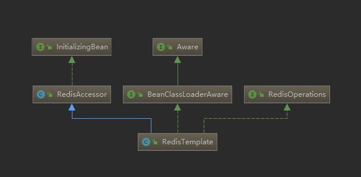

# RedisTemplate使用不当导致的线上事故

## 一、前因

公司有个核心项目redis的客户端一直是使用的jedis，后面技术负责人要求把jedis客户端替换成效能更高的lettuce客户端，同时使用spring框架自带的RedisTemplate类来操作redis。

## 二、事故预演

按照预设的结果，本次开发任务应该是非常轻松的：

1. 将配置文件中jedis连接池的配置项平移替换成lettuce的；
2. 把项目中jedis配置相关的代码删掉；
3. 把使用到jedis的地方替换成redisTemplate。

### 伪代码

其他配置项不一一展示

```xml
spring.redis.jedis.pool.max-idle = 200
spring.redis.jedis.pool.min-idle = 10
spring.redis.jedis.pool.max-active = 200
spring.redis.jedis.pool.max-wait = 2000
```

替换成

```xml
spring.redis.lettuce.pool.max-idle = 200
spring.redis.lettuce.pool.min-idle = 10
spring.redis.lettuce.pool.max-wait = 2000
spring.redis.lettuce.pool.max-active = 200
```

业务代码也从jedis换成redisTemplate

jedis的伪代码：

```java
/**
 * 设置商品库存到redis - jedis
 * @param goodId 商品id
 * @param count 库存量
 * @return
 */    
@PatchMapping("/storage/jedis")
public String setStorageByJedis(
    @RequestParam("goodId") String goodId,
    @RequestParam("count") String count) {
    Jedis jedis = getJedis();
    jedis.set("good:" + goodId, count);
    jedis.close();
    return "success";
}
```

redisTemplate的伪代码：

```java
/**
 * 设置商品库存到redis - redisTemplate
 * @param goodId 商品id
 * @param count 库存量
 * @return
 */
@PatchMapping("/storage")
public String setStorage(
    @RequestParam("goodId") String goodId,
    @RequestParam("count") String count) {
    redisTemplate.opsForValue().set("good:" + goodId, count);
    return "success";
}
```

然而一切工作做完，信心满满的上线发布之后，却爆了很多线上bug。


从错误日志中我们可以清晰的看到是因为String类型的数据无法转换成int类型，我心中出现了一个大大的问号：明明我存到redis的是可以转成数字类型的字符串呀？

### 原因分析

通过Redis-Desktop-Manager可视化工具查看数据


发现string类型的键值对value值多了**一对双引号**

**纳尼！怎么用jedis的时候就没有，换成redisTemplate就有了？**

经过一番代码检查，发现使用redisTemplate的过程中好像少了一个步骤：**配置序列化**

一般如果没有特殊配置或者要使用redis连接池，就只用在配置中心或者配置文件中加入

```
spring.redis.host = 172.0.0.1
spring.redis.port = 6379
spring.redis.password = 123456
```

然后注入redisTemplate就可以使用了，非常简单。

然而RedisTemplate使用的默认序列化器是JDK自带的序列化器，看源码：


看RedisTemplate的类图



由于RedisTemplate继承了RedisAccessor，RedisAccessor实现了InitializingBean，所以在RedisTemplate类初始化完成后，可以重写`afterPropertiesSet()`方法，设置序列化器。

### 解决方案

写一个redis的配置类，重新设置序列化器。

```java
@Configuration
@ConditionalOnClass(RedisOperations.class)
public class RedisTemplateAutoConfiguration {

    @Bean
    @ConditionalOnMissingBean(name="redisTemplate")
    public RedisTemplate redisTemplate(RedisConnectionFactory redisConnectionFactory){
        RedisTemplate template=new RedisTemplate();
        template.setKeySerializer(new StringRedisSerializer());
        template.setValueSerializer(new StringRedisSerializer());
        template.setConnectionFactory(redisConnectionFactory);
        return template;
    }

```

**这里只针对redis的string类型配置StringRedisSerializer序列化器，大家可以根据项目实际需求增加Hash对象类型的配置。**

Spring自带提供了多种序列化器，如下


也可以自定义序列化器，需要实现RedisSerializer接口，并重写serialize()和deserialize()方法。

为了方便演示，没有写全局的redis配置类，直接在接口中重置序列化器，伪代码如下：

```java
@PatchMapping("/storage")
public String setStorage(
	@RequestParam("goodId") String goodId,
	@RequestParam("count") String count) {
	redisTemplate.setKeySerializer(new StringRedisSerializer()); // 重置redis string类型key的序列化器
	redisTemplate.setValueSerializer(new StringRedisSerializer()); // 重置redis string类型value的序列化器
	redisTemplate.opsForValue().set("good:" + goodId, count);
	return "success";
}
```

