# Spring实用代码技巧

## 获取spring容器对象

### 实现BeanFactoryAware接口

```java
@Slf4j
@Service
public class UserService implements BeanFactoryAware {

    private BeanFactory beanFactory;

    @Override
    public void setBeanFactory(BeanFactory beanFactory) {
        this.beanFactory = beanFactory;
    }

    void show() {
        User user = (User) beanFactory.getBean("user");
        log.info("{}",user);
    }
}
```

实现BeanFactoryAware接口，然后重写`setBeanFactory`方法。

### 实现ApplicationContextAware接口

```java
@Slf4j
@Service
public class UserService2 implements ApplicationContextAware {
    private ApplicationContext applicationContext;

    @Override
    public void setApplicationContext(ApplicationContext applicationContext) {
        this.applicationContext = applicationContext;
    }

    void show() {
        User user = (User) applicationContext.getBean("user");
        user.setAge(28);
        log.info("{}", user);
    }
}
```

实现ApplicationContextAware接口，然后重写`setApplicationContext`方法。

### 实现ApplicationListener接口

```java
@Slf4j
@Service
public class UserService3 implements ApplicationListener<ContextRefreshedEvent> {

    private ApplicationContext applicationContext;

    @Override
    public void onApplicationEvent(ContextRefreshedEvent contextRefreshedEvent) {
        applicationContext = contextRefreshedEvent.getApplicationContext();
    }

    void show() {
        User user = (User) applicationContext.getBean("user");
        user.setAge(38);
        log.info("{}", user);
    }
}
```

实现ApplicationListener接口，需要注意的是该接口接收的泛型是ContextRefreshedEvent类，然后重写`onApplicationEvent`方法。

## 初始化bean

### XML中指定init-method方法（基本弃用）

```java
public class UserService4 {

    void initUser() {
        System.out.println("init by spring-beans.xml");
    }
}
<bean id="initMethod" class="com.rameo.springskill.service.UserService4" init-method="initUser"/>
```

### 使用@PostConstruct注解

```java
public class UserService4 { 
 
    @PostConstruct 
    public void init() { 
        System.out.println("init by @PostConstruct"); 
    } 
} 
```

在需要初始化的方法上增加`@PostConstruct`注解，这样就有初始化的能力。

### 实现InitializingBean接口

```java
public class UserService4 implements InitializingBean { 
 
    @Override 
    public void afterPropertiesSet() throws Exception { 
        System.out.println("init by afterPropertiesSet");
    } 
} 
```

实现InitializingBean接口，重写`afterPropertiesSet()`方法，该方法中可以完成初始化功能。

他们的调用优先级如图：

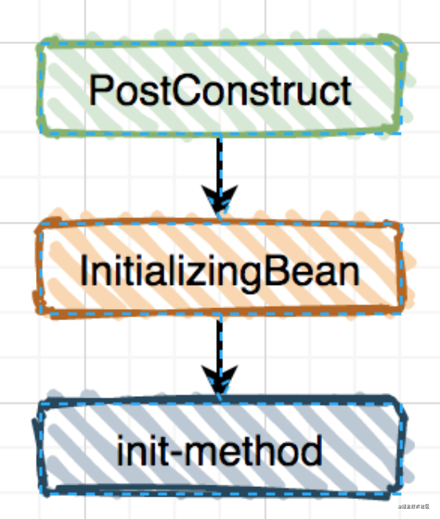

***

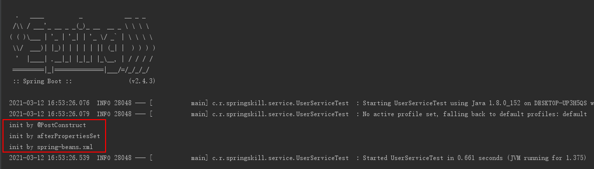

## 强大的@Conditional

我们在项目的实际开发过程中经常会遇到下面的场景：

- 某个功能需要根据项目中有没有某个class/jar判断是否开启该功能。

- 某个bean的实例化需要先判断另一个bean有没有实例化，再判断是否实例化自己。

- 某个功能是否开启，在配置文件中有个参数可以对它进行控制。

这时候就可以用到Conditional家族了

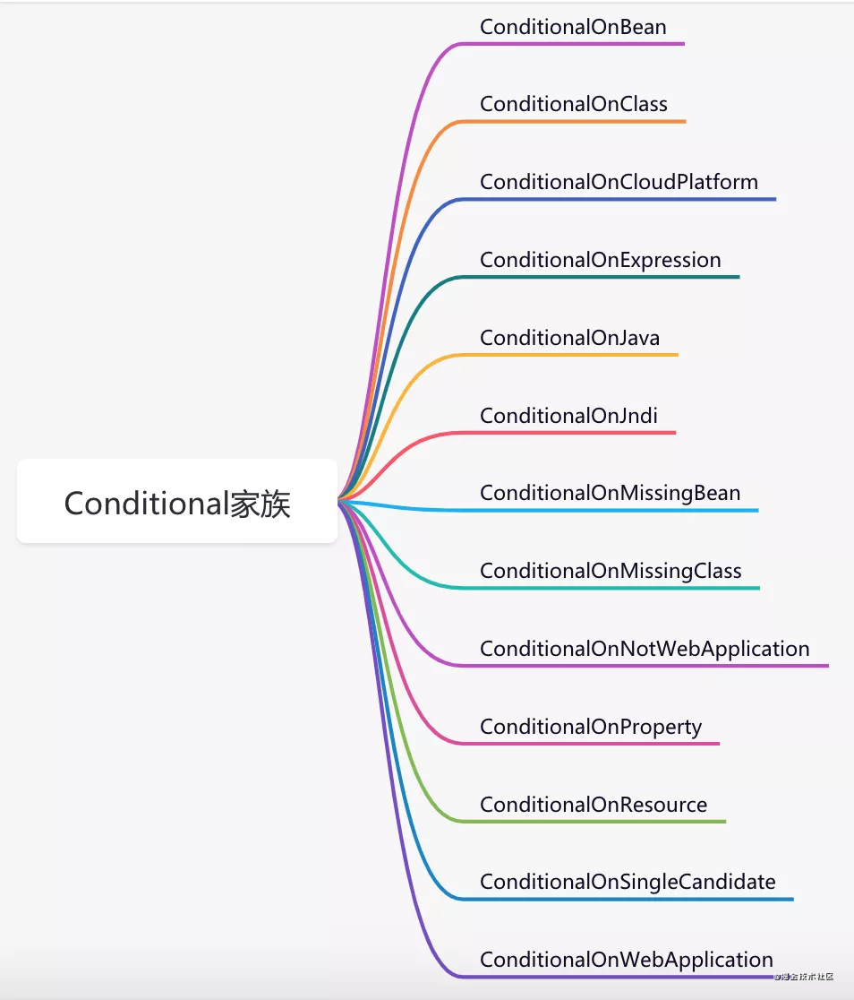

介绍几个常用的：

### @ConditionalOnClass

问题1可以用@`ConditionalOnClass`注解解决，代码如下：

```java
public class A {
}

public class B {
}

@ConditionalOnClass(B.class)
@Configuration
public class TestConfiguration {

    @Bean
    public A a() {
      return new A();
    }
}
```

如果项目中存在B类，则会实例化A类。如果不存在B类，则不会实例化A类。

### @ConditionalOnBean

问题2可以通过`@ConditionalOnBean`注解解决，代码如下：

```java
@Configuration
public class TestConfiguration {

    @Bean
    public B b() {
        return new B();
    }

    @ConditionalOnBean(name="b")
    @Bean
    public A a() {
      return new A();
    }
}
```

实例A只有在实例B存在时，才能实例化。

### @ConditionalOnProperty

问题3可以通过`@ConditionalOnProperty`注解解决，代码如下：

```
@ConditionalOnProperty(prefix = "demo",name="enable", havingValue = "true",matchIfMissing=true )
@Configuration
public class TestConfiguration {

    @Bean
    public A a() {
      return new A();
    }
}
```

 在`applicationContext.properties`文件中配置参数：

```properties
demo.enable=false
```

 各参数含义：

- prefix 表示参数名的前缀，这里是demo

- name 表示参数名

- havingValue 表示指定的值，参数中配置的值需要跟指定的值比较是否相等，相等才满足条件

- matchIfMissing 表示是否允许缺省配置。

这个功能可以作为开关，相比`EnableXXX`注解的开关更优雅，因为它可以通过参数配置是否开启，而`EnableXXX`注解的开关需要在代码中硬编码开启或关闭。

### 自定义Conditional

`springboot`自带的`Conditional`系列已经可以满足我们绝大多数的需求了。但如果你有比较特殊的场景，也可以自定义自定义Conditional。

第一步，自定义注解：

```java
@Conditional(MyCondition.class)
@Retention(RetentionPolicy.RUNTIME)
@Target({ElementType.TYPE, ElementType.METHOD})
@Documented
public @interface MyConditionOnProperty {
    String name() default "";
    String havingValue() default "";
}
```

第二步，实现`Condition`接口：

```java
public class MyCondition implements Condition {
    @Override
    public boolean matches(ConditionContext context, AnnotatedTypeMetadata metadata) {
        System.out.println("实现自定义逻辑");
        return false;
    }
}
```

 第三步，使用@MyConditionOnProperty注解。

`Conditional`的奥秘就藏在`ConfigurationClassParser`类的`processConfigurationClass`方法中： 

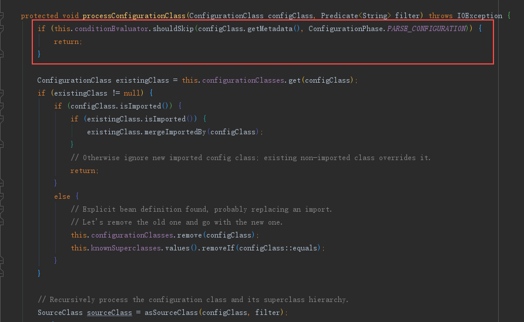


这个方法逻辑流程： 

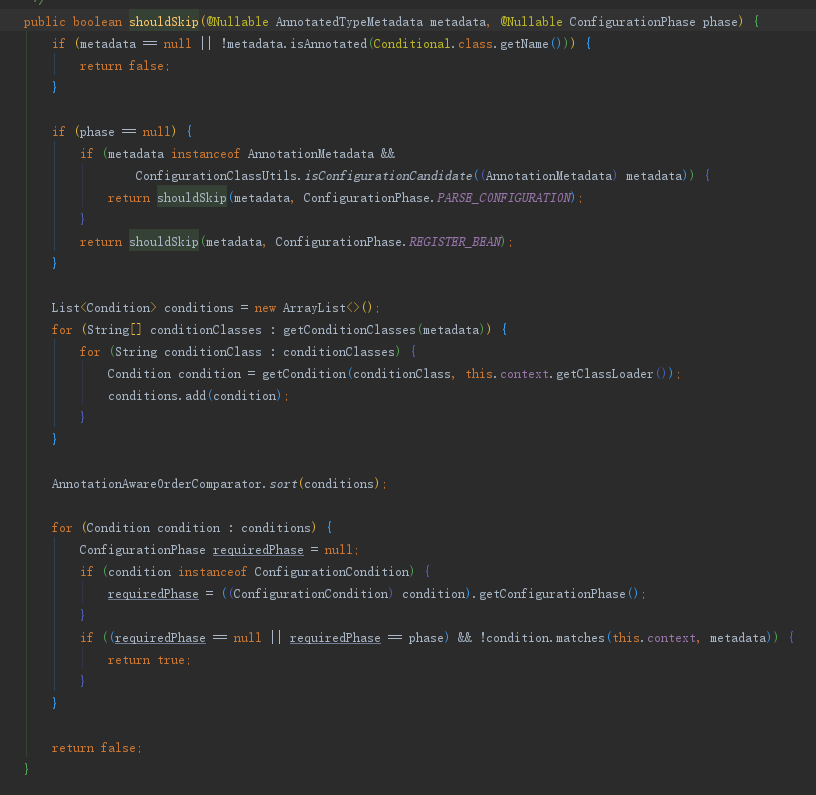


1.  先判断有没有使用Conditional注解，如果没有直接返回false
2.  收集condition到集合中
3.  按order排序该集合
4.  遍历该集合，循环调用condition的matchs方法。

## 自定义类型转换

spring目前支持3种类型转换器：

- **Converter<S,T>**：将 S 类型对象转为 T 类型对象

- **ConverterFactory<S, R>**：将 S 类型对象转为 R 类型及子类对象

- **GenericConverter**：它支持多个source和目标类型的转化，同时还提供了source和目标类型的上下文，这个上下文能让你实现基于属性上的注解或信息来进行类型转换。

### 代码实现

假如：接口中接收参数的实体对象中，有个字段的类型是Date，但是实际传参的是字符串类型并且有一个int类型字段需要转枚举，要如何处理呢？

第一步，定义一个实体User：

```java
@Data
public class User {
    private Long id;
    private String name;
    private Integer gender;
    private Date registerDate;
}
```

 第二步，实现Converter接口：

```java
public class StringToDateConverter implements Converter<String, Date> {

    @SneakyThrows
    @Override
    public Date convert(String source) {
        if (StringUtil.isEmpty(source)) {
            return null;
        }
        SimpleDateFormat sdf= new SimpleDateFormat("yyyy-MM-dd HH:mm:ss");
        return sdf.parse(source);
    }
}
```

实现ConverterFactory接口：

```java
@Component
public class GenderConvertorFactory implements ConverterFactory<Integer, GenderEnum> {
    @Override
    public <T extends GenderEnum> Converter<Integer, T> getConverter(Class<T> targetType) {
        return source ->  {
            for (T t : targetType.getEnumConstants()) {
                if (t.getCode() == source) {
                    return t;
                }
            }
            return null;
        };
    }
}
```

第三步，将新定义的类型转换器注入到spring容器中：

```java
@Configuration
public class WebMvcConfig implements WebMvcConfigurer {
    
    @Override
    public void addFormatters(FormatterRegistry registry) {
        registry.addConverter(new StringToDateConverter());
    }
    
    @Autowired
    GenderConvertorFactory genderConvertorFactory;

    @Override
    public void addFormatters(FormatterRegistry registry) {
        registry.addConverterFactory(genderConvertorFactory);
    }
}
```

 第四步，调用接口

```java
@RequestMapping("/user")
@RestController
public class UserController {

    @RequestMapping("/save")
    public String save(@RequestBody User user) {
        return "success";
    }
}
```

 请求接口时User对象中registerDate字段会被自动转换成Date类型。

## 跨域问题的解决方案

关于跨域问题，前后端的解决方案还是挺多的，这里我重点说说spring的解决方案，目前有三种： 

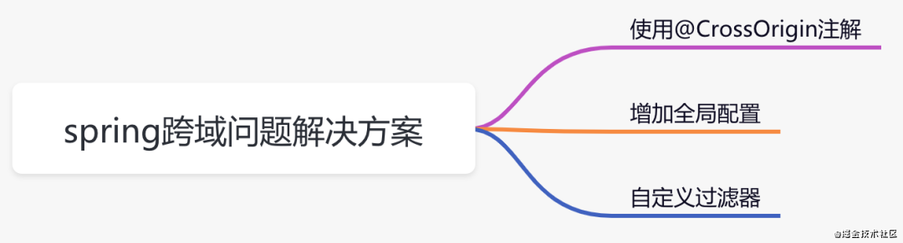

### 使用@CrossOrigin注解

```java
@RequestMapping("/user")
@RestController
public class UserController {

    @CrossOrigin(origins = "http://localhost:80")
    @GetMapping("/user")
    public String getUser(@RequestParam("name") String name) {
        System.out.println("name:" + name);
        return "success";
    }
}
```

该方案需要在跨域访问的接口上加`@CrossOrigin`注解，访问规则可以通过注解中的参数控制，控制粒度更细。如果需要跨域访问的接口数量较少，可以使用该方案。

### 增加全局配置

```java
@Configuration
public class WebConfig implements WebMvcConfigurer {

    @Override
    public void addCorsMappings(CorsRegistry registry) {
        registry.addMapping("/**")
                .allowedOrigins("*")
                .allowedMethods("GET", "POST")
                .allowCredentials(true)
                .maxAge(3600)
                .allowedHeaders("*");

    }
}
```

该方案需要实现`WebMvcConfigurer`接口，重写`addCorsMappings`方法，在该方法中定义跨域访问的规则。这是一个全局的配置，可以应用于所有接口。

### 自定义过滤器

```java
@WebFilter("corsFilter")
@Configuration
public class CorsFilter implements Filter {

    @Override
    public void init(FilterConfig filterConfig) throws ServletException {

    }

    @Override
    public void doFilter(ServletRequest request, ServletResponse response, FilterChain chain) throws IOException, ServletException {
        HttpServletResponse httpServletResponse = (HttpServletResponse) response;
        httpServletResponse.setHeader("Access-Control-Allow-Origin", "*");
        httpServletResponse.setHeader("Access-Control-Allow-Methods", "POST, GET");
        httpServletResponse.setHeader("Access-Control-Max-Age", "3600");
        httpServletResponse.setHeader("Access-Control-Allow-Headers", "x-requested-with");
        chain.doFilter(request, response);
    }

    @Override
    public void destroy() {

    }
}
```

该方案通过在请求的`header`中增加`Access-Control-Allow-Origin`等参数解决跨域问题。

其实使用`@CrossOrigin`注解 和 实现`WebMvcConfigurer`接口的方案，spring在底层最终都会调用到`DefaultCorsProcessor`类的`handleInternal`方法：

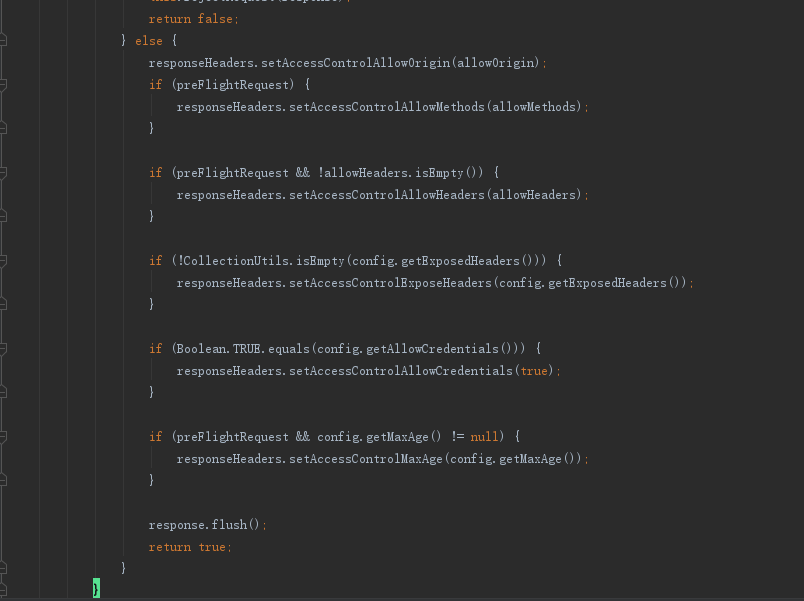

都会往`header`中添加跨域需要参数，只是实现形式不一样而已。

## 项目启动时的附加功能

有时候我们需要在项目启动时定制化一些附加功能，比如：加载一些系统参数、完成初始化、预热本地缓存等，该怎么办呢？

### 使用方式

`springboot`提供了：

- CommandLineRunner

- ApplicationRunner

以`ApplicationRunner`接口为例：

```java
@Component
public class TestRunner implements ApplicationRunner {

    @Autowired
    private LoadDataService loadDataService;

    public void run(ApplicationArguments args) throws Exception {
        loadDataService.load();
    }
}
```

实现`ApplicationRunner`接口，重写`run`方法，在该方法中实现自己定制化需求。

如果项目中有多个类实现了`ApplicationRunner`接口，他们的执行顺序要怎么指定呢？

答案是使用`@Order(n)`注解，n的值越小越先执行。当然也可以通过`@Priority`注解指定顺序。

### springboot启动主要流程 

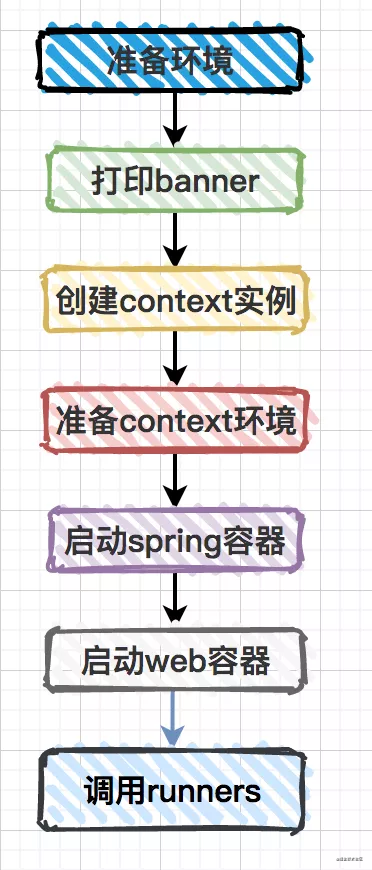

 在`SpringApplication`类的`callRunners`方法中，我们能看到这两个接口的具体调用：

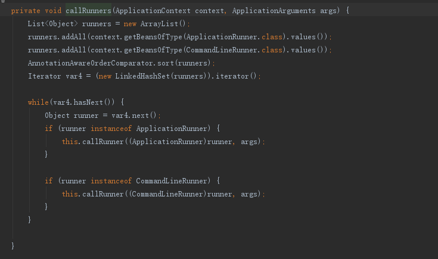

## Enable开关真香

### 使用方式

只要在`@Configuration`定义的配置类上加上这类注解，就能开启相关的功能。

1. 定义一个LogFilter

   ```java
   public class LogFilter implements Filter {
       @Override
       public void init(FilterConfig filterConfig) throws ServletException {
   
       }
   
       @Override
       public void doFilter(ServletRequest request, ServletResponse response, FilterChain chain) throws IOException, ServletException {
           System.out.println("记录请求日志");
           chain.doFilter(request, response);
           System.out.println("记录响应日志");
       }
   
       @Override
       public void destroy() {
           
       }
   }
   ```

2. 注册LogFilter

   ```java
   @ConditionalOnWebApplication
   public class LogFilterWebConfig {
       @Bean
       public LogFilter timeFilter() {
           return new LogFilter();
       }
   }
   ```

3. 定义开关@EnableLog注解

   ```java
   @Target(ElementType.TYPE)
   @Retention(RetentionPolicy.RUNTIME)
   @Documented
   @Import(LogFilterWebConfig.class)
   public @interface EnableLog {
   }
   ```

4. 在`springboot`启动类加上`@EnableLog`注解，即可开启LogFilter记录请求和响应日志的功能。

## @Async实现异步

以前我们在使用异步功能时，通常情况下有三种方式：

- 继承Thread类

- 实现Runable接口

- 使用线程池

### 使用方式

spring已经帮我们抽取了一些公共的地方，我们无需再继承`Thread`类或实现`Runable`接口

第一步，springboot项目启动类上加`@EnableAsync`注解。

```java
@EnableAsync
@SpringBootApplication
public class Application {
    public static void main(String[] args) {
       SpringApplication.run(Application.class, args);
    }
}
```

 第二步，在需要使用异步的方法上加上@Async注解：

```java
@Service
public class PersonService {
    @Async
    public String get() {
        return "data";
    }
}
```

spring会为我们的异步方法创建一个线程去执行，如果该方法被调用次数非常多的话，需要创建大量的线程，会导致资源浪费。

这时，我们可以定义一个线程池，异步方法将会被自动提交到线程池中执行。

```java
@Configuration
public class ThreadPoolConfig {

    @Value("${thread.pool.corePoolSize:5}")
    private int corePoolSize;

    @Value("${thread.pool.maxPoolSize:10}")
    private int maxPoolSize;

    @Value("${thread.pool.queueCapacity:200}")
    private int queueCapacity;

    @Value("${thread.pool.keepAliveSeconds:30}")
    private int keepAliveSeconds;

    @Value("${thread.pool.threadNamePrefix:ASYNC_}")
    private String threadNamePrefix;

    @Bean
    public Executor MyExecutor() {
        ThreadPoolTaskExecutor executor = new ThreadPoolTaskExecutor();
        executor.setCorePoolSize(corePoolSize);
        executor.setMaxPoolSize(maxPoolSize);
        executor.setQueueCapacity(queueCapacity);
        executor.setKeepAliveSeconds(keepAliveSeconds);
        executor.setThreadNamePrefix(threadNamePrefix);
        executor.setRejectedExecutionHandler(new ThreadPoolExecutor.CallerRunsPolicy());
        executor.initialize();
        return executor;
    }
}
```

### spring异步核心方法

`AsyncExecutionAspectSupport.class`

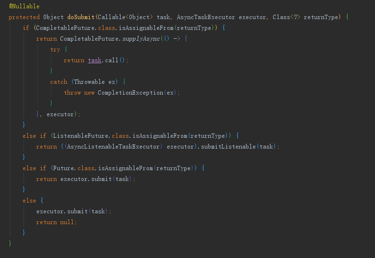

根据返回值不同，处理情况也不太一样，具体分为如下情况： 

- CompletableFuture
- ListenableFuture
- Future
- Void

## 缓存

### spring cache架构图

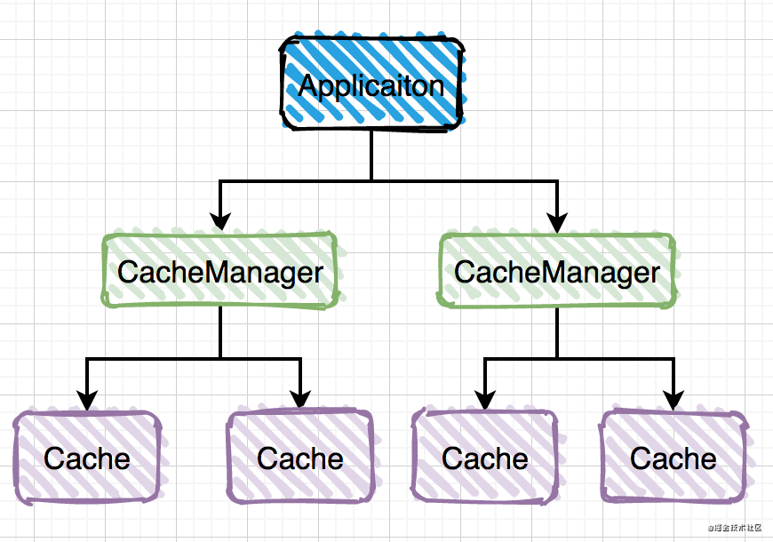

### 多种缓存

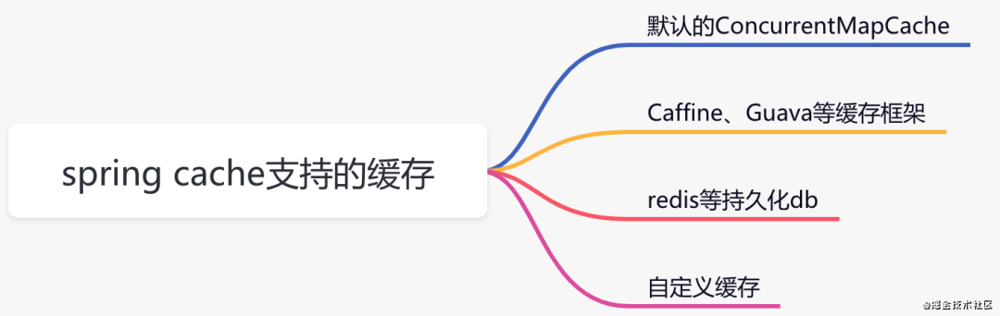

### 代码实现

我们在这里以spring官方推荐的`caffeine`为例。

 第一步，引入caffeine的相关jar包

```xml
<dependency>
    <groupId>org.springframework.boot</groupId>
    <artifactId>spring-boot-starter-cache</artifactId>
</dependency>
<dependency>
    <groupId>com.github.ben-manes.caffeine</groupId>
    <artifactId>caffeine</artifactId>
    <version>2.6.0</version>
</dependency>
```

第二步，配置`CacheManager`，开启`EnableCaching`

```java
@Configuration
@EnableCaching
public class CacheConfig {
    @Bean
    public CacheManager cacheManager(){
        CaffeineCacheManager cacheManager = new CaffeineCacheManager();
        //Caffeine配置
        Caffeine<Object, Object> caffeine = Caffeine.newBuilder()
                //最后一次写入后经过固定时间过期
                .expireAfterWrite(10, TimeUnit.SECONDS)
                //缓存的最大条数
                .maximumSize(1000);
        cacheManager.setCaffeine(caffeine);
        return cacheManager;
    }
}
```

第三步，使用`Cacheable`注解获取数据

```java
@Service
public class CategoryService {
   
   //category是缓存名称,#type是具体的key，可支持el表达式
   @Cacheable(value = "category", key = "#type")
   public CategoryModel getCategory(Integer type) {
       return getCategoryByType(type);
   }

   private CategoryModel getCategoryByType(Integer type) {
       System.out.println("根据不同的type:" + type + "获取不同的分类数据");
       CategoryModel categoryModel = new CategoryModel();
       categoryModel.setId(1L);
       categoryModel.setParentId(0L);
       categoryModel.setName("电器");
       categoryModel.setLevel(3);
       return categoryModel;
   }
}
```

调用categoryService.getCategory()方法时，先从`caffine`缓存中获取数据，如果能够获取到数据则直接返回该数据，不会进入方法体。如果不能获取到数据，则直接方法体中的代码获取到数据，然后放到caffine缓存中。

## 自定义starter

### 传统方式引入新功能

以前在没有使用`starter`时，我们在项目中需要引入新功能，步骤一般是这样的：

- 在maven仓库找该功能所需jar包

- 在maven仓库找该jar所依赖的其他jar包

- 配置新功能所需参数

 以上这种方式会带来三个问题：

1. 如果依赖包较多，找起来很麻烦，容易找错，而且要花很多时间。
2. 各依赖包之间可能会存在版本兼容性问题，项目引入这些jar包后，可能没法正常启动。
3. 如果有些参数没有配好，启动服务也会报错，没有默认配置。

 「为了解决这些问题，springboot的starter机制应运而生」。

### Starter机制的好处

1. 它能启动相应的默认配置。
2. 它能够管理所需依赖，摆脱了需要到处找依赖 和 兼容性问题的困扰。
3. 自动发现机制，将spring.factories文件中配置的类，自动注入到spring容器中。
4. 遵循“约定大于配置”的理念。

在业务工程中只需引入starter包，就能使用它的功能。

### Starter标准组件 

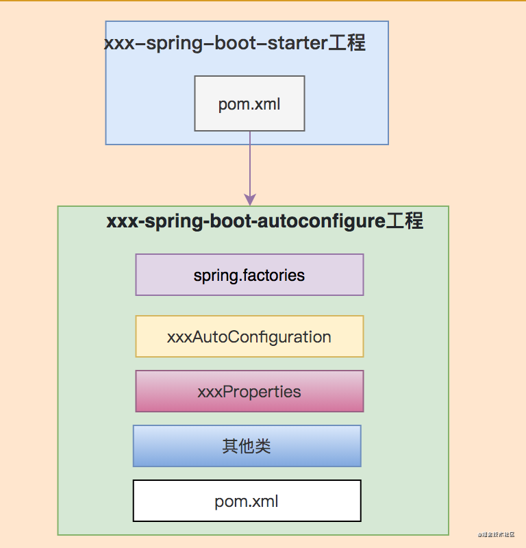

### 代码实现

下面以提供excel功能的rpa-excel-starter为例。

创建rpa-excel-starter工程： 

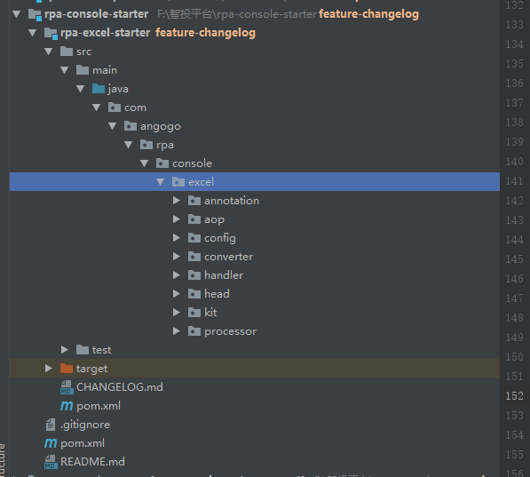


其中的`pom.xml`配置的依赖如下：

```xml
<dependencies>
    <dependency>
        <groupId>org.springframework.boot</groupId>
        <artifactId>spring-boot-starter-web</artifactId>
        <scope>provided</scope>
    </dependency>
    <dependency>
        <groupId>org.springframework.boot</groupId>
        <artifactId>spring-boot-starter-validation</artifactId>
    </dependency>
    <dependency>
        <groupId>org.springframework.boot</groupId>
        <artifactId>spring-boot-starter-aop</artifactId>
    </dependency>
    <dependency>
        <groupId>org.springframework.boot</groupId>
        <artifactId>spring-boot-starter</artifactId>
    </dependency>
    <dependency>
        <groupId>org.projectlombok</groupId>
        <artifactId>lombok</artifactId>
    </dependency>
    <dependency>
        <groupId>com.alibaba</groupId>
        <artifactId>easyexcel</artifactId>
    </dependency>
    <dependency>
        <groupId>net.dreamlu</groupId>
        <artifactId>mica-auto</artifactId>
    </dependency>
</dependencies>
```

可以从pom依赖中看到我们并没有依赖rpa-excel-autoconfigure工程，因为使用了mica-auto自动生成 `spring.factories`文件，并将Configuration配置类写入到spring.factories。

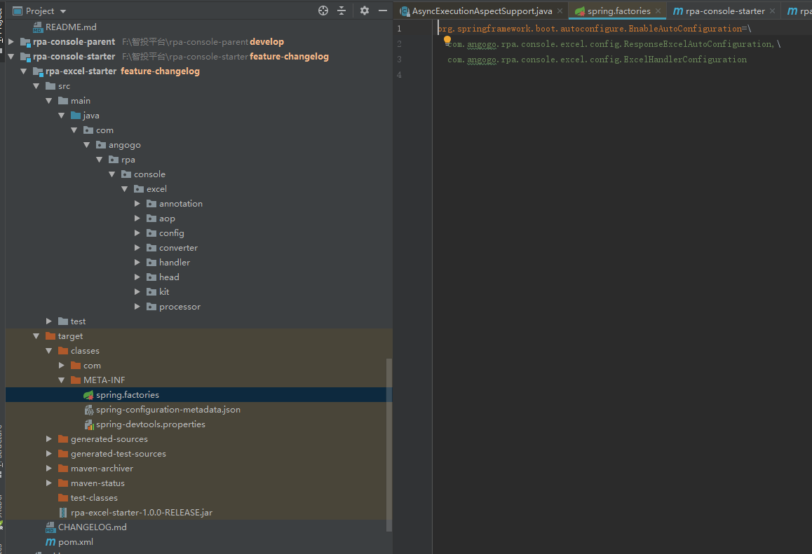

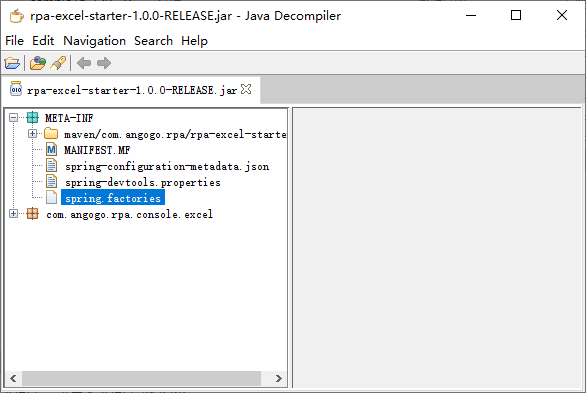


这样在业务项目中引入相关依赖:

```xml
<dependency>
      <groupId>com.angogo.rpa</groupId>
      <artifactId>rpa-excel-starter</artifactId>
      <version>1.0.0-RELEASE</version>
</dependency>
```

就能通过注解使用导出功能了

```java
@ResponseExcel(name = "图片信息", sheet = "图片信息列表")
@ApiOperation("导出图片信息列表")
@SysLog(title = "导出图片信息列表", logType = EXPORT, operationType = QUERY)
@GetMapping("/export/images")
public List<ImageExportVo> exportImages(ImageQuery imageQuery) {
    return imageLibraryService.getExportImageList(imageQuery);
}
@Data
public class ImageExportVo {
    @ExcelProperty("图片名称")
    @ApiModelProperty("图片名称")
    private String imageName;

    @ExcelProperty("文件名称")
    @ApiModelProperty("文件名称")
    private String fileName;

    @ExcelProperty("确认状态")
    @ApiModelProperty("确认状态：0-未确认，1-已确认")
    private String confirmStatus;

    @ExcelProperty("确认人")
    @ApiModelProperty("确认人")
    private String confirmor;

    @ExcelProperty("媒体类型")
    @ApiModelProperty("媒体类型：0-广点通，1-今日头条")
    private String mediaType;

    @ExcelProperty("设计师")
    @ApiModelProperty("设计师")
    private String designer;

    @ExcelProperty("标签")
    @ApiModelProperty("标签")
    private String tag;
 }
```

## Spring大事务优化

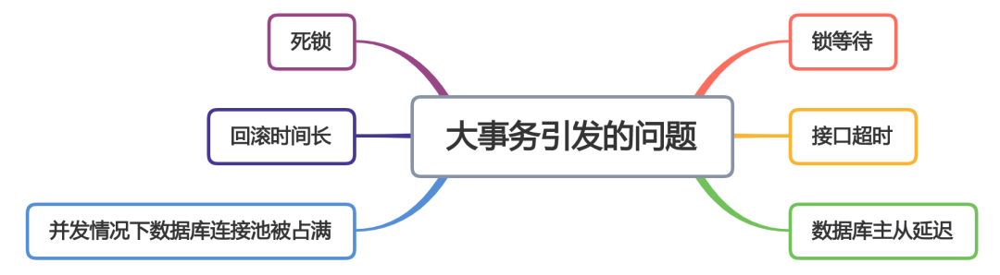

### 少用@Transactional注解

在实际项目开发中，我们在业务方法加上@Transactional注解开启事务功能，这是非常普遍的做法，它被称为`声明式事务`。 部分代码如下：

```java
@Transactional(rollbackFor=Exception.class)
public void save(User user) {
   doSameThing...
}
```

然而，我要说的第一条是：`少用@Transactional注解`。 为什么？

我们知道@Transactional注解是通过spring的`aop`起作用的，但是如果使用不当，事务功能可能会失效。如果恰巧你经验不足，这种问题不太好排查。 @Transactional注解一般加在某个业务方法上，会导致整个业务方法都在同一个事务中，而且粒度太粗，不好控制事务范围，是出现大事务问题的最常见的原因。

那我们该怎么办呢？

可以使用`编程式事务`，在spring项目中使用TransactionTemplate类的对象，手动执行事务。 部分代码如下：

```java
   @Autowired
   private TransactionTemplate transactionTemplate;
   
   ...
   
   public void save(final User user) {
         transactionTemplate.execute((status) => {
            doSameThing...
            return Boolean.TRUE;
         })
   }
```

从上面的代码中可以看出，使用`TransactionTemplate`的编程式事务功能自己灵活控制事务的范围，是避免大事务问题的首选办法。

> 少使用@Transactional注解开启事务，并不是说一定不能用它，如果项目中有些业务逻辑比较简单，而且不经常变动，使用@Transactional注解开启事务开启事务也无妨，因为它更简单，开发效率更高，但是千万要小心事务失效的问题。

### 将查询方法放到事务外

如果出现大事务，可以将查询(select)方法放到事务外，也是比较常用的做法，因为一般情况下这类方法是不需要事务的。

比如出现如下代码：

```java
   @Transactional(rollbackFor=Exception.class)
   public void save(User user) {
         queryData1();
         queryData2();
         addData1();
         updateData2();
   }
```

可以将queryData1和queryData2两个查询方法放在事务外执行，将真正需要事务执行的代码才放到事务中，比如：addData1和updateData2方法，这样就能有效的减少事务的粒度。 如果使用TransactionTemplate的编程式事务这里就非常好修改。

```java
   @Autowired
   private TransactionTemplate transactionTemplate;
   
   ...
   
   public void save(final User user) {
         queryData1();
         queryData2();
         transactionTemplate.execute((status) => {
            addData(user);
            updateData2(user);
            return Boolean.TRUE;
         })
   }
```

但是如果你实在还是想用@Transactional注解，该怎么拆分呢？

```java
    public void save(User user) {
         queryData1();
         queryData2();
         doSave();
    }
   
    @Transactional(rollbackFor=Exception.class)
    public void doSave(User user) {
       addData(user);
       updateData(user);
    }
```

这个例子是非常经典的错误

> 同一个类中非事务方法直接调用事务方法，事务是不会生效的。因为@Transactional注解的声明式事务是通过spring aop起作用的，而spring aop需要生成代理对象，直接方法调用使用的还是原始对象，所以事务不会生效。

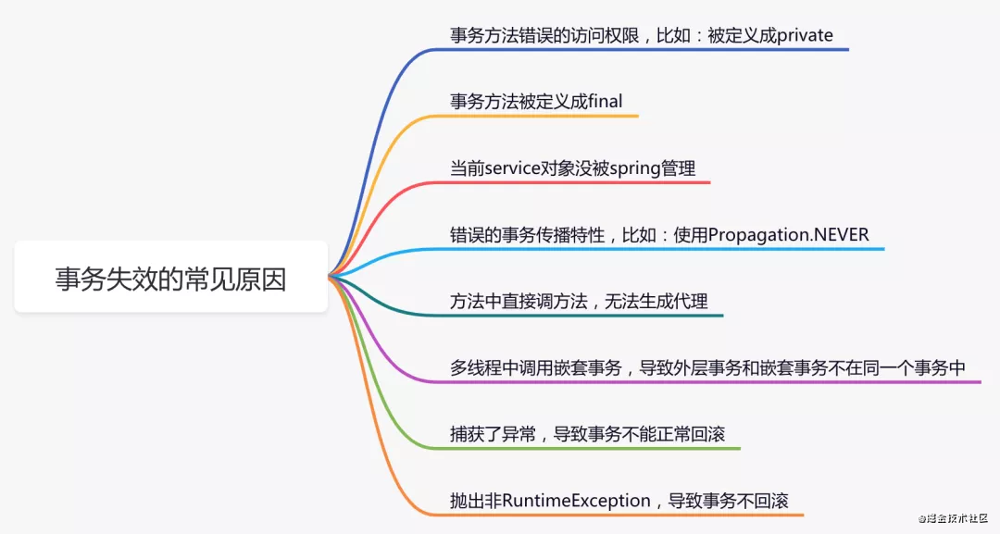


有没有办法解决这个问题呢？

#### 新加一个Service方法

这个方法非常简单，只需要新加一个Service方法，把@Transactional注解加到新Service方法上，把需要事务执行的代码移到新方法中。具体代码如下：

```java
@Servcie
  public class ServiceA {
     @Autowired
     prvate ServiceB serviceB;
  
     public void save(User user) {
           queryData1();
           queryData2();
           serviceB.doSave(user);
     }
   }
   
   @Servcie
   public class ServiceB {
   
      @Transactional(rollbackFor=Exception.class)
      public void doSave(User user) {
         addData(user);
         updateData(user);
      }
   
   }
```

#### 在该Service类中注入自己

如果不想再新加一个Service类，在该Service类中注入自己也是一种选择。具体代码如下：

```java
@Servcie
  public class ServiceA {
     @Autowired
     prvate ServiceA serviceA;
  
     public void save(User user) {
           queryData1();
           queryData2();
           serviceA.doSave(user);
     }
     
     @Transactional(rollbackFor=Exception.class)
     public void doSave(User user) {
         addData(user);
         updateData(user);
      }
   }
```

针对第一、二种方法有一个疑问：这种做法会不会出现循环依赖问题？

其实spring内部实现了三级缓存来保证它不会出现循环依赖问题。但是spring官方并不推荐这样的用法，我们通常可以增加一个层，比如`防腐层`facade层（门面模式）来内聚service层。

#### 在该Service类中使用AopContext.currentProxy()获取代理对象

上面的方法2确实可以解决问题，但是代码看起来并不直观，还可以通过在该Service类中使用AOPProxy获取代理对象，实现相同的功能。具体代码如下：

```java
  @Servcie
  public class ServiceA {
  
     public void save(User user) {
           queryData1();
           queryData2();
           ((ServiceA)AopContext.currentProxy()).doSave(user);
     }
     
     @Transactional(rollbackFor=Exception.class)
     public void doSave(User user) {
         addData(user);
         updateData(user);
      }
   }   
```

#### 使用编程式事务

```java
  @Servcie
  public class ServiceA {
     @Autowired
     private TransactionTemplate transactionTemplate;
     
     public void save(User user) {
           queryData1();
           queryData2();
           doSave(user);
     }
     
     private void doSave(User user) {
        transactionTemplate.execute(new TransactionCallbackWithoutResult() {
            @Override
            protected void doInTransactionWithoutResult(@NonNull TransactionStatus transactionStatus) {
                try {
                    addData(user);
                    updateData(user);
                } catch (Exception e) {
                    transactionStatus.setRollbackOnly();
                }
            }
        });
      }
   }   
```

### 事务中避免远程调用

> 我们在接口中调用其他系统的接口是不能避免的，由于网络不稳定，这种远程调的响应时间可能比较长，如果远程调用的代码放在某个事物中，这个事物就可能是大事务。当然，远程调用不仅仅是指调用接口，还有包括：发MQ消息，或者连接redis、mongodb保存数据等。

```java
   @Transactional(rollbackFor=Exception.class)
   public void save(User user) {
         callRemoteApi();
         addData();
   }
```

远程调用的代码可能耗时较长，切记一定要放在事务之外。

```java
   @Autowired
   private TransactionTemplate transactionTemplate;
   
   ...
   
   public void save(final User user) {
         callRemoteApi();
         transactionTemplate.execute((status) => {
            addData();
            return Boolean.TRUE;
         })
   }
```

那么，远程调用的代码不放在事务中如何保证数据一致性呢？这就需要建立：`重试+补偿机制`，达到数据最终一致性了。

### 事务中避免一次性处理太多数据

如果一个事务中需要处理的数据太多，也会造成大事务问题。比如为了操作方便，你可能会一次批量更新1000条数据，这样会导致大量数据锁等待，特别在高并发的系统中问题尤为明显。

解决办法是分批处理（`guava Lists.partition`），1000条数据，分20次，一次只处理50条数据，这样可以大大减少大事务的出现。

```java
  @Servcie
  public class ServiceA {
  
     @Transactional(rollbackFor=Exception.class)
     public void save(List<User> users) {
         Lists.partition(users, 50).forEach(user-> doSave(user));
     }
     
     @Transactional(rollbackFor=Exception.class)
     public void doSave(List<User> users) {
         dao.batchSave(users);
      }
   }
```

### 非事务执行

在使用事务之前，我们都应该思考一下，是不是所有的数据库操作都需要在事务中执行？

```java
   @Autowired
   private TransactionTemplate transactionTemplate;
   
   ...
   
   public void save(final User user) {
         transactionTemplate.execute((status) => {
            addData();
            addLog();
            updateCount();
            return Boolean.TRUE;
         })
   }
```

上面的例子中，其实addLog增加操作日志方法 和 updateCount更新统计数量方法，是可以不在事务中执行的，因为操作日志和统计数量这种业务允许少量数据不一致的情况。

```java
   @Autowired
   private TransactionTemplate transactionTemplate;
   
   ...
   
   public void save(final User user) {
         transactionTemplate.execute((status) => {
            addData();           
            return Boolean.TRUE;
         })
         addLog();
         updateCount();
   }
```

当然大事务中要鉴别出哪些方法可以非事务执行，其实没那么容易，需要对整个业务梳理一遍，才能找出最合理的答案。

### 异步处理

是不是事务中的所有方法都需要同步执行？我们都知道，方法同步执行需要等待方法返回，如果一个事务中同步执行的方法太多了，势必会造成等待时间过长，出现大事务问题。

看看下面这个列子：

```java
   @Autowired
   private TransactionTemplate transactionTemplate;
   
   ...
   
   public void save(final User user) {
         transactionTemplate.execute((status) => {
            order();
            delivery();
            return Boolean.TRUE;
         })
   }
```

order方法用于下单，delivery方法用于发货，是不是下单后就一定要马上发货呢？

答案是否定的。

这里发货功能其实可以走mq异步处理逻辑。

```java
  @Autowired
   private TransactionTemplate transactionTemplate;

   ...

   public void save(final User user) {
         transactionTemplate.execute((status) => {
            order();
            return Boolean.TRUE;
         })
         sendMq();
   }
```

