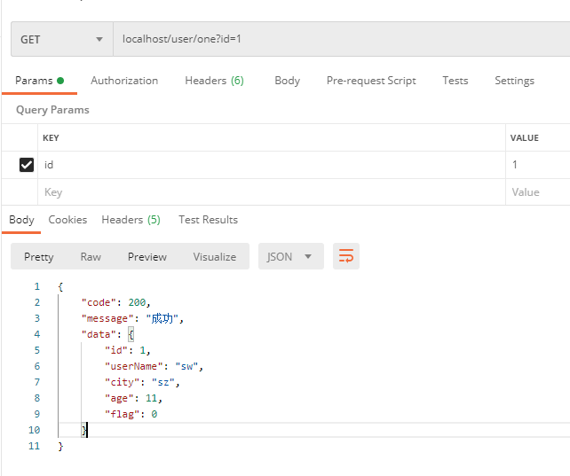
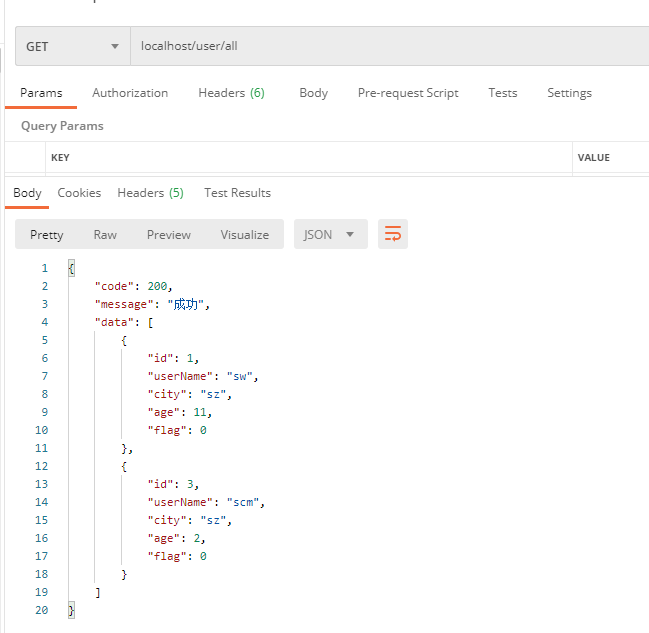
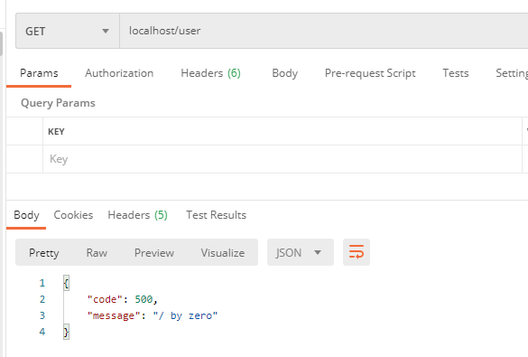
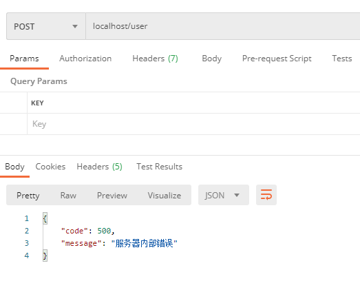
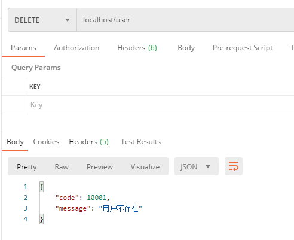

# SpringBoot统一接口返回和全局异常处理

## 背景

在分布式、微服务盛行的今天，绝大部分项目都采用的微服务框架，前后端分离方式。前端和后端进行交互，前端按照约定请求URL路径，并传入相关参数，后端服务器接收请求，进行业务处理，返回数据给前端。维护一套完善且规范的接口是非常有必要的， 这样不仅能够提高对接效率，也可以让我的代码看起来更加简洁优雅。

> 使用统一返回结果时，还有一种情况，就是程序的报错是由于运行时异常导致的结果，有些异常是我们在业务中抛出的，有些是无法提前预知。

因此，我们需要定义一个统一的全局异常，在`Controller`捕获所有异常，并且做适当处理，并作为一种结果返回。

## 统一接口返回

### 定义API返回码枚举类

```java
public enum ResultCode {
    /* 成功状态码 */
    SUCCESS(200, "成功"),
    
    /* 错误状态码 */
    NOT_FOUND(404, "请求的资源不存在"),
    INTERNAL_ERROR(500, "服务器内部错误"),
    PARAMETER_EXCEPTION(501, "请求参数校验异常"),
    
    /* 业务状态码 */
    USER_NOT_EXIST_ERROR(10001, "用户不存在"),
    ;

    private Integer code;
    private String message;

    public Integer code() {
        return this.code;
    }

    public String message() {
        return this.message;
    }

    ResultCode(Integer code, String message) {
        this.code = code;
        this.message = message;
    }
}
```

### 定义正常响应的API统一返回体

```java
@Data
public class Result<T> implements Serializable {
private Integer code;
    private String message;
    private boolean success = true;
    private T data;
    @JsonIgnore
    private ResultCode resultCode;

    private Result() {
    }

    public void setResultCode(ResultCode resultCode) {
        this.resultCode = resultCode;
        this.code = resultCode.code();
        this.message = resultCode.message();
    }

    public Result(ResultCode resultCode, T data) {
        this.code = resultCode.code();
        this.message = resultCode.message();
        this.data = data;
    }

    public static <T> Result<T> success() {
        Result<T> result = new Result<>();
        result.setResultCode(ResultCode.SUCCESS);
        return result;
    }

    public static <T> Result<T> success(T data) {
        Result<T> result = new Result<>();
        result.setResultCode(ResultCode.SUCCESS);
        result.setData(data);
            return result;
    }
}
```

### 定义异常响应的API统一返回体

```java
@Data
public class ErrorResult implements Serializable {
    private Integer code;
    private String message;
    private boolean success = false;
    @JsonIgnore
    private ResultCode resultCode;

    public static ErrorResult error() {
        ErrorResult result = new ErrorResult();
        result.setResultCode(ResultCode.INTERNAL_ERROR);
        return result;
    }

    public static ErrorResult error(String message) {
        ErrorResult result = new ErrorResult();
        result.setCode(ResultCode.INTERNAL_ERROR.code());
        result.setMessage(message);
        return result;
    }

    public static ErrorResult error(Integer code, String message) {
        ErrorResult result = new ErrorResult();
        result.setCode(code);
        result.setMessage(message);
        return result;
    }
    
    public static ErrorResult error(ResultCode resultCode, String message) {
        ErrorResult result = new ErrorResult();
        result.setResultCode(resultCode);
        result.setMessage(message)
        return result;
    }
}
```

### 编写包装返回结果的自定义注解

```java
@Retention(RetentionPolicy.RUNTIME)
@Target({ElementType.TYPE, ElementType.METHOD})  //作用于方法和类（接口）上
@Documented
public @interface ResponseResult {
}
```

### 定义返回结果拦截器

```java
@Component
public class ResponseResultInterceptor implements HandlerInterceptor {
    /* 使用统一返回体的标识 */
    private static final String RESPONSE_RESULT_ANNOTATION = "RESPONSE-RESULT-ANNOTATION";

    @Override
    public boolean preHandle(HttpServletRequest request, HttpServletResponse response, Object handler) {
        // 正在处理请求的方法bean
        if (handler instanceof HandlerMethod) {
            final HandlerMethod handlerMethod = (HandlerMethod) handler;
            // 获取当前类
            final Class<?> clazz = handlerMethod.getBeanType();
            // 获取当前方法
            final Method method = handlerMethod.getMethod();
            // 判断是否在类对象上加了注解
            if (clazz.isAnnotationPresent(ResponseResult.class)) {
                // 设置该请求返回体，需要包装，往下传递，在ResponseBodyAdvice接口进行判断
                request.setAttribute(RESPONSE_RESULT_ANNOTATION, clazz.getAnnotation(ResponseResult.class));
            }
            // 判断是否在方法上加了注解
            else if (method.isAnnotationPresent(ResponseResult.class)) {
                // 设置该请求返回体，需要包装，往下传递，在ResponseBodyAdvice接口进行判断
                request.setAttribute(RESPONSE_RESULT_ANNOTATION, method.getAnnotation(ResponseResult.class));
            }
        }
        return true;
    }
}
```

### WebMvc配置类拦截器注册者添加返回结果拦截器

```java
@Configuration
public class WebMvcConfig implements WebMvcConfigurer {
    /**
     * 添加自定义拦截器
     */
    @Override
    public void addInterceptors(InterceptorRegistry registry) {
        registry.addInterceptor(new ResponseResultInterceptor()).addPathPatterns("/**");
    }
}
```

### 编写响应体处理器

```java
/**
 * 统一处理响应体，用Result.success静态方法包装，
 * 在API接口使用时就可以直接返回原始类型
 */
@RestControllerAdvice
public class ResponseResultHandler implements ResponseBodyAdvice<Object> {
    /* 使用统一返回体的标识 */
    private static final String RESPONSE_RESULT_ANNOTATION = "RESPONSE-RESULT-ANNOTATION";

    @Override
    public boolean supports(MethodParameter methodParameter, Class<? extends HttpMessageConverter<?>> aClass) {
        ServletRequestAttributes sra = (ServletRequestAttributes) RequestContextHolder.getRequestAttributes();
        HttpServletRequest request = Objects.requireNonNull(sra).getRequest();
        ResponseResult responseResult = (ResponseResult) request.getAttribute(RESPONSE_RESULT_ANNOTATION);
        // 判断返回体是否需要处理
        return responseResult != null;
    }

    @Override
    public Object beforeBodyWrite(Object body, MethodParameter methodParameter, MediaType mediaType, Class<? extends HttpMessageConverter<?>> aClass, ServerHttpRequest serverHttpRequest, ServerHttpResponse serverHttpResponse) {
        // 异常响应体则直接返回code+message的消息体
        if (body instanceof ErrorResult) {
            return body;
        }
        // 正常响应体则返回Result包装的code+message+data的消息体
        return Result.success(body);
    }
}
```

### 接口调用

```java
@Api("用户管理")
@RestController
@RequestMapping("user")
@ResponseResult  // 作用于类上，对所有接口有效
public class UserController {

    @Autowired
    private UserService userService;

    @ResponseResult  // 作用于方法上
    @ApiOperation("根据ID查询用户")
    @GetMapping("one")
    public User selectOne(Long id) {
        // 由于在ResponseResultHandler中已经统一将返回数据用Result.success包装了，
        // 直接返回原始类型即可，代码更简洁
        return this.userService.queryById(id);
    }

    @ResponseResult
    @ApiOperation("查询所有用户")
    @GetMapping("all")
    public List<User> selectAll(Page page) {
        // 由于在ResponseResultHandler中已经统一将返回数据用Result.success包装了，
        // 直接返回原始类型即可，代码更简洁
        return this.userService.queryAllByLimit(page);
    }
}
```

### 测试结果



------



## 全局异常处理

### 编写自定义异常基类

```java
@Data
public class BaseException extends RuntimeException {

    private static final int BASE_EXCEPTION_CODE = ResultCode.INTERNAL_ERROR.code();
    private static final String BASE_EXCEPTION_MESSAGE = ResultCode.INTERNAL_ERROR.message();

    private Integer code;
    private String message;

    public BaseException() {
        super(BASE_EXCEPTION_MESSAGE);
        this.code = BASE_EXCEPTION_CODE;
        this.message = BASE_EXCEPTION_MESSAGE;
    }

    public BaseException(String message) {
        super(message);
        this.code = BASE_EXCEPTION_CODE;
        this.message = message;
    }

    public BaseException(ResultCode resultCode) {
        super(resultCode.message());
        this.code = resultCode.code();
        this.message = resultCode.message();
    }

    public BaseException(Throwable cause) {
        super(cause);
        this.code = BASE_EXCEPTION_CODE;
        this.message = BASE_EXCEPTION_MESSAGE;
    }

    public BaseException(String message, Throwable cause) {
        super(message, cause);
        this.code = BASE_EXCEPTION_CODE;
        this.message = message;
    }

    public BaseException(Integer code, String message) {
        super(message);
        this.code = code;
        this.message = message;
    }

    public BaseException(Integer code, String message, Throwable cause) {
        super(message, cause);
        this.code = code;
        this.message = message;
    }
}
```

### 编写自定义业务异常类

```java
public class BizException extends BaseException {
    public BizException(ResultCode resultCode) {
        super(resultCode);
    }
}
```

### 定义全局异常处理类

通过`@ExceptionHandler`注解来统一处理某一类异常

```java
@Slf4j
@RestControllerAdvice
public class GlobalExceptionHandler {
    /**
     * 统一处理自定义基础异常
     */
    @ExceptionHandler(BaseException.class)
    public ErrorResult baseException(BaseException e) {
        if (StringUtils.isEmpty(e.getCode())) {
            return ErrorResult.error(e.getMessage());
        }
        return ErrorResult.error(e.getCode(), e.getMessage());
    }

    /**
     * 统一处理自定义业务异常
     */
    @ExceptionHandler(BizException.class)
    public ErrorResult bizException(BizException e) {
        if (StringUtils.isEmpty(e.getCode())) {
            return ErrorResult.error(e.getMessage());
        }
        return ErrorResult.error(e.getCode(), e.getMessage());
    }

    /**
     * 统一处理非自定义异常外的所有异常
     */
    @ExceptionHandler(Exception.class)
    public ErrorResult handleException(Exception e) {
        log.error(e.getMessage(), e);
        return ErrorResult.error(e.getMessage());
    }
    
    /**
     * 兼容Validation校验框架：忽略参数异常处理器
     */
    @ExceptionHandler(MissingServletRequestParameterException.class)
    public ApiResult<String> parameterMissingExceptionHandler(MissingServletRequestParameterException e) {
        log.error(e.getMessage(), e);
        return ErrorResult.error(PARAMETER_EXCEPTION, "请求参数 " + e.getParameterName() + " 不能为空");
    }
    
    /**
     * 兼容Validation校验框架：缺少请求体异常处理器
     */
    @ExceptionHandler(HttpMessageNotReadableException.class)
    public ErrorResult parameterBodyMissingExceptionHandler(HttpMessageNotReadableException e) {
        log.error(e.getMessage(), e);
        return ErrorResult.error(PARAMETER_EXCEPTION, "参数体不能为空");
    }

    /**
     * 兼容Validation校验框架：参数效验异常处理器
     */
    @ExceptionHandler(MethodArgumentNotValidException.class)
    public ErrorResult parameterExceptionHandler(MethodArgumentNotValidException e) {
        log.error(e.getMessage(), e);
        // 获取异常信息
        BindingResult exceptions = e.getBindingResult();
        // 判断异常中是否有错误信息，如果存在就使用异常中的消息，否则使用默认消息
        if (exceptions.hasErrors()) {
            List<ObjectError> errors = exceptions.getAllErrors();
            if (!errors.isEmpty()) {
                // 这里列出了全部错误参数，按正常逻辑，只需要第一条错误即可
                FieldError fieldError = (FieldError) errors.get(0);
                return ErrorResult.error(PARAMETER_EXCEPTION, fieldError.getDefaultMessage());
            }
        }
        return ErrorResult.error(PARAMETER_EXCEPTION, "请求参数校验异常");
    }
}
```

### 接口调用

```java
	@ResponseResult
    @GetMapping
    public User update() {
        // 非自定义的运行时异常
        long id = 10 / 0;
        return userService.queryById(id);
    }

    @ResponseResult
    @PostMapping
    public User insert() {
        // 抛出自定义的基础异常
        throw new BaseException();
    }

    @ResponseResult
    @DeleteMapping
    public boolean delete() {
        // 抛出自定义的业务异常
        throw new BizException(USER_NOT_EXIST_ERROR);
    }
```

### 测试结果



------



------

