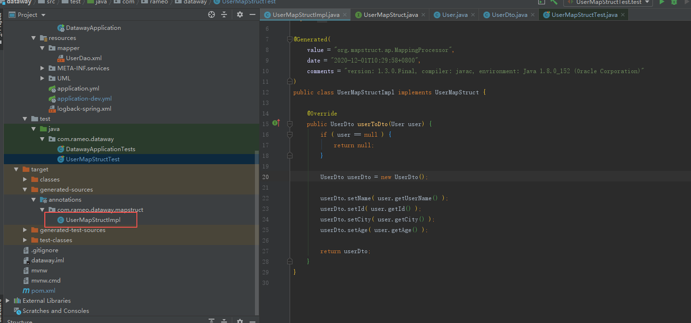
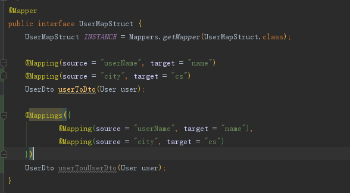

# 优雅的对象转换-MapStruct

## MapStruct简单介绍

MapStruct 是一个属性映射工具，只需要定义一个 `Mapper` 接口，MapStruct 就会`自动实现`这个映射接口，避免了复杂繁琐的映射实现。

> 在一个Java工程中会涉及到多种对象，po、vo、dto、entity、do、domain这些定义的对象运用在不同的场景模块中，这种对象与对象之间的互相转换，就需要有一个专门用来解决转换问题的工具。以往的方式要么是自己写转换器，要么是用Apache或Spring的BeanUtils来实现转换。无论哪种方式都存在明显的缺点，比如手写转换器既浪费时间， 而且在添加新的字段的时候也要进行方法的修改；而无论是 BeanUtils, BeanCopier 等都是使用反射来实现，效率低下并且仅支持属性名一致时的转换。

MapSturct 是一个生成类型安全， 高性能且无依赖的 JavaBean 映射代码的注解处理器。作为一个工具类，相比于手写，其具有便捷，不容易出错的特点。

## MapStruct的使用

### 引入依赖

maven工程需要在pom文件中引入以下依赖
```xml
<properties>
    <mapstruct.version> 1.3.0.Final </mapStruct.version>
</properties>

<dependencies>
    <dependency>
      <groupId>org.mapstruct</groupId>
      <artifactId>mapstruct-jdk8</artifactId>
      <version>${mapstruct.version}</version>
    </dependency>
    <dependency>
      <groupId>org.mapstruct</groupId>
      <artifactId>mapstruct-processor</artifactId>
      <version>${mapstruct.version}</version>
    </dependency>
</dependencies>
```

### 基本使用
定义数据实体
```java
@Data
@AllArgsConstructor
@TableName ( "user" )
public class User {
    @TableId ( value = "id", type = IdType.AUTO)
    private Long id;

    @TableField ( "user_name" )
    private String userName;

    @TableField ( "gender" )
    private Integer gender;

    @TableField ( "age" )
    private Integer age;

    @TableField ( "flag" )
    private Integer flag;
} 
```
定义转换实体
```java
@Data
public class UserDto {
    private Long id;
    private String name;
    private String gender;
    private Integer age;
} 
```

编写转换接口

```java
@Mapper
public interface UserMapStruct {
    UserMapStruct INSTANCE = Mappers.getMapper(UserMapStruct.class);

    /**
     * 单一对象的转换
     * 这里模拟两种情况：1、属性名不一致  2、使用表达式将实体类的性别int类型转成枚举中定义的性别的String类型释义
     */
    @Mapping(source = "userName", target = "name")
    @Mapping(target = "gender", expression = "java(com.rameo.mapstruct.GenderEnum.desc(user.getGender()))")   // 支持表达式
    UserDto userToDto(User user);
    
    /**
     * 对象集合的转换
     */
    List<UserDto> userToDtoList(List<User> userList);
}
```

编写测试方法

```java
@RunWith(SpringRunner.class)
@SpringBootTest
public class UserMapStructTest {
    private User user;

    @Before
    public void before() {
        user = new User(1L, "sw", "shenzhen", 11, 1);
    }

    @Test
    public void test() {
        UserDto userDto = UserMapStruct.INSTANCE.userToDto(user);
        Assert.assertNotNull(userDto);
        Assert.assertEquals(userDto.getId(), 1);
        Assert.assertEquals(userDto.getName(), "sw");
        Assert.assertEquals(userDto.getCity(), "shenzhen");
        Assert.assertEquals(userDto.getAge(), 12);
    }
}
```

以上示例参考[MapStruct](http://mapstruct.org/)官网的例子，例子中使用了lombok插件，请自行添加相关依赖和插件后使用。

## MapStruct原理说明

1. 在 `target/generated-sources/annotations` 里可以看到，代码中可以看到其生成了一个`实现类`， 而代码也类似于我们手写。这个在编译期生成的代码，性能比反射要快不少。

   

2. MapStruct是利用编译期动态生成set/get代码的class文件 ，在运行时直接调用该class文件。 该方式实际上仍会存在set/get代码，只是不需要自己手写。

## MapStruct 转换方式

1. 属性名称相同，直接转化，类似BeanUtils的转换防守
2. 属性名不相同， 可通过 @Mapping 注解进行指定转化
   例 @Mapping(source = "userName", target = "name")

## MapStruct使用注意

- 当多个对象中，有其中一个为 null，则会直接返回 null
- 如一对一转换一样，属性通过名字来自动匹配。因此，名称和类型相同的不需要进行特殊处理
- 当多个原对象中，有相同名字的属性时，需要通过 @Mapping 注解来具体的指定，以免出现歧义
- 当有多个属性不一致时，有两种解决方式



1. 添加多个@Mapping（推荐）
2. 用@Mappings将多个@Mapping包起来（sonar检测会告警，不影响使用）

## 参考资料

- 官网：https://mapstruct.org/
- Github地址：https://github.com/mapstruct/mapstruct/
- 实例分享：https://github.com/mapstruct/mapstruct-examples


