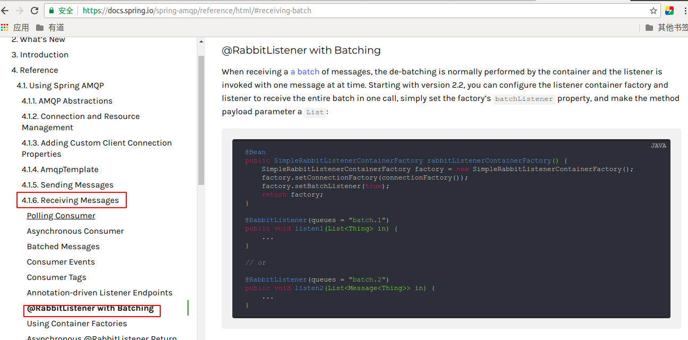

# 🚀如何用RabbitMQ批处理能力优化服务

## 场景模拟

某个RabbitMq队列经常出现拥堵的现象，原因是每消费一条该队列的消息，就会插入一条数据入DB，数据库虽然配置了连接池，但是依然处理不过来，导致消息堆积。

## 如何优化

基本的优化思路（`代码层面`）应该就是将一条一条的插入，优化成批量的插入。譬如：每收集一百条数据，通过ORM框架提供的insertBatch/saveBatch/saveAll等批量插入的方法入DB。

那么，这里需要思考的是如何收集这一百条数据，RabbitMQ正好就提供了这样的能力（存到`redis+定时拉取`也是一种可行的方案）。

## Spring支持RabbitMq批量操作

> AMQP在协议上规定每次只能传送一条数据，因此做批量数据操作，需要在应用层上定义，Spring目前已经提供了该能力。

[官方文档](https://docs.spring.io/spring-amqp/reference/html/#receiving-batch)

从 2.2 版本开始，您可以将侦听器容器工厂和侦听器配置为一次调用接收整个批次，只需设置工厂的 batchListener 属性，并将方法有效负载参数设为 `List`。



## 代码实现

### 配置队列

```java
@Configuration
public class RabbitMqConfig {	
    /**
     * 测试队列
     */
    public static final String TEST_QUEUE = "test_batch_queue";
    
    /**
     * 交换机
     */
    public static final String TEST_EXCHANGE = "test_exchange";

    /**
     * 发送一个批次中消息的数量
     */
    @Value("${rabbitmq.batch.size:100}")
    private int batchSize;

    /**
     * 批量消息的最大大小;如果超过了此值，它会取代batchSize, 并导致要发送的部分批处理
     */
    @Value("${rabbitmq.batch.bufferLimit:1024}")
    private int bufferLimit;

    /**
     * 当没有新的活动添加到消息批处理时之后，将发送部分批处理的时间
     */
    @Value("${rabbitmq.batch.timeOut:10000}")
    private long timeOut;
    
    /**
     * 自动创建交换机
     */
    @Bean
    public DirectExchange directExchange() {
        return new DirectExchange(TEST_EXCHANGE);
    }

    /**
     * 自动创建队列
     */
    @Bean
    public Queue createBatchQueue() {
        return new Queue(TEST_QUEUE);
    }

    /**
     * 自己将队列绑定到交换机，路由键使用队列名
     */
    @Bean
    public Binding directBinding() {
        return BindingBuilder.bind(createBatchQueue()).to(directExchange()).withQueueName();
    }
}
```


### 配置批量发送Template

```java
@Configuration
public class RabbitMqConfig {	
    /**
     * 使用定时任务线程池，定时从队列中拉取数据
     */
    @Bean("batchQueueTaskScheduler")
    public TaskScheduler batchQueueTaskScheduler() {
        return new ThreadPoolTaskScheduler();
    }

    /**
     * 批量处理rabbitTemplate
     */
    @Bean("batchQueueRabbitTemplate")
    public BatchingRabbitTemplate batchQueueRabbitTemplate(ConnectionFactory connectionFactory,
                                                           @Qualifier("batchQueueTaskScheduler") TaskScheduler taskScheduler) {
        // 注意，该策略只支持一个exchange/routingKey
        BatchingStrategy batchingStrategy = new SimpleBatchingStrategy(batchSize, bufferLimit, timeOut);
        return new BatchingRabbitTemplate(connectionFactory, batchingStrategy, taskScheduler);
    }
}
```


### 配置监听容器

```java
@Configuration
public class RabbitMqConfig {	
    /**
     * 配置监听容器
     */
    @Bean("batchQueueRabbitListenerContainerFactory")
    public SimpleRabbitListenerContainerFactory batchQueueRabbitListenerContainerFactory(ConnectionFactory connectionFactory) {
        SimpleRabbitListenerContainerFactory factory = new SimpleRabbitListenerContainerFactory();
        factory.setConnectionFactory(connectionFactory);
        factory.setBatchListener(true); // 配置一个BatchMessageListenerAdapter
        factory.setConsumerBatchEnabled(true); // 允许创建批量消息
        factory.setBatchSize(batchSize);
        return factory;
    }
}
```


### 编写消费者

```java
@Slf4j
@Component
public class TestBatchConsumer implements BatchMessageListener {

    /**
     * 重写批量消息监听
     */
    @Override
    @RabbitListener(bindings = @QueueBinding(
            value = @Queue(value = RabbitMqConfig.TEST_QUEUE),
            exchange = @Exchange(RabbitMqConfig.TEST_EXCHANGE), key = RabbitMqConfig.TEST_QUEUE
    ), containerFactory = "batchQueueRabbitListenerContainerFactory")
    public void onMessageBatch(List<Message> messages) {
        try {
            if (CollectionUtils.isEmpty(messages)) {
                return;
            }
            List<AdAction> adActions = Lists.newArrayList();
            for (Message message : messages) {
                // json字符串解析成对象
                AdAction adAction = JSON.parseObject(new String(message.getBody()), AdAction.class);
                adActions.add(adAction);
            }
            // 批量插入
            adActionService.insertBatch(adActions);
            log.info("TestBatchConsumer process success , size = {}", messages.size());
        } catch (Exception ex) {
            log.error("TestBatchConsumer process failed,messages: {}", messages, ex);
        }
    }
}
```


### 编写生成者

```java
@Component
@Slf4j
public class TestBatchProvider {

    private final BatchingRabbitTemplate batchQueueRabbitTemplate;

    @Autowired
    public TestBatchProvider(BatchingRabbitTemplate batchQueueRabbitTemplate) {
        this.batchQueueRabbitTemplate = batchQueueRabbitTemplate;
    }

    /**
     * 发送批量消息
     */
    public void sendTestBatchMsg(Message message) {
        this.batchQueueRabbitTemplate.convertAndSend(RabbitMqConfig.TEST_EXCHANGE, RabbitMqConfig.TEST_QUEUE, message);
    }
}
```

### 最后

其实代码实现非常简单，如果有需要请自取！👏👏