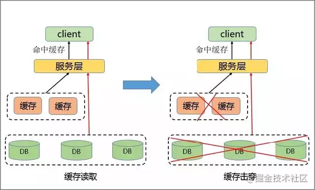
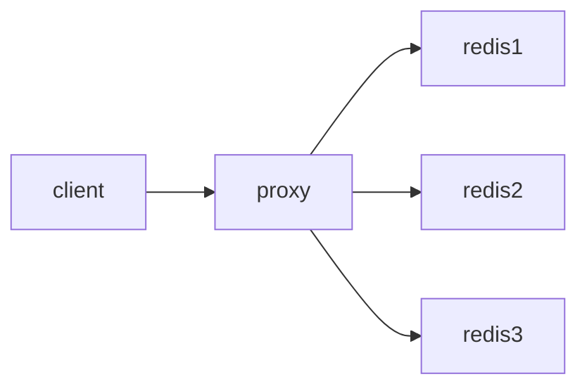

# Redis热key的发现与解决

## 热点Key产生的原因
### 1、用户消费的数据远大于生产的数据
热key问题就是某个瞬间有大量的请求去访问redis上某个固定的key，导致缓存击穿，请求都打到了DB上，压垮了缓存服务和DB服务，从而影响到应用服务可用的可用性。

> 最常见的就是微博的热搜，比如XX明星结婚/出轨。那么关于XX明星的Key就会瞬间增大，就会出现热数据问题。微博也时不时的来个崩溃。

同理，被大量刊发、浏览的热点新闻、热点评论、明星直播等，这些典型的读多写少的场景也会产生热点问题。

### 2、请求分片集中，超过单Server的性能极限
在服务端读数据进行访问时，往往会对数据进行`分片`切分，此过程中会在某一主机 Server上对相应的Key进行访问，当访问超过Server极限时，就会导致热点Key问题的产生。

## 热点Key问题的危害

### 1、流量集中，达到物理网卡上限。
当某一热点 Key 的请求在某一主机上超过该主机网卡上限时，由于流量的过度集中，会导致服务器中其它服务无法进行。

### 2、请求过多，缓存分片服务被打垮。
如果热点过于集中，热点 Key 的缓存过多，超过目前的缓存容量时，就会导致缓存分片服务被打垮现象的产生。

### 3、DB 击穿，引起业务雪崩。
当缓存服务崩溃后，此时再有请求产生，会缓存到后台 DB 上，由于DB 本身性能较弱，在面临大请求时很容易发生请求穿透现象，会进一步导致雪崩现象，严重影响设备的性能。

## 热点key的发现
### 1、凭借业务经验，进行预估哪些是热key
其实这个方法还是挺有可行性的。比如某商品在做秒杀，那这个商品的key就可以判断出是热key。缺点很明显，并非所有业务都能预估出哪些key是热key。

### 2、在客户端进行收集
这个方式就是在操作redis之前，加入一行代码进行数据统计。那么这个数据统计的方式有很多种，也可以是给外部的通讯系统发送一个通知信息。缺点就是对客户端代码造成入侵。

### 3、在Proxy层做收集

有些集群架构是下面这样的，Proxy可以是`Twemproxy`，是统一的入口。可以在Proxy层做收集上报，但是缺点很明显，并非所有的redis集群架构都有proxy。

### 4、用redis自带命令
- **monitor命令**：该命令可以实时抓取出redis服务器接收到的命令，然后写代码统计出热key是啥。当然，也有现成的分析工具可以给你使用，比如`redis-faina`。但是该命令在高并发的条件下，有内存增暴增的隐患，还会降低redis的性能。
- **hotkeys参数**：redis 4.0.3提供了redis-cli的热点key发现功能，执行redis-cli时加上`–hotkeys`选项即可。但是该参数在执行的时候，如果key比较多，执行起来比较慢。

### 5、自己抓包评估
Redis客户端使用TCP协议与服务端进行交互，通信协议采用的是`RESP`。自己写程序监听端口，按照RESP协议规则解析数据，进行分析。缺点就是开发成本高，维护困难，有丢包可能性。

以上五种方案，各有优缺点。根据自己业务场景进行抉择即可。

## 热点Key的解决方案
### 1、利用二级缓存
比如利用`ehcache`、`spring cache`，甚至是一个`HashMap`都可以。在你发现热key以后，把热key加载到系统的JVM中。

针对这种热key请求，会直接从jvm中取，而不会走到redis层。

假设此时有十万个针对同一个key的请求过来,如果没有本地缓存，这十万个请求就直接怼到同一台redis上了。\
现在假设，你的应用层有50台机器，OK，你也有jvm缓存了。这十万个请求平均分散开来，每个机器有2000个请求，会从JVM中取到value值，然后返回数据。避免了十万个请求怼到同一台redis上的情形。

### 2、读写分离
读写分离就是将同为 `Write` 的请求发送到 `Master` 模块内，而将 `Read` 的请求发送至 `ReadOnly` 模块。

而模块中的只读节点还可以进一步扩充，把这个key，在多个redis上都存一份不。有热key请求进来的时候，我们就在有备份的redis上随机选取一台，进行访问取值，返回数据。从而有效解决热点读的问题。

读写分离同时具有可以灵活扩容读热点能力、可以存储大量热点Key、对客户端友好等优点。