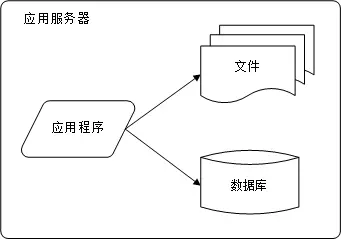
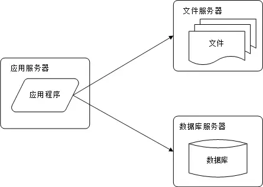
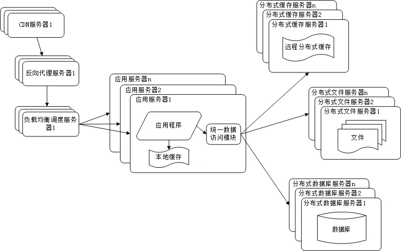
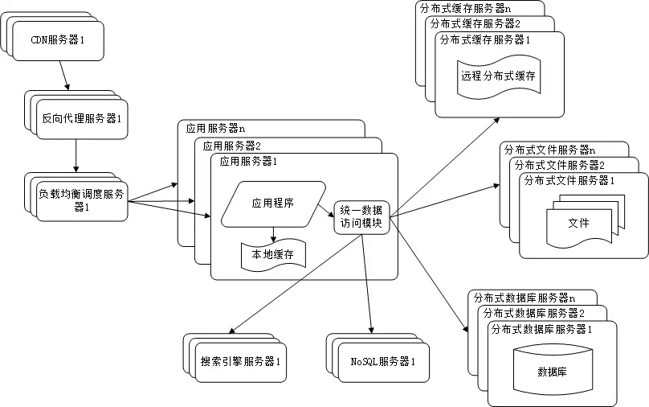
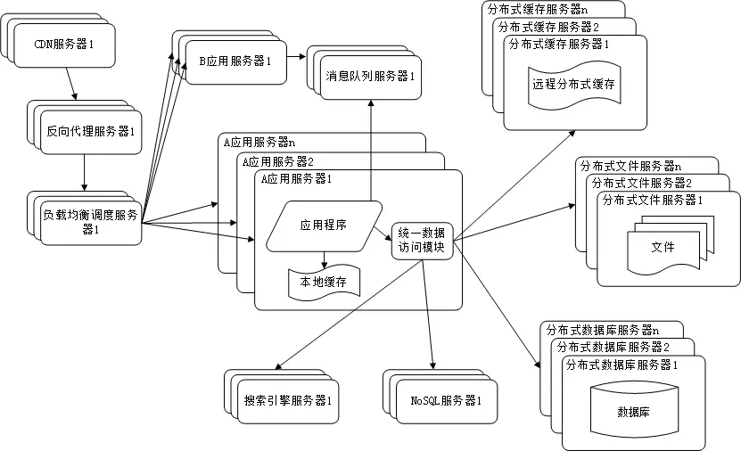
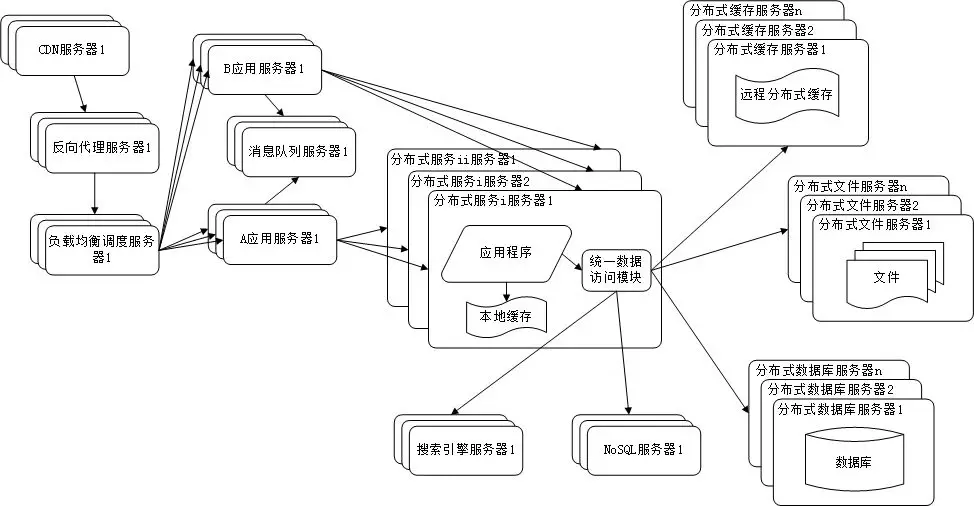

# 1.5W字长文讲解分布式系统

## 一、分布式系统的特点

### 1、高并发，大流量

需要面对高并发用户，大流量访问。Google 日均 PV 35 亿，日 IP 访问数 3 亿；腾讯微信的最大在线用户数 9.63 亿。

### 2、高可用

系统必须提供 7 x 24 小时不间断服务。在线可用率达到至少4个9，

```xml
4个9 = （1-99.99%）X24 X 365 = 0.876 小时 = 52.56分钟
```

### 3、海量数据

需要存储、管理海量数据，需要使用大量服务器。Facebook 每周上传的照片数量接近 10 亿，百度收录的网页数目有数百亿，Google 有近百万台服务器为全球用户提供服务。

### 4、用户分布广泛，网络情况复杂

许多大型互联网站都是为全球用户提供服务的，用户分布范围广，各地网络情况千差万别。在国内，还有各个运营
商网络互通难的问题。

### 5、安全环境恶劣

由于互联网的开放性，使得互联网站更容易受到攻击，大型网站几乎每天都会被黑客攻击。

### 6、需求快速变更，发布频繁

和传统软件的版本发布频率不同，互联网产品为快速适应市场，满足用户需求，其产品发布频率极高。一般大型网站的产品每周都有新版本发布上线，中小型网站的发布更频繁，有时候一天会发布几十次。

### 7、渐进式发展

几乎所有的大型互联网网站都是从一个小网站开始，渐进地发展起来的。Facebook 是扎克伯格同学在哈佛大学的宿舍里开发的；Google 的第一台服务器部署在斯坦福大学的实验室；阿里巴巴是在马云家的客厅诞生的。好的互联网产品都是慢慢运营出来的，不是一开始就开发好的，这也正好与网站架构的发展演化过程对应。

## 二、大型网站架构演化发展历程

大型网站的技术挑战主要来自于庞大的用户，高并发的访问和海量的数据，任何简单的业务一旦需要处理数以 P 计的数据和面对数以亿计的用户，问题就会变得很棘手。大型网站架构主要解决这类问题。

### 1、初始阶段的网站架构

大型网站都是从小型网站发展而来，网站架构也是一样，是从小型网站架构逐步演化而来。小型网站最开始没有太多人访问，只需要一台服务器就绰绰有余，这时的网站架构如下图所示：



应用程序、数据库、文件等所有资源都在一台服务器上。

### 2、应用服务和数据服务分离

随着网站业务的发展，一台服务器逐渐不能满足需求：越来越多的用户访问导致性能越来越差，越来越多的数据导致存储空间不足。这时就需要将应用和数据分离。

应用和数据分离后整个网站使用3台服务器：**应用服务器**、**文件服务器**和**数据库服务器**。这 3 台服务器对硬件资源的要求各不相同：

> 应用服务器需要处理大量的业务逻辑，因此需要更快更强大的CPU；
> 数据库服务器需要快速磁盘检索和数据缓存，因此需要更快的磁盘和更大的内存；
> 文件服务器需要存储大量用户上传的文件，因此需要更大的硬盘。

此时，网站系统的架构如下图所示：



应用和数据分离后，不同特性的服务器承担不同的服务角色，网站的并发处理能力和数据存储空间得到了很大改善，支持网站业务进一步发展。但是随着用户逐渐增多，网站又一次面临挑战：数据库压力太大导致访问延迟，进而影响整个网站的性能，用户体验受到影响。这时需要对网站架构进一步优化。

### 3、使用缓存改善网站性能

网站访问的特点和现实世界的财富分配一样遵循二八定律：80% 的业务访问集中在20% 的数据上。既然大部分业务访问集中在一小部分数据上，那么如果把这一小部分数据缓存在内存中，就可以减少数据库的访问压力，提高整个网站的数据访问速度，改善数据库的写入性能了。 

网站使用的缓存可以分为两种：缓存在应用服务器上的**本地缓存**和缓存在专门的分布式缓存服务器上的**远程缓存**。

> 本地缓存的访问速度更快一些，但是受应用服务器内存限制，其缓存数据量有限，而且会出现和应用程序争用内存的情况。
> 远程分布式缓存可以使用集群的方式，部署大内存的服务器作为专门的缓存服务器，可以在理论上做到不受内存容量限制的缓存服务。


使用缓存后，数据访问压力得到有效缓解，但是单一应用服务器能够处理的请求连接有限，在网站访问高峰期，应
用服务器成为整个网站的瓶颈。

### 4、使用应用服务器集群改善网站的并发处理能力

使用集群是网站解决高并发、海量数据问题的常用手段。

当一台服务器的处理能力、存储空间不足时，不要企图去更换更强大的服务器，对大型网站而言，不管多么强大的服务器，都满足不了网站持续增长的业务需求。这种情况下，更恰当的做法是增加一台服务器分担原有服务器的访问及存储压力。 

**对网站架构而言，只要能通过增加一台服务器的方式改善负载压力，就可以以同样的方式持续增加服务器不断改善系统性能，从而实现系统的可伸缩性。**

应用服务器实现集群是网站可伸缩架构设计中较为简单成熟的一种，如下图所示：


通过负载均衡调度服务器，可以将来自用户浏览器的访问请求分发到应用服务器集群中的任何一台服务器上，如果有更多用户，就在集群中加入更多的应用服务器，使应用服务器的压力不再成为整个网站的瓶颈。

### 5、数据库读写分离

网站在使用缓存后，使对大部分数据读操作访问都可以不通过数据库就能完成，但是仍有一部分读操作（缓存访问不命中、缓存过期）和全部的写操作都需要访问数据库，在网站的用户达到一定规模后，数据库因为负载压力过高而成为网站的瓶颈。

目前大部分的主流数据库都提供**主从热备**功能，通过配置两台数据库主从关系，可以将一台数据库服务器的数据更新同步到另一台服务器上。

网站利用数据库的这一功能，实现数据库读写分离，从而改善数据库负载压力。如下图所示：


应用服务器在写数据的时候，访问主数据库，主数据库通过主从复制机制将数据更新同步到从数据库，这样当应用服务器读数据的时候，就可以通过从数据库获得数据。为了便于应用程序访问读写分离后的数据库，通常在应用服务器端使用专门的数据访问模块，使数据库读写分离对应用透明。

### 6、使用反向代理和 CDN 加速网站响应

随着网站业务不断发展，用户规模越来越大，由于中国复杂的网络环境，不同地区的用户访问网站时，速度差别也极大。有研究表明，网站访问延迟和用户流失率正相关，网站访问越慢，用户越容易失去耐心而离开。为了提供更好的用户体验，留住用户，网站需要加速网站访问速度。

主要手段有使用 **CDN** 和**方向代理**。如下图所示：


**CDN 和反向代理的基本原理都是缓存。**

> CDN 部署在网络提供商的机房，使用户在请求网站服务时，可以从距离自己最近的网络提供商机房获取数据反向代理则部署在网站的中心机房，当用户请求到达中心机房后，首先访问的服务器是反向代理服务器，如果反向代理服务器中缓存着用户请求的资源，就将其直接返回给用户

使用 CDN 和反向代理的目的都是尽早返回数据给用户，一方面加快用户访问速度，另一方面也减轻后端服务器的负载压力。

### 7、使用分布式文件系统和分布式数据库系统

任何强大的单一服务器都满足不了大型网站持续增长的业务需求。数据库经过读写分离后，从一台服务器拆分成两台服务器，但是随着网站业务的发展依然不能满足需求，这时需要使用分布式数据库。文件系统也一样，需要使用分布式文件系统。

如下图所示：



**分布式数据库是网站数据库拆分的最后手段**，只有在单表数据规模非常庞大的时候才使用。不到不得已时，网站更常用的数据库拆分手段是**业务分库**，将不同业务的数据部署在不同的物理服务器上。

### 8、使用 NoSQL 和搜索引擎

随着网站业务越来越复杂，对数据存储和检索的需求也越来越复杂，网站需要采用一些非关系数据库技术如NoSQL 和非数据库查询技术如搜索引擎。

如下图所示：



NoSQL 和搜索引擎都是源自互联网的技术手段，对可伸缩的分布式特性具有更好的支持。应用服务器则通过一个统一数据访问模块访问各种数据，减轻应用程序管理诸多数据源的麻烦。

### 9、业务拆分

大型网站为了应对日益复杂的业务场景，通过使用分而治之的手段将整个网站业务分成不同的产品线。如大型购物交易网站都会将首页、商铺、订单、买家、卖家等拆分成不同的产品线，分归不同的业务团队负责。

具体到技术上，也会根据产品线划分，将一个网站拆分成许多不同的应用，每个应用独立部署。应用之间可以通过一个超链接建立关系（在首页上的导航链接每个都指向不同的应用地址），也可以通过消息队列进行数据分发，当然最多的还是通过访问同一个数据存储系统来构成一个关联的完整系统。

如下图所示：



### 10、分布式微服务

随着业务拆分越来越小，存储系统越来越庞大，应用系统的整体复杂度呈指数级增加，部署维护越来越困难。由于所有应用要和所有数据库系统连接，在数万台服务器规模的网站中，这些连接的数目是服务器规模的平方，导致数据库连接资源不足，拒绝服务。

既然每一个应用系统都需要执行许多相同的业务操作，比如用户管理、商品管理等，那么可以将这些共用的业务提取出来，独立部署。由这些可复用的业务连接数据库，提供共用业务服务，而应用系统只需要管理用户界面，通过分布式服务调用共用业务服务完成具体业务操作。

如下图所示：



## 三、拆分 VS 集群

### 1、拆分

不同的多台服务器上面部署不同的服务模块，模块之间通过RPC通信和调用，用于拆分业务功能，独立部署，多个服务器共同组成一个整体对外提供服务。

### 2、集群

不同的多台服务器上面部署相同的服务模块，通过分布式调度软件进行统一的调度，用于分流容灾，降低单个服务器的访问压力。

## 四、架构的比较

### 1、单体架构

单体架构易于开发、易于测试、易于部署，且系统中各个功能、模块、方法的调用过程都是进程内调用，不会发生[进程间通信](https://zh.wikipedia.org/wiki/行程間通訊)（Inter-Process Communication，IPC）。

- 纵向角度：**分层架构（Layered Architecture）**


- 横向角度：按照技术、功能、职责等维度，将软件拆分为各个模块，以便代码重用和管理。

单体系统真正的缺陷不在于如何拆分，而在于拆分之后的`隔离`与`自治能力`的欠缺。

譬如：内存泄漏、线程爆炸、阻塞、死循环等问题，都会影响整个程序，而不单单是某一个功能或模块。如果消耗的是层次更高的公共资源，如端口号、数据库连接池泄露，将会波及整台机器，甚至集群中其他的单体副本。

从可维护性来说，单体架构也不占优势，由于代码都在同一个进程，难于阻断错误传播，无法单独停止、更新、升级，做灰度发布、A/B测试也更复杂。

单体架构其实没什么好说的，ALL IN ONE，应付小型网站绰绰有余，不行就加多几台机器。

### 2、SOA

**三种代表性架构模式**

- [烟囱式架构](https://en.wikipedia.org/wiki/Information_silo)（Information Silo Architecture）：信息烟囱又名信息孤岛（Information Island），使用这种架构的系统被称为孤岛式信息系统或者买烟囱式信息系统。是一种完全不与其他相关信息系统进行互相操作或者协调工作的设计模式。

- [微内核架构](https://en.wikipedia.org/wiki/Microkernel)（Microkernel Architecture）：微内核架构也被称为插件式架构（plug-in Architecture）。将公共服务、资源、数据集中成为一个被所有业务系统共同依赖的核心（Kernel，也称Core System），具体的业务系统以插件模块（plug-in Modules）的形式存在，提供可拓展、天然隔离、灵活的功能特性。

  微内核架构的局限和使用前提是它假设系统中各个插件模块之间是互不认识，不可预知系统将安装哪些模块，这些插件可访问内核中的公共资源，但不会直接交互。

  

- [事件驱动架构](https://en.wikipedia.org/wiki/Event-driven_architecture)（Event-Driven Architecture）：子系统间建立一套事件队列管道（Event Queues），系统外部的消息通过事件的形式发送到管道中，并被订阅消费。事件的消费者高度解耦，但能通过事件管道进行通信。

  

  > SOAP 协议被逐渐边缘化的本质原因：过于严格的规范定义带来过度的复杂性。它可以实现多个异构大型系统之间的复杂集成交互，却很难作为一种具有广泛普适性的软件架构风格来推广。

### 3、微服务

**微服务是一种架构风格**，一个大型复杂软件应用由一个或多个微服务组成。系统中的各个微服务可被独立部署，各个微服务之间是松耦合的。每个微服务仅关注于完成一件任务并很好地完成该任务。在所有情况下，每个任务代表着一个小的业务能力。

微服务，从本质意义上看，还是 SOA 架构。但内涵有所不同，微服务并不绑定某种特殊的技术，在一个微服务的系统中，可以有 Java 编写的服务，也可以有 Python编写的服务，他们是靠Restful架构风格统一成一个系统的。所以微服务本身与具体技术实现无关，扩展性强。

微服务追求的是更加自由的架构风格，摒弃了几乎所有 SOA 里可以抛弃的约束和规定，提倡以“实践标准”代替“规范标准”。

服务的`注册发现`、`跟踪治理`、`负载均衡`、`故障隔离`、`认证授权`、`伸缩扩展`、`传输通信`、`事务处理`，等等，这些问题，在微服务中不再会有统一的解决方案。

### 4、后微服务时代

> 后微服务时代（Cloud Native）
>
> 从软件层面独力应对微服务架构问题，发展到软、硬一体，合力应对架构问题的时代，此即为“后微服务时代”。

 传统 Spring Cloud 与 Kubernetes 提供的解决方案对比

|          | Kubernetes              | Spring Cloud              |
| -------- | ----------------------- | ------------------------- |
| 弹性伸缩 | Autoscaling             | N/A                       |
| 服务发现 | KubeDNS / CoreDNS       | Spring Cloud Eureka       |
| 配置中心 | ConfigMap / Secret      | Spring Cloud Config       |
| 服务网关 | Ingress Controller      | Spring Cloud Zuul/Gateway |
| 负载均衡 | Load Balancer           | Spring Cloud Ribbon       |
| 服务安全 | RBAC API                | Spring Cloud Security     |
| 跟踪监控 | Metrics API / Dashboard | Spring Cloud Turbine      |
| 降级熔断 | N/A                     | Spring Cloud Hystrix      |

当虚拟化的基础设施从单个服务的容器扩展至由多个容器构成的服务集群、通信网络和存储设施时，软件与硬件的界限便已经模糊。一旦虚拟化的硬件能够跟上软件的灵活性，那些与业务无关的技术性问题便有可能从软件层面剥离，悄无声息地解决于硬件基础设施之内，让软件得以只专注业务，真正“围绕业务能力构建”团队与产品。

虚拟化的基础设施只能针对容器管理，粒度相对粗犷，而诸如断路器、服务的监控、认证、授权、安全、负载均衡等都需要细化管理，为了解决这类问题，出现了“[服务网格](https://en.wikipedia.org/wiki/Service_mesh)”（Service Mesh）的“边车代理模式”（Sidecar Proxy）。这个代理除了实现正常的服务间通信外（称为数据平面通信），还接收来自控制器的指令（称为控制平面通信），根据控制平面中的配置，对数据平面通信的内容进行分析处理，以实现熔断、认证、度量、监控、负载均衡等各种附加功能。这样便实现了既不需要在应用层面加入额外的处理代码，也提供了几乎不亚于程序代码的精细管理能力。

### 5、无服务时代

> 无服务架构（Serverless）
>
> 如果说微服务架构是分布式系统这条路的极致，那无服务架构，也许就是“不分布式”的云端系统这条路的起点。

无服务只涉及两块内容：`后端设施`（Backend）和`函数`（Function）。

- **后端设施**是指数据库、消息队列、日志、缓存，等等这一类用于支撑业务逻辑运行，但本身无业务含义的技术组件，这些后端设施都运行在云上，无服务中称其`“后端即服务”`（Backend as a Service，BaaS）。
- **函数**是指业务逻辑代码，其运行在云端，不必考虑算力和容量问题，无服务中称其为`“函数即服务”`（Function as a Service，FaaS）。

无服务的愿景是让开发者只需要纯粹地关注业务，不需要考虑技术组件，后端的技术组件是现成的，可以直接取用，没有采购、版权和选的烦恼；不需要考虑如何部署，部署过程完全是托管到云端的，工作由云端自动完成；不需要考虑算力，有整个数据中心支撑，算力可以认为是无限的；也不需要操心运维，维护系统持续平稳运行是云计算服务商的责任而不再是开发者的责任。

## 五、REST设计风格

REST 与 RPC 在思想上差异的核心是`抽象的目标`不一样，即`面向资源`的编程思想与`面向过程`的编程思想两者之间的区别。

REST 并不是一种远程服务调用协议，协议都带有一定的规范性和强制性，至少有一个规约文档，但是REST并没有定义这些内容。REST是一种风格而不是规范、协议。

REST，即“表征状态转移”的缩写，“REST”（**Re**presentational **S**tate **T**ransfer）实际上是“HTT”（**H**yper**t**ext **T**ransfer）的进一步抽象，两者就如同接口与实现类的关系一般。

### 1、理解REST

下面通过阅读文章的例子来理解什么是“表征”以及 REST 中其他关键概念。

- **资源**（Resource）：你现在正在阅读一篇名为《REST 设计风格》的文章，这篇文章的内容（其蕴含的信息、数据）本身，称之为“资源”。
- **表征**（Representation）：指信息与用户交互时的表示形式，这与我们软件分层架构中常说的“表示层”（Presentation Layer）的语义其实是一致的。譬如：服务端向浏览器返回的HTML、PDF、Markdown、RSS等形式的版本，它们是同一个资源多种表征。
- **状态**（State）：在特定语境中才能产生的上下文信息即被称为“状态”。我们所说的有`状态（Stateful）`抑或是`无状态（Stateless）`，都是只相对于服务端来说的，服务端自己记住用户状态称为`有状态`；客户端记住状态，请求时明确告知服务端，称为`无状态`。
- **转移**（Transfer）：无论状态是由服务端还是客户端来提供的，“取下一篇文章”这个行为逻辑必然只能由服务端来提供，因为只有服务端拥有该资源及其表征形式。服务器通过某种方式，把“用户当前阅读的文章”转变成“下一篇文章”，这就被称为“表征状态转移”。
- **统一接口**（Uniform Interface）：HTTP 协议中已经提前约定好了一套“统一接口”，它包括：GET、HEAD、POST、PUT、DELETE、TRACE、OPTIONS 七种基本操作，任何一个支持 HTTP 协议的服务器都会遵守这套规定，对特定的 URI 采取这些操作，服务器就会触发相应的表征状态转移。
- **超文本驱动**（Hypertext Driven）：浏览器作为所有网站的通用的客户端，任何网站的导航（状态转移）行为都不可能是预置于浏览器代码之中，而是由服务器发出的请求响应信息（超文本）来驱动的。
- **自描述消息**（Self-Descriptive Messages）：由于资源的表征可能存在多种不同形态，在消息中应当有明确的信息来告知客户端该消息的类型以及应如何处理这条消息。一种被广泛采用的自描述方法是在名为“Content-Type”的 HTTP Header 中标识出[互联网媒体类型](https://en.wikipedia.org/wiki/Media_type)（MIME type），譬如“Content-Type : application/json; charset=utf-8”，则说明该资源会以 JSON 的格式来返回，请使用 UTF-8 字符集进行处理。

### 2、RESTful的系统

一套理想的、完全满足 REST 风格的系统应该满足以下六大原则。

1. **服务端与客户端分离**（Client-Server）

   将用户界面所关注的逻辑和数据存储所关注的逻辑分离开来，有助于提高用户界面的跨平台的可移植性。

2. **无状态**（Stateless）

   无状态是 REST 的一条核心原则，REST 希望服务器不要去负责维护状态，每一次从客户端发送的请求中，应包括所有的必要的上下文信息，会话信息也由客户端负责保存维护，服务端依据客户端传递的状态来执行业务处理逻辑，驱动整个应用的状态变迁。

3. **可缓存**（Cacheability）

   无状态服务虽然提升了系统的可见性、可靠性和可伸缩性，但降低了系统的网络性。“降低网络性”的通俗解释是某个功能如果使用有状态的设计只需要一次（或少量）请求就能完成，使用无状态的设计则可能会需要多次请求，或者在请求中带有额外冗余的信息。为了缓解这个矛盾，REST 希望软件系统能够如同万维网一样，允许客户端和中间的通讯传递者（譬如代理）将部分服务端的应答缓存起来。

4. **分层系统**（Layered System）

   指客户端一般不需要知道是否直接连接到了最终的服务器，抑或连接到路径上的中间服务器。中间服务器可以通过负载均衡和共享缓存的机制提高系统的可扩展性，这样也便于缓存、伸缩和安全策略的部署。该原则的典型的应用是内容分发网络（Content Distribution Network，CDN）。

5. **统一接口**（Uniform Interface）

   REST 希望开发者面向资源编程，希望软件系统设计的重点放在抽象系统该有哪些资源上，而不是抽象系统该有哪些行为（服务）上。面向资源编程的`抽象程度`通常更高。抽象程度高意味着坏处是往往距离人类的思维方式更远，而好处是往往通用程度会更好。

6. **按需代码**（[Code-On-Demand](https://en.wikipedia.org/wiki/Code_on_demand)）

   指任何按照客户端（譬如浏览器）的请求，将可执行的软件程序从服务器发送到客户端的技术，按需代码赋予了客户端无需事先知道所有来自服务端的信息应该如何处理、如何运行的宽容度。

### 3、RESTful的好处

- 降低的服务接口的学习成本。

  统一接口（Uniform Interface）是 REST 的重要标志，将对资源的标准操作都映射到了标准的 HTTP 方法上去，这些方法对于每个资源的用法都是一致的，语义都是类似的，不需要刻意去学习。

- 资源天然具有集合与层次结构。

  以资源为中心抽象的接口，由于资源是名词，天然就可以产生集合与层次结构。

- REST 绑定于 HTTP 协议。

  REST 复用 HTTP 协议中已经定义的概念和相关基础支持来解决问题。

### 4、RESTful的不足与争议

- **面向资源的编程思想只适合做 CRUD，面向过程、面向对象编程才能处理真正复杂的业务逻辑**

  用户是可以使用自定义方法的，按 Google 推荐的 REST API 风格，[自定义方法](https://cloud.google.com/apis/design/custom_methods)应该放在资源路径末尾，嵌入冒号加自定义动词的后缀。譬如，我可以把删除操作映射到标准 DELETE 方法上，如果此外还要提供一个恢复删除的 API，那它可能会被设计为：

  ```
  POST /user/user_id/cart/book_id:undeleteCopy to clipboardErrorCopied
  ```

  如果你不想使用自定义方法，那就设计一个回收站的资源，在那里保留着还能被恢复的商品，将恢复删除视为对该资源某个`状态值`的修改，映射到 PUT 或者 PATCH 方法上，这也是一种完全可行的设计。

- **REST 与 HTTP 完全绑定，不适合应用于要求高性能传输的场景中**

  对于需要直接控制传输，如二进制细节、编码形式、报文格式、连接方式等细节的场景中，REST 确实不合适，这些场景往往存在于服务集群的内部节点之间

- **REST 不利于事务支持**

- **REST 没有传输可靠性支持**

  应对传输可靠性最简单粗暴的做法是把消息再重发一遍。这种简单处理能够成立的前提是服务应具有[幂等性](https://zh.wikipedia.org/wiki/冪等)（Idempotency），即服务被重复执行多次的效果与执行一次是相等的。

- **REST 缺乏对资源进行“部分”和“批量”的处理能力**

## 六、CAP理论和Base定理

### 1、数据库事务

- **一致性**（Consistency）：保证系统中所有的数据都是符合期望的，且相互关联的数据之间不会产生矛盾。
- **原子性**（Atomic）：在同一个业务处理过程中，事务保证对多个数据的修改，要么同时成功，要么同时撤销。
- **隔离性**（Isolation）：在不同的业务处理过程中，事务保证了各自业务正在读、写的数据互相独立，不会彼此影响。
- **持久性**（Durability）：事务应当保证所有成功被提交的数据修改都能正确的被持久化，不丢失数据。

所有需要保证数据一致性的应用场景，包括但不限于：数据库、事务内存、缓存、消息队列、分布式存储，等到，都会用到事务。

- **内部一致性**：当一个服务只使用一个数据源时，通过 A、I、D 来获得一致性是最经典的做法，也是相对容易的。此时，多个并发事务所读写的数据能够被数据源感知是否存在冲突，并发事务的读写在时间线上的最终顺序是由数据源来确定的，这种事务间一致性被称为“内部一致性”。
- **外部一致性**：当一个服务使用到多个不同的数据源，甚至多个不同服务同时涉及多个不同的数据源时，问题就变得相对困难了许多。此时，并发执行甚至是先后执行的多个事务，在时间线上的顺序并不由任何一个数据源来决定，这种涉及多个数据源的事务间一致性被称为“外部一致性”。

#### 实现原子性和持久性

原子性保证了事务的多个操作要么都生效要么都不生效，不会存在中间状态；持久性保证了一旦事务生效，就不会再因为任何原因而导致其修改的内容被撤销或丢失。

数据必须要成功写入磁盘、磁带等持久化存储器后才能拥有持久性，只存储在内存中的数据，一旦遇到应用程序忽然崩溃，或者数据库、操作系统一侧的崩溃，甚至是机器突然断电宕机等情况就会丢失，这些意外情况都统称为`“崩溃”`（Crash）。

由于写入存在中间状态，所以可能发生以下情形。

- **未提交事务，写入后崩溃**：程序还没修改完三个数据，但数据库已经将其中一个或两个数据的变动写入磁盘，此时出现崩溃，一旦重启之后，数据库必须要有办法得知崩溃前发生过一次不完整的购物操作，将已经修改过的数据从磁盘中恢复成没有改过的样子，以保证原子性。
- **已提交事务，写入前崩溃**：程序已经修改完三个数据，但数据库还未将全部三个数据的变动都写入到磁盘，此时出现崩溃，一旦重启之后，数据库必须要有办法得知崩溃前发生过一次完整的购物操作，将还没来得及写入磁盘的那部分数据重新写入，以保证持久性。

由于写入中间状态与崩溃都是无法避免的，为了保证原子性和持久性，就只能在崩溃后采取恢复的补救措施，这种数据恢复操作被称为`“崩溃恢复”`（Crash Recovery，也有资料称作 Failure Recovery 或 Transaction Recovery）。

为了能够顺利地完成崩溃恢复，在磁盘中写入数据就不能像程序修改内存中变量值那样，直接改变某表某行某列的某个值，而是必须将修改数据这个操作所需的全部信息，包括修改什么数据、数据物理上位于哪个内存页和磁盘块中、从什么值改成什么值，等等，以日志的形式——即仅进行顺序追加的文件写入的形式（这是最高效的写入方式）先记录到磁盘中。

只有在日志记录全部都安全落盘，数据库在日志中看到代表事务成功提交的“提交记录”（Commit Record）后，才会根据日志上的信息对真正的数据进行修改，修改完成后，再在日志中加入一条“结束记录”（End Record）表示事务已完成持久化，这种事务实现方法被称为“Commit Logging”（提交日志）。

Commit Logging 保障数据持久性、原子性的原理并不难理解：首先，日志一旦成功写入 Commit Record，那整个事务就是成功的，即使真正修改数据时崩溃了，重启后根据已经写入磁盘的日志信息恢复现场、继续修改数据即可，这保证了持久性；其次，如果日志没有成功写入 Commit Record 就发生崩溃，那整个事务就是失败的，系统重启后会看到一部分没有 Commit Record 的日志，那将这部分日志标记为回滚状态即可，整个事务就像完全没好有发生过一样，这保证了原子性。

Commit Logging 存在一个巨大的先天缺陷：所有对数据的真实修改都必须发生在事务提交以后，即日志写入了 Commit Record 之后。在此之前，即使磁盘 I/O 有足够空闲、即使某个事务修改的数据量非常庞大，占用了大量的内存缓冲区，无论有何种理由，都决不允许在事务提交之前就修改磁盘上的数据，这一点是 Commit Logging 成立的前提，却对提升数据库的性能十分不利。

ARIES 提出了“Write-Ahead Logging”的日志改进方案，所谓“提前写入”（Write-Ahead），就是允许在事务提交之前，提前写入变动数据的意思。

Write-Ahead Logging 先将何时写入变动数据，按照事务提交时点为界，划分为 FORCE 和 STEAL 两类情况。

- **FORCE**：当事务提交后，要求变动数据必须同时完成写入则称为 FORCE，如果不强制变动数据必须同时完成写入则称为 NO-FORCE。现实中绝大多数数据库采用的都是 NO-FORCE 策略，因为只要有了日志，变动数据随时可以持久化，从优化磁盘 I/O 性能考虑，没有必要强制数据写入立即进行。
- **STEAL**：在事务提交前，允许变动数据提前写入则称为 STEAL，不允许则称为 NO-STEAL。从优化磁盘 I/O 性能考虑，允许数据提前写入，有利于利用空闲 I/O 资源，也有利于节省数据库缓存区的内存。

Commit Logging 允许 NO-FORCE，但不允许 STEAL。因为假如事务提交前就有部分变动数据写入磁盘，那一旦事务要回滚，或者发生了崩溃，这些提前写入的变动数据就都成了错误。

Write-Ahead Logging 允许 NO-FORCE，也允许 STEAL，它给出的解决办法是增加了另一种被称为 Undo Log 的日志类型，当变动数据写入磁盘前，必须先记录 Undo Log，注明修改了哪个位置的数据、从什么值改成什么值，等等。以便在事务回滚或者崩溃恢复时根据 Undo Log 对提前写入的数据变动进行擦除。Undo Log 现在一般被翻译为“回滚日志”，此前记录的用于崩溃恢复时重演数据变动的日志就相应被命名为 Redo Log，一般翻译为“重做日志”。由于 Undo Log 的加入，Write-Ahead Logging 在崩溃恢复时会执行以下三个阶段的操作。

- **分析阶段**（Analysis）：该阶段从最后一次检查点（Checkpoint，可理解为在这个点之前所有应该持久化的变动都已安全落盘）开始扫描日志，找出所有没有 End Record 的事务，组成待恢复的事务集合，这个集合至少会包括 Transaction Table 和 Dirty Page Table 两个组成部分。
- **重做阶段**（Redo）：该阶段依据分析阶段中产生的待恢复的事务集合来重演历史（Repeat History），具体操作为：找出所有包含 Commit Record 的日志，将这些日志修改的数据写入磁盘，写入完成后在日志中增加一条 End Record，然后移除出待恢复事务集合。
- **回滚阶段**（Undo）：该阶段处理经过分析、重做阶段后剩余的恢复事务集合，此时剩下的都是需要回滚的事务，它们被称为 Loser，根据 Undo Log 中的信息，将已经提前写入磁盘的信息重新改写回去，以达到回滚这些 Loser 事务的目的。

重做阶段和回滚阶段的操作都应该设计为幂等的。

数据库按照是否允许 FORCE 和 STEAL 可以产生共计四种组合，从优化磁盘 I/O 的角度看，NO-FORCE 加 STEAL 组合的性能无疑是最高的；从算法实现与日志的角度看 NO-FORCE 加 STEAL 组合的复杂度无疑也是最高的。这四种组合与 Undo Log、Redo Log 之间的具体关系如图所示。


#### 实现隔离性

隔离性保证了每个事务各自读、写的数据互相独立，不会彼此影响。

现代数据库均提供了以下三种锁。

- **写锁**（Write Lock，也叫作排他锁，eXclusive Lock，简写为 X-Lock）：如果数据有加写锁，就只有持有写锁的事务才能对数据进行写入操作，数据加持着写锁时，其他事务不能写入数据，也不能施加读锁。

- **读锁**（Read Lock，也叫作共享锁，Shared Lock，简写为 S-Lock）：多个事务可以对同一个数据添加多个读锁，数据被加上读锁后就不能再被加上写锁，所以其他事务不能对该数据进行写入，但仍然可以读取。对于持有读锁的事务，如果该数据只有它自己一个事务加了读锁，允许直接将其升级为写锁，然后写入数据。

- **范围锁**（Range Lock）：对于某个范围直接加排他锁，在这个范围内的数据不能被写入。

  ```sql
  SELECT * FROM books WHERE price < 100 FOR UPDATE;Copy to clipboardErrorCopied
  ```

  加了范围锁后，不仅无法修改该范围内已有的数据，也不能在该范围内新增或删除任何数据，后者是一组排他锁的集合无法做到的。

事务隔离级别按从高到低：

- **可串行化**（Serializable）：[ANSI/ISO SQL-92](https://en.wikipedia.org/wiki/SQL-92)中定义的最高等级的隔离级别便是`可串行化`（Serializable）。[并发控制理论](https://en.wikipedia.org/wiki/Concurrency_control)（Concurrency Control）决定了隔离程度与并发能力是相互抵触的，隔离程度越高，并发访问时的吞吐量就越低。
- **可重复度**（Repeatable Read）：对事务所涉及的数据加读锁和写锁，且一直持有至事务结束，但不再加范围锁。`可重复读`比`可串行化`弱化的地方在于[幻读问题](https://en.wikipedia.org/wiki/Isolation_(database_systems)#Phantom_reads)（Phantom Reads），它是指在事务执行过程中，两个完全相同的范围查询得到了不同的结果集。原因是`可重复读`没有范围锁来禁止在该范围内插入新的数据。
- **读已提交**（Read Committed）：对事务涉及的数据加的写锁会一直持续到事务结束，但加的读锁在查询操作完成后就马上会释放。`读已提交`比`可重复读`弱化的地方在于[不可重复读问题](https://en.wikipedia.org/wiki/Isolation_(database_systems)#Non-repeatable_reads)（Non-Repeatable Reads），它是指在事务执行过程中，对同一行数据的两次查询得到了不同的结果。原因是`读已提交`的隔离级别缺乏贯穿整个事务周期的读锁，无法禁止读取过的数据发生变化。
- **读未提交**（Read Uncommitted）：对事务涉及的数据只加写锁，会一直持续到事务结束，但完全不加读锁。`读未提交`比`读已提交`弱化的地方在于[脏读问题](https://en.wikipedia.org/wiki/Isolation_(database_systems)#Dirty_reads)（Dirty Reads），它是指在事务执行过程中，一个事务读取到了另一个事务未提交的数据。

### 2、CAP理论

在分布式系统中，C代表Consistency（强一致性）、A代表Availability（可用性）、P代表Partition tolerance（分区容错性）。

CAP的证明基于异步网络，异步网络也是反映了真实网络中情况的模型。真实的网络系统中，节点之间不可能保持同步，即便是时钟也不可能保持同步，所有的节点依靠获得的消息来进行本地计算和通讯。这个概念其实是相当强的，意味着任何超时判断也是不可能的，因为没有共同的时间标准。之后我们会扩展CAP的证明到弱一点的异步网络中，这个网络中时钟不完全一致，但是时钟运行的步调是一致的，这种系统是允许节点做超时判断的。

CAP的证明很简单，假设两个节点集{G1, G2}，由于网络分片导致G1和G2之间所有的通讯都断开了，如果不满足P，则整个网络不可用，如果在G1中写，在G2中读刚写的数据， G2中返回的值不可能G1中的写值。由于A的要求，G2一定要返回这次读请求，由于P的存在，导致C一定是不可满足的。

CAP理论就是说在分布式存储系统中，**最多只能实现上面的两点**。 而由于当前的网络硬件肯定会出现延迟丢包等问题，所以分区容忍性是我们必须需要实现的。所以我们只能在一致性和可用性之间进行权衡，没有任何分布式系统能同时保证这三点。

CA - 单点集群，满足一致性，可用性的系统，通常在可扩展性上不太强大。
CP - 满足一致性，分区容忍必的系统，通常性能不是特别高。
AP - 满足可用性，分区容忍性的系统，通常可能对一致性要求低一些。


> 分布式架构的时候必须做出取舍。 一致性和可用性之间取一个平衡。多余大多数web应用，其实并不需要强一致性。因此牺牲C换取P，这是目前分布式数据库产品的方向。

那么，一致性与可用性该如何选择呢？

对于web网站来说，关系数据库的很多主要特性往往无用武之地，很多web实时系统并不要求严格的数据库事务，对读一致性的要求很低， 有些场合对写一
致性要求并不高。允许实现**最终一致性**。

### 3、BASE定理

BASE就是为了解决关系数据库强一致性引起的问题而引起的可用性降低而提出的解决方案。

BASE其实是下面三个术语的缩写：

- 基本可用（Basically Available）
- 软状态（Soft state）
- 最终一致（Eventually consistent）

它的思想是通过让系统放松对某一时刻数据一致性的要求来换取系统整体伸缩性和性能上改观。为什么这么说呢，缘由就在于大型系统往往由于地域分布和极高性能的要求，不可能采用分布式事务来完成这些指标，要想获得这些指标，我们必须采用另外一种方式来完成，这里BASE就是解决这个问题的办法。

### 4、分布式一致性理论paxos、raft、zab算法

这一块研究不深，就不献丑了，提供一个网站演示Raft算法的。

演示 Raft http://thesecretlivesofdata.com/raft/

## 七、文末福利


