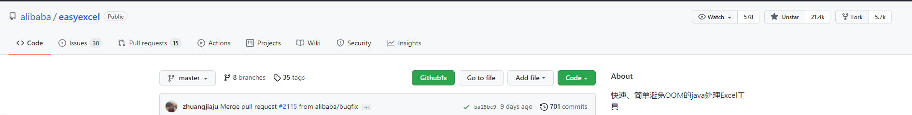

# 阿里巴巴10个顶级开源项目

## 一、项目来源

所有项目均参考自Github上阿里巴巴公开的开源项目。

[阿里巴巴的github地址](https://github.com/alibaba)

## 二、项目介绍

### 1、arthas


截至目前，github上有27.4k个星和6k的fork，是阿里巴巴最受欢迎的开源项目。

`Arthas` 是Alibaba开源的Java诊断工具，深受开发者喜爱。

当你遇到以下类似问题而束手无策时，`Arthas`可以帮助你解决：

1. 这个类从哪个 jar 包加载的？为什么会报各种类相关的 Exception？
2. 我改的代码为什么没有执行到？难道是我没 commit？分支搞错了？
3. 遇到问题无法在线上 debug，难道只能通过加日志再重新发布吗？
4. 线上遇到某个用户的数据处理有问题，但线上同样无法 debug，线下无法重现！
5. 是否有一个全局视角来查看系统的运行状况？
6. 有什么办法可以监控到JVM的实时运行状态？
7. 怎么快速定位应用的热点，生成火焰图？
8. 怎样直接从JVM内查找某个类的实例？

`Arthas` 提供管理界面在线排查问题，无需重启；动态跟踪Java代码；实时监控JVM状态。

`Arthas` 支持JDK 6+，支持Linux/Mac/Windows，采用命令行交互模式，同时提供丰富的 `Tab` 自动补全功能，进一步方便进行问题的定位和诊断。

- Github: https://github.com/alibaba/arthas
- 文档: https://arthas.aliyun.com/doc/

超过120家公司登记了使用：


### 2、p3c


p3c是阿里巴巴开发的Java规约检查插件，可以继承到idea和eclipse中。

相信不少搞Java开发的同学都了解过阿里巴巴出品`《Java开发手册》`，主要整理了阿里内部使用的Java开发的规范。

p3c插件实现了开发手册中的的53条规则，大部分基于PMD实现，其中有4条规则基于IDEA实现，并且基于IDEA [Inspection](https://www.jetbrains.com/help/idea/code-inspection.html)实现了实时检测功能。部分规则实现了`Quick Fix`功能（快速修复）。 

目前插件检测有两种模式：实时检测、手动触发。

主要功能一览：


### 3、druid


Druid 是一个 JDBC 组件库，与c3p0、dbcp齐名，包含数据库连接池、SQL Parser 等组件，被大量业务和技术产品使用或集成，经历过最严苛线上业务场景考验。

#### Druid连接池

Druid连接池是阿里巴巴开源的数据库连接池项目。Druid连接池为监控而生，内置强大的监控功能，监控特性不影响性能。功能强大，能防SQL注入，内置Loging能诊断Hack应用行为。

- Github项目地址 https://github.com/alibaba/druid
- 文档 [https://github.com/alibaba/druid/wiki/%E5%B8%B8%E8%A7%81%E9%97%AE%E9%A2%98](https://github.com/alibaba/druid/wiki/常见问题)
- 下载 [http://repo1.maven.org/maven2/com/alibaba/druid/](http://repo1.maven.org/maven2/com/alibaba/druid/1.1.10/)
- 监控DEMO http://120.26.192.168/druid/index.html

#### 竞品对比

| 功能类别           | 功能            | Druid        | HikariCP    | DBCP | Tomcat-jdbc     | C3P0 |
| ------------------ | --------------- | ------------ | ----------- | ---- | --------------- | ---- |
| 性能               | PSCache         | 是           | 否          | 是   | 是              | 是   |
| LRU                | 是              | 否           | 是          | 是   | 是              |      |
| SLB负载均衡支持    | 是              | 否           | 否          | 否   | 否              |      |
| 稳定性             | ExceptionSorter | 是           | 否          | 否   | 否              | 否   |
| 扩展               | 扩展            | Filter       |             |      | JdbcIntercepter |      |
| 监控               | 监控方式        | jmx/log/http | jmx/metrics | jmx  | jmx             | jmx  |
| 支持SQL级监控      | 是              | 否           | 否          | 否   | 否              |      |
| Spring/Web关联监控 | 是              | 否           | 否          | 否   | 否              |      |
|                    | 诊断支持        | LogFilter    | 否          | 否   | 否              | 否   |
| 连接泄露诊断       | logAbandoned    | 否           | 否          | 否   | 否              |      |
| 安全               | SQL防注入       | 是           | 无          | 无   | 无              | 无   |
| 支持配置加密       | 是              | 否           | 否          | 否   | 否              |      |

### 4、fastjson


fastjson是阿里巴巴的开源`JSON`解析库，它可以解析JSON格式的字符串，支持将Java Bean序列化为JSON字符串，也可以从JSON字符串反序列化到JavaBean。

#### fastjson的优点

##### 1、速度快

fastjson相对其他JSON库的特点是快，从2011年fastjson发布1.1.x版本之后，其性能从未被其他Java实现的JSON库超越。

##### 2、使用广泛

fastjson在阿里巴巴大规模使用，在数万台服务器上部署，fastjson在业界被广泛接受。在2012年被开源中国评选为最受欢迎的国产开源软件之一。

##### 3、测试完备

fastjson有非常多的testcase，在1.2.11版本中，testcase超过3321个。每次发布都会进行回归测试，保证质量稳定。

##### 4、使用简单

fastjson的API十分简洁。

```
String text = JSON.toJSONString(obj); //序列化
VO vo = JSON.parseObject("{...}", VO.class); //反序列化
```

### 5、easyexcel



EasyExcel是一个基于Java的简单、省内存的读写Excel的开源项目。在尽可能节约内存的情况下支持读写百万行级别的Excel。

Java解析、生成Excel比较有名的框架有Apache poi、jxl。但他们都存在一个严重的问题就是非常的耗内存，poi有一套SAX模式的API可以一定程度的解决一些内存溢出的问题，但POI还是有一些缺陷，比如07版Excel解压缩以及解压后存储都是在内存中完成的，内存消耗依然很大。easyexcel重写了poi对07版Excel的解析，一个3M的excel用POI sax解析依然需要100M左右内存，改用easyexcel可以降低到几M，并且再大的excel也不会出现内存溢出；03版依赖POI的sax模式，在上层做了模型转换的封装，让使用者更加简单方便。

举个例子：**64M内存1分钟内读取75M(46W行25列)的Excel**


还有极速模式能更快，但是内存占用会在100M多一点。

### 6、canal


阿里巴巴 MySQL binlog 增量订阅&消费组件。

#### 简介

主要用途是基于 MySQL 数据库增量日志解析，提供增量数据订阅和消费。


基于日志增量订阅和消费的业务包括

- 数据库镜像
- 数据库实时备份
- 索引构建和实时维护(拆分异构索引、倒排索引等)
- 业务 cache 刷新
- 带业务逻辑的增量数据处理

当前的 canal 支持源端 MySQL 版本包括 5.1.x , 5.5.x , 5.6.x , 5.7.x , 8.0.x

#### 工作原理

##### MySQL主备复制原理


- MySQL master 将数据变更写入二进制日志( binary log, 其中记录叫做二进制日志事件binary log events，可以通过 show binlog events 进行查看)
- MySQL slave 将 master 的 binary log events 拷贝到它的中继日志(relay log)
- MySQL slave 重放 relay log 中事件，将数据变更反映它自己的数据

##### canal 工作原理

- canal 模拟 MySQL slave 的交互协议，伪装自己为 MySQL slave ，向 MySQL master 发送dump 协议
- MySQL master 收到 dump 请求，开始推送 binary log 给 slave (即 canal )
- canal 解析 binary log 对象(原始为 byte 流)

### 7、Spring Cloud Alibaba


Spring Cloud Alibaba 致力于提供微服务开发的一站式解决方案。此项目包含开发分布式应用微服务的必需组件，方便开发者通过 Spring Cloud 编程模型轻松使用这些组件来开发分布式应用服务。

依托 Spring Cloud Alibaba，您只需要添加一些注解和少量配置，就可以将 Spring Cloud 应用接入阿里微服务解决方案，通过阿里中间件来迅速搭建分布式应用系统。

#### 主要功能

- **服务限流降级**：默认支持 WebServlet、WebFlux、OpenFeign、RestTemplate、Spring Cloud Gateway、Zuul、Dubbo 和 RocketMQ 限流降级功能的接入，可以在运行时通过控制台实时修改限流降级规则，还支持查看限流降级 Metrics 监控。
- **服务注册与发现**：适配 Spring Cloud 服务注册与发现标准，默认集成了 Ribbon 的支持。
- **分布式配置管理**：支持分布式系统中的外部化配置，配置更改时自动刷新。
- **消息驱动能力**：基于 Spring Cloud Stream 为微服务应用构建消息驱动能力。
- **分布式事务**：使用 @GlobalTransactional 注解， 高效并且对业务零侵入地解决分布式事务问题。
- **阿里云对象存储**：阿里云提供的海量、安全、低成本、高可靠的云存储服务。支持在任何应用、任何时间、任何地点存储和访问任意类型的数据。
- **分布式任务调度**：提供秒级、精准、高可靠、高可用的定时（基于 Cron 表达式）任务调度服务。同时提供分布式的任务执行模型，如网格任务。网格任务支持海量子任务均匀分配到所有 Worker（schedulerx-client）上执行。
- **阿里云短信服务**：覆盖全球的短信服务，友好、高效、智能的互联化通讯能力，帮助企业迅速搭建客户触达通道。

#### 组件

- **[Sentinel](https://github.com/alibaba/Sentinel)**：把流量作为切入点，从流量控制、熔断降级、系统负载保护等多个维度保护服务的稳定性。
- **[Nacos](https://github.com/alibaba/Nacos)**：一个更易于构建云原生应用的动态服务发现、配置管理和服务管理平台。
- **[RocketMQ](https://rocketmq.apache.org/)**：一款开源的分布式消息系统，基于高可用分布式集群技术，提供低延时的、高可靠的消息发布与订阅服务。
- **[Dubbo](https://github.com/apache/dubbo)**：Apache Dubbo™ 是一款高性能 Java RPC 框架。
- **[Seata](https://github.com/seata/seata)**：阿里巴巴开源产品，一个易于使用的高性能微服务分布式事务解决方案。
- **[Alibaba Cloud OSS](https://www.aliyun.com/product/oss)**: 阿里云对象存储服务（Object Storage Service，简称 OSS），是阿里云提供的海量、安全、低成本、高可靠的云存储服务。您可以在任何应用、任何时间、任何地点存储和访问任意类型的数据。
- **[Alibaba Cloud SchedulerX](https://help.aliyun.com/document_detail/43136.html)**: 阿里中间件团队开发的一款分布式任务调度产品，提供秒级、精准、高可靠、高可用的定时（基于 Cron 表达式）任务调度服务。
- **[Alibaba Cloud SMS](https://www.aliyun.com/product/sms)**: 覆盖全球的短信服务，友好、高效、智能的互联化通讯能力，帮助企业迅速搭建客户触达通道。

### 8、nacos


#### Nacos 简介

Nacos 是构建以“服务”为中心的现代应用架构 (例如微服务范式、云原生范式) 的服务基础设施。

Nacos 支持几乎所有主流类型的“服务”的发现、配置和管理：[Kubernetes Service](https://kubernetes.io/docs/concepts/services-networking/service/)、[gRPC](https://grpc.io/docs/guides/concepts.html#service-definition) & [Dubbo RPC Service](https://dubbo.incubator.apache.org/)、[Spring Cloud RESTful Service](https://spring.io/understanding/REST)

#### Nacos 特性

- **服务发现和服务健康监测**

  Nacos 支持基于 DNS 和基于 RPC 的服务发现。服务提供者使用 [原生SDK](https://nacos.io/zh-cn/docs/sdk.html)、[OpenAPI](https://nacos.io/zh-cn/docs/open-api.html)、或一个[独立的Agent TODO](https://nacos.io/zh-cn/docs/other-language.html)注册 Service 后，服务消费者可以使用[DNS TODO](https://nacos.io/zh-cn/docs/xx) 或[HTTP&API](https://nacos.io/zh-cn/docs/open-api.html)查找和发现服务。

  Nacos 提供对服务的实时的健康检查，阻止向不健康的主机或服务实例发送请求。Nacos 支持传输层 (PING 或 TCP)和应用层 (如 HTTP、MySQL、用户自定义）的健康检查。 对于复杂的云环境和网络拓扑环境中（如 VPC、边缘网络等）服务的健康检查，Nacos 提供了 agent 上报模式和服务端主动检测2种健康检查模式。Nacos 还提供了统一的健康检查仪表盘，帮助您根据健康状态管理服务的可用性及流量。

- **动态配置服务**

  动态配置服务可以让您以中心化、外部化和动态化的方式管理所有环境的应用配置和服务配置。

  动态配置消除了配置变更时重新部署应用和服务的需要，让配置管理变得更加高效和敏捷。

  配置中心化管理让实现无状态服务变得更简单，让服务按需弹性扩展变得更容易。

  Nacos 提供了一个简洁易用的UI ([控制台样例 Demo](http://console.nacos.io/nacos/index.html)) 帮助您管理所有的服务和应用的配置。Nacos 还提供包括配置版本跟踪、金丝雀发布、一键回滚配置以及客户端配置更新状态跟踪在内的一系列开箱即用的配置管理特性，帮助您更安全地在生产环境中管理配置变更和降低配置变更带来的风险。

- **动态 DNS 服务**

  动态 DNS 服务支持权重路由，让您更容易地实现中间层负载均衡、更灵活的路由策略、流量控制以及数据中心内网的简单DNS解析服务。动态DNS服务还能让您更容易地实现以 DNS 协议为基础的服务发现，以帮助您消除耦合到厂商私有服务发现 API 上的风险。

  Nacos 提供了一些简单的 [DNS APIs TODO](https://nacos.io/zh-cn/docs/xx) 帮助您管理服务的关联域名和可用的 IP:PORT 列表.

- **服务及其元数据管理**

  Nacos 能让您从微服务平台建设的视角管理数据中心的所有服务及元数据，包括管理服务的描述、生命周期、服务的静态依赖分析、服务的健康状态、服务的流量管理、路由及安全策略、服务的 SLA 以及最首要的 metrics 统计数据。

#### Nacos 地图


- 特性大图：要从功能特性，非功能特性，全面介绍我们要解的问题域的特性诉求
- 架构大图：通过清晰架构，让您快速进入 Nacos 世界
- 业务大图：利用当前特性可以支持的业务场景，及其最佳实践
- 生态大图：系统梳理 Nacos 和主流技术生态的关系
- 优势大图：展示 Nacos 核心竞争力
- 战略大图：要从战略到战术层面讲 Nacos 的宏观优势

#### Nacos 生态图


### 9、Sentinel


#### Sentinel 介绍

随着微服务的流行，服务和服务之间的稳定性变得越来越重要。Sentinel 是面向分布式服务架构的流量控制组件，主要以流量为切入点，从流量控制、熔断降级、系统自适应保护等多个维度来帮助您保障微服务的稳定性。

#### Sentinel 基本概念

##### 资源

资源是 Sentinel 的关键概念。它可以是 Java 应用程序中的任何内容，例如，由应用程序提供的服务，或由应用程序调用的其它应用提供的服务，甚至可以是一段代码。在接下来的文档中，我们都会用资源来描述代码块。

只要通过 Sentinel API 定义的代码，就是资源，能够被 Sentinel 保护起来。大部分情况下，可以使用方法签名，URL，甚至服务名称作为资源名来标示资源。

##### 规则

围绕资源的实时状态设定的规则，可以包括流量控制规则、熔断降级规则以及系统保护规则。所有规则可以动态实时调整。

### Sentinel 功能和设计理念

##### 流量控制

流量控制在网络传输中是一个常用的概念，它用于调整网络包的发送数据。然而，从系统稳定性角度考虑，在处理请求的速度上，也有非常多的讲究。任意时间到来的请求往往是随机不可控的，而系统的处理能力是有限的。我们需要根据系统的处理能力对流量进行控制。Sentinel 作为一个调配器，可以根据需要把随机的请求调整成合适的形状，如下图所示：


流量控制有以下几个角度:

- 资源的调用关系，例如资源的调用链路，资源和资源之间的关系；
- 运行指标，例如 QPS、线程池、系统负载等；
- 控制的效果，例如直接限流、冷启动、排队等。

Sentinel 的设计理念是让您自由选择控制的角度，并进行灵活组合，从而达到想要的效果。

##### 熔断降级

除了流量控制以外，降低调用链路中的不稳定资源也是 Sentinel 的使命之一。由于调用关系的复杂性，如果调用链路中的某个资源出现了不稳定，最终会导致请求发生堆积。这个问题和 [Hystrix](https://github.com/Netflix/Hystrix/wiki#what-problem-does-hystrix-solve) 里面描述的问题是一样的。


Sentinel 和 Hystrix 的原则是一致的: 当调用链路中某个资源出现不稳定，例如，表现为 timeout，异常比例升高的时候，则对这个资源的调用进行限制，并让请求快速失败，避免影响到其它的资源，最终产生雪崩的效果。

在限制的手段上，Sentinel 和 Hystrix 采取了完全不一样的方法。

Hystrix 通过[线程池](https://github.com/Netflix/Hystrix/wiki/How-it-Works#benefits-of-thread-pools)的方式，来对依赖(在我们的概念中对应资源)进行了隔离。这样做的好处是资源和资源之间做到了最彻底的隔离。缺点是除了增加了线程切换的成本，还需要预先给各个资源做线程池大小的分配。

Sentinel 对这个问题采取了两种手段:

- 通过并发线程数进行限制

和资源池隔离的方法不同，Sentinel 通过限制资源并发线程的数量，来减少不稳定资源对其它资源的影响。这样不但没有线程切换的损耗，也不需要您预先分配线程池的大小。当某个资源出现不稳定的情况下，例如响应时间变长，对资源的直接影响就是会造成线程数的逐步堆积。当线程数在特定资源上堆积到一定的数量之后，对该资源的新请求就会被拒绝。堆积的线程完成任务后才开始继续接收请求。

- 通过响应时间对资源进行降级

除了对并发线程数进行控制以外，Sentinel 还可以通过响应时间来快速降级不稳定的资源。当依赖的资源出现响应时间过长后，所有对该资源的访问都会被直接拒绝，直到过了指定的时间窗口之后才重新恢复。

##### 系统负载保护

Sentinel 同时提供[系统维度的自适应保护能力](https://sentinelguard.io/zh-cn/docs/system-adaptive-protection.html)。防止雪崩，是系统防护中重要的一环。当系统负载较高的时候，如果还持续让请求进入，可能会导致系统崩溃，无法响应。在集群环境下，网络负载均衡会把本应这台机器承载的流量转发到其它的机器上去。如果这个时候其它的机器也处在一个边缘状态的时候，这个增加的流量就会导致这台机器也崩溃，最后导致整个集群不可用。

针对这个情况，Sentinel 提供了对应的保护机制，让系统的入口流量和系统的负载达到一个平衡，保证系统在能力范围之内处理最多的请求。

### Sentinel 工作机制

- 对主流框架提供适配或者显示的 API，来定义需要保护的资源，并提供设施对资源进行实时统计和调用链路分析。
- 根据预设的规则，结合对资源的实时统计信息，对流量进行控制。同时，Sentinel 提供开放的接口，方便您定义及改变规则。
- Sentinel 提供实时的监控系统，方便您快速了解目前系统的状态。

#### 总体框架


### 10、COLA


**COLA 是 Clean Object-Oriented and Layered Architecture的缩写，代表“整洁面向对象分层架构”。 **

**目前COLA已经发展到[COLA 4.0](https://blog.csdn.net/significantfrank/article/details/110934799)。**

COLA分为两个部分，COLA架构和COLA组件。


好的应用架构，都遵循一些共同模式，不管是六边形架构、洋葱圈架构、整洁架构、还是COLA架构，**都提倡以业务为核心，解耦外部依赖，分离业务复杂度和技术复杂度等**。

为了能够快速创建满足COLA架构的应用，我们提供了两个`archetype`，位于[`cola-archetypes`目录](https://github.com/alibaba/COLA/blob/master/cola-archetypes)下：

1. `cola-archetype-service`：用来创建纯后端服务的`archetype`。
2. `cola-archetype-web`：用来创建`adapter`和后端服务一体的`web`应用`archetype`。

执行以下命令：

```
mvn archetype:generate  \
    -DgroupId=com.alibaba.cola.demo.web \
    -DartifactId=demo-web \
    -Dversion=1.0.0-SNAPSHOT \
    -Dpackage=com.alibaba.demo \
    -DarchetypeArtifactId=cola-framework-archetype-web \
    -DarchetypeGroupId=com.alibaba.cola \
    -DarchetypeVersion=4.0.1
```

命令执行成功的话，会看到如下的应用代码结构：


COLA架构的核心职责就是定义良好的应用结构，提供最佳应用架构的最佳实践。通过不断探索，我们发现良好的分层结构，良好的包结构定义，可以帮助我们治理混乱不堪的业务应用系统。

