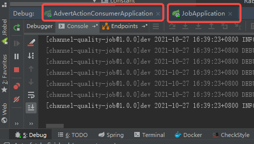
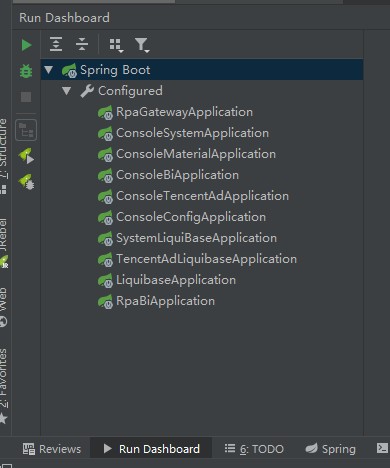
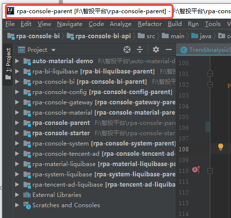
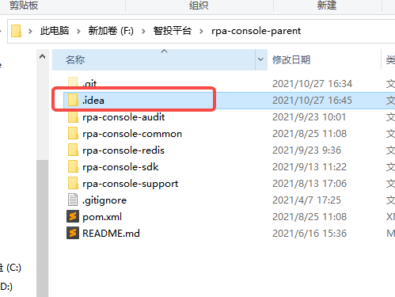
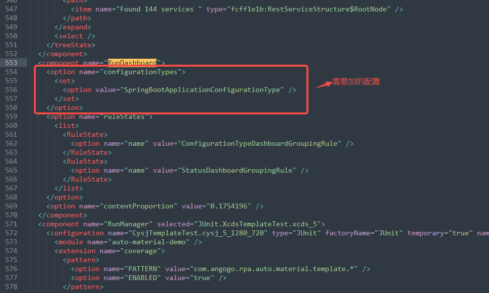

# IDEA实用技巧

### 一、面板展示Run Dashboard

#### 1、为什么？

idea在正常情况下，在一个window中有多个web项目启动时，只会在下方面板位置的`Run`或`Debug`选项tab下，以tab页的方式切换项目，即不方便，也不直观。



这时我们就可以使用Run Dashboard，操作更符合我们的习惯。



#### 2、怎样做？

- **打开idea该window所属的项目文件夹，如下图确定项目所在文件地址**

  

- **打开文件夹下的`.idea`文件夹**



- **打开`workspace.xml`，按 ctrl+f 搜索`RunDashboard`，增加如下配置：**

  ```xml
  <option name="configurationTypes">
      <set>
          <option value="SpringBootApplicationConfigurationType" />
      </set>
  </option>
  ```

- **到图中的红框位置**

  

- **重启idea生效**

