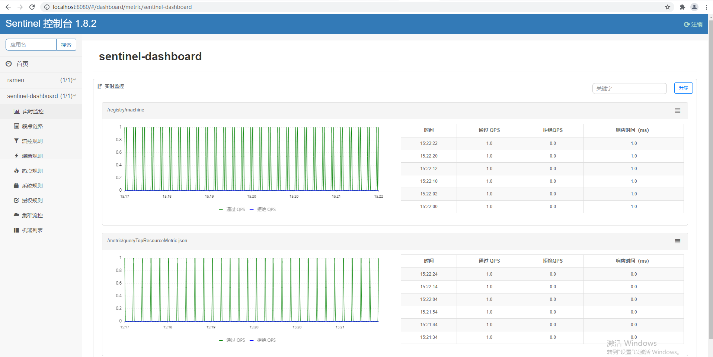
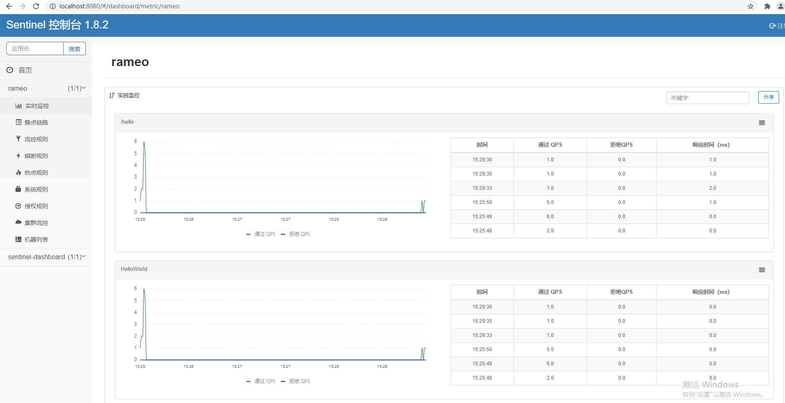

# Sentinel快速接入

Sentinel 的使用可以分为两个部分:

- 核心库（Java 客户端）：不依赖任何框架/库，能够运行于 Java 7 及以上的版本的运行时环境，同时对 Dubbo / Spring Cloud 等框架也有较好的支持（见 [主流框架适配](https://sentinelguard.io/zh-cn/docs/open-source-framework-integrations.html)）。
- 控制台（Dashboard）：Dashboard 主要负责管理推送规则、监控、管理机器信息等。

## 启动 Sentinel 控制台

### 概述

Sentinel 提供一个轻量级的开源控制台，它提供机器发现以及健康情况管理、监控（单机和集群），规则管理和推送的功能。这里，我们将会详细讲述如何通过简单的步骤就可以使用这些功能。

接下来，我们将会逐一介绍如何整合 Sentinel 核心库和 Dashboard，让它发挥最大的作用。同时我们也在阿里云上提供企业级的 Sentinel 服务：[AHAS Sentinel 控制台](https://github.com/alibaba/Sentinel/wiki/AHAS-Sentinel-控制台)，您只需要几个简单的步骤，就能最直观地看到控制台如何实现这些功能，并体验多样化的监控及全自动托管的集群流控能力。

Sentinel 控制台包含如下功能:

- **查看机器列表以及健康情况**：收集 Sentinel 客户端发送的心跳包，用于判断机器是否在线。
- **监控 (单机和集群聚合)**：通过 Sentinel 客户端暴露的监控 API，定期拉取并且聚合应用监控信息，最终可以实现秒级的实时监控。
- **规则管理和推送**：统一管理推送规则。
- **鉴权**：生产环境中鉴权非常重要。这里每个开发者需要根据自己的实际情况进行定制。

> 注意：Sentinel 控制台目前仅支持单机部署。Sentinel 控制台项目提供 Sentinel 功能全集示例，不作为开箱即用的生产环境控制台，若希望在生产环境使用请根据[文档](https://github.com/alibaba/Sentinel/wiki/在生产环境中使用-Sentinel)自行进行定制和改造。

### 获取 Sentinel 控制台

您可以从 [release 页面](https://github.com/alibaba/Sentinel/releases) 下载最新版本的控制台 jar 包。

您也可以从最新版本的源码自行构建 Sentinel 控制台：

- 下载 [控制台](https://github.com/alibaba/Sentinel/tree/master/sentinel-dashboard) 工程
- 使用以下命令将代码打包成一个 fat jar: `mvn clean package`

### 启动

> **注意**：启动 Sentinel 控制台需要 JDK 版本为 1.8 及以上版本。

使用如下命令启动控制台：

```bash
java -Dserver.port=8080 -Dcsp.sentinel.dashboard.server=localhost:8080 -Dproject.name=sentinel-dashboard -jar sentinel-dashboard.jar
```

其中 `-Dserver.port=8080` 用于指定 Sentinel 控制台端口为 `8080`。

从 Sentinel 1.6.0 起，Sentinel 控制台引入基本的**登录**功能，默认用户名和密码都是 `sentinel`。可以参考 [鉴权模块文档](https://sentinelguard.io/zh-cn/docs/dashboard.html#鉴权) 配置用户名和密码。

> 注：若您的应用为 Spring Boot 或 Spring Cloud 应用，您可以通过 Spring 配置文件来指定配置，详情请参考 [Spring Cloud Alibaba Sentinel 文档](https://github.com/spring-cloud-incubator/spring-cloud-alibaba/wiki/Sentinel)。

启动成功可以看到默认的应用：**sentinel-dashboard**



## 客户端接入控制台

以SpringBoot项目为例：

### 通过 `pom.xml` 引入 JAR 包

```xml
<dependency>
	<groupId>com.alibaba.cloud</groupId>
	<artifactId>spring-cloud-starter-alibaba-sentinel</artifactId>
	<version>2.2.1.RELEASE</version>
</dependency>
```

### 配置启动参数

在application.yml或application.properties文件中增加配置

```yml
spring:
  application:
    name: rameo
  security:
    user: # 配置安全用户
      name: admin
      password: 123456
  cloud:
    sentinel:
      transport:
        dashboard: 127.0.0.1:8080   #sentinel控制台的请求地址
```

### 定义资源

**资源** 是 Sentinel 中的核心概念之一。最常用的资源是我们代码中的 Java 方法。 当然，您也可以更灵活的定义你的资源，例如，把需要控制流量的代码用 Sentinel API `SphU.entry("HelloWorld")` 和 `entry.exit()` 包围起来即可。在下面的例子中，我们将 `System.out.println("hello world");` 作为资源（被保护的逻辑），用 API 包装起来。参考代码如下:

```java
public static void main(String[] args) {
    // 配置规则.
    initFlowRules();

    while (true) {
        // 1.5.0 版本开始可以直接利用 try-with-resources 特性
        try (Entry entry = SphU.entry("HelloWorld")) {
            // 被保护的逻辑
            System.out.println("hello world");
	} catch (BlockException ex) {
            // 处理被流控的逻辑
	    System.out.println("blocked!");
	}
    }
}
```

完成以上两步后，代码端的改造就完成了。

您也可以通过我们提供的 [注解支持模块](https://sentinelguard.io/zh-cn/docs/annotation-support.html)，来定义我们的资源，类似于下面的代码：

```java
@SentinelResource("HelloWorld")
public void helloWorld() {
    // 资源中的逻辑
    System.out.println("hello world");
}
```

这样，`helloWorld()` 方法就成了我们的一个资源。注意注解支持模块需要配合 Spring AOP 或者 AspectJ 一起使用。

### 定义规则

接下来，通过流控规则来指定允许该资源通过的请求次数，例如下面的代码定义了资源 `HelloWorld` 每秒最多只能通过 20 个请求。

```java
private static void initFlowRules(){
    List<FlowRule> rules = new ArrayList<>();
    FlowRule rule = new FlowRule();
    rule.setResource("HelloWorld");
    rule.setGrade(RuleConstant.FLOW_GRADE_QPS);
    // Set limit QPS to 20.
    rule.setCount(20);
    rules.add(rule);
    FlowRuleManager.loadRules(rules);
}
```

完成上面 3 步，Sentinel 就能够正常工作了。更多的信息可以参考 [使用文档](https://sentinelguard.io/zh-cn/docs/basic-api-resource-rule.html)。

### 启动项目

默认情况下Sentinel 会在客户端首次调用的时候进行初始化（`懒加载`），开始向控制台发送心跳包。

需要先访问接口，才能在控制台看到效果。



## Sentinel与Hystrix的区别

| 功能           | Sentinel                                                   | Hystrix                 |
| :------------- | :--------------------------------------------------------- | :---------------------- |
| 隔离策略       | 信号量隔离（并发线程数限流）                               | 线程池隔离/信号量隔离   |
| 熔断降级策略   | 基于响应时间、异常比率、异常数                             | 基于异常比率            |
| 实时统计实现   | 滑动窗口（LeapArray）                                      | 滑动窗口（基于 RxJava） |
| 动态规则配置   | 支持多种数据源                                             | 支持多种数据源          |
| 扩展性         | 多个扩展点                                                 | 插件的形式              |
| 基于注解的支持 | 支持                                                       | 支持                    |
| 限流           | 基于 QPS，支持基于调用关系的限流                           | 有限的支持              |
| 流量整形       | 支持预热模式、匀速器模式、预热排队模式(流量规则处可配置)   | 不支持                  |
| 系统自适应保护 | 支持                                                       | 不支持                  |
| 控制台         | 提供开箱即用的控制台，可配置规则、查看秒级监控、机器发现等 | 简单的监控查看          |

