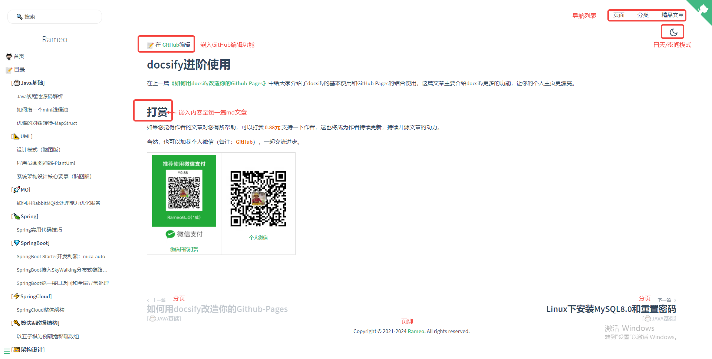
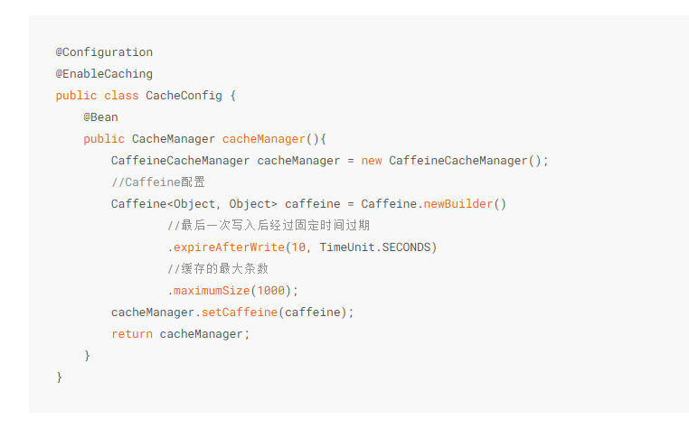

# docsify进阶使用

在上一篇[《如何用docsify改造你的Github-Pages》](./如何用docsify改造你的Github-Pages.md)中给大家介绍了docsify的基本使用和GitHub Pages的结合使用，这篇文章主要介绍docsify更多的功能，让你的个人主页更漂亮。

先放个整体图，看下有哪些好玩的东西🧐🧐

- **导航列表**
- **白天/夜间模式切换**
- **上一篇/下一篇功能**
- **嵌入GitHub编辑功能**
- **全局嵌入功能**
- **页脚**
- **图片放大**
- **代码高亮**
- **代码一键复制到剪切板**
- **支持emoji表情**
- **字数统计**



## 导航列表

在`<body>`标签下加入

```html
<nav>
    <ul>
        <li>
            页面
            <ul>
                <li><a href="#">封面</a></li>
                <li><a href="#/README">首页</a></li>
            </ul>
        </li>
        <li>
            分类
            <ul>
                <li><a href="#/MQ/README">MQ</a></li>
                <li><a href="#/DDD/README">DDD</a></li>
                <li><a href="#/UML/README">UML</a></li>
                <li><a href="#/Spring/README">Spring</a></li>
                <li><a href="#/SpringBoot/README">SpringBoot</a></li>
                <li><a href="#/SpringCloud/README">SpringCloud</a></li>
                <li><a href="#/Java基础/README">Java基础</a></li>
                <li><a href="#/Skill/README">实用技巧</a></li>
                <li><a href="#/Architecture/README">架构设计</a></li>
                <li><a href="#/Specification/README">开发规范</a></li>
                <li><a href="#/Algorithm/README">算法&数据结构</a></li>
            </ul>
        </li>
        <li>
            精品文章
            <ul>
                <li><a href="#/DDD/DDD系列第一讲：Domain-Primitive">DDD系列第一讲：Domain-Primitive</a></li>
                <li><a href="#/Skill/如何用docsify改造你的Github-Pages">如何用docsify改造你的Github-Pages</a></li>
                <li><a href="#/SpringBoot/mica-auto">SpringBoot Starter开发利器：mica-auto</a></li>
                <li><a href="#/Java基础/线程池/Java线程池源码解析">Java线程池源码解析</a></li>
                <li><a href="#/Java基础/线程池/如何撸一个mini线程池">如何撸一个mini线程池</a></li>
            </ul>
        </li>
    </ul>
</nav>
```

## 白天/夜间模式切换

分别引入css、js文件

```html
<link rel="stylesheet" href="//cdn.jsdelivr.net/npm/docsify-darklight-theme@latest/dist/style.min.css">
<script src="//cdn.jsdelivr.net/npm/docsify-darklight-theme@latest/dist/index.min.js"></script>
```

在docsify的初始化js代码中加入

```html
<script>
    window.$docsify = {
        darklightTheme: {
            defaultTheme: 'light',
            siteFont: 'Source Sans Pro,Helvetica Neue,Arial,sans-serif',
            codeFontFamily: 'Roboto Mono, Monaco, courier, monospace',
            bodyFontSize: '15px',
            dark: {
                background: 'rgb(28,32,34)',
                highlightColor: '#e96900',
                codeBackgroundColor: 'rgb(34,39,46)',
                codeTextColor: '#b4b4b4',
            },
            light: {
                highlightColor: '#e96900',
            }
        },
    };
</script>
```

## 上一篇/下一篇

引入js文件

```html
<script src="//cdn.jsdelivr.net/npm/docsify-pagination/dist/docsify-pagination.min.js"></script>
```

在docsify的初始化js代码中加入

```html
<script> 	
	window.$docsify = {
        pagination: {
            previousText: "上一篇",
            nextText: "下一篇",
            crossChapter: true,
            crossChapterText: true,
        },
    };
</script>
```

## 嵌入GitHub编辑功能/全局嵌入功能/页脚

在docsify的初始化js代码中加入plugins功能

```html
<script>
    window.$docsify = {
        plugins: [
            function (hook, vm) {
                hook.beforeEach(function (content) { // content为md文件本身的内容
                    const en = vm.route.file.indexOf("README_EN") > -1;
                    if (/githubusercontent\.com/.test(vm.route.file)) {
                        url = vm.route.file
                            .replace("raw.githubusercontent.com", "github.com")
                            .replace(/\/main/, "/blob/main");
                    } else {
                        url =
                            "https://github.com/rameosu/rameo/tree/main/docs/" +
                            vm.route.file;
                    }
                    const github = `[GitHub](${url})`;
                    // 全局嵌入GitHub编辑功能
                    const editHtml = en
                        ? `:memo: Edit on ${github}\n`
                        : `:memo: 在 ${github}编辑\n`;
                    if (vm.route.path == "/") {
                        return editHtml + content;
                    }
                    // 全局嵌入代码
                    const subscription = `
                        <h2>打赏</h2>
                        如果您觉得作者的文章对您有所帮助，可以打赏 <b style="color: #e96900">0.88元</b> 支持一下作者，这也将成为作者持续更新，持续开源文章的动力。
                        </br>
                        </br>
                        当然，也可以加我个人微信（备注：<b style="color: #e96900">GitHub</b>），一起交流进步。
                        </br>
                        </br>
                        <table>
                            <tr>
                              <td align="center" style="width: 200px;">
                                <a href="https://rameosu.github.io/rameo">
                                  <br>
                                  <sub>微信扫码打赏</sub>
                                </a><br>
                              </td>
                              <td align="center" style="width: 200px;">
                                <a href="https://rameosu.github.io/rameo">
                                  <br>
                                  <sub>个人微信</sub>
                                </a><br>
                              </td>
                            </tr>
                        </table>
                    `;
                    // 拼接的内容即为页面最终渲染的效果
                    return editHtml + content + `<br>` + subscription;
                });
                hook.afterEach(function (html) { // 页脚
                    const footer = [
                        "<footer style='text-align: center;'>",
                        '<span>Copyright © 2021-2024 <a href="https://github.com/rameosu/rameo" target="_blank">Rameo</a>. All rights reserved.',
                        "</footer>",
                    ].join("");
                    return html + footer;
                });
            },
        ],
    };
</script>
```

## 图片放大

引入js文件

```html
<script src="//cdn.jsdelivr.net/npm/docsify/lib/plugins/zoom-image.min.js"></script>
```

## 代码高亮

引入js文件，支持不同类型的代码

```html
<script src="//cdn.jsdelivr.net/npm/prismjs/components/prism-json.min.js"></script>
<script src="//cdn.jsdelivr.net/npm/prismjs/components/prism-java.min.js"></script>
<script src="//cdn.jsdelivr.net/npm/prismjs/components/prism-bash.min.js"></script>
<script src="//cdn.jsdelivr.net/npm/prismjs/components/prism-cpp.min.js"></script>
<script src="//cdn.jsdelivr.net/npm/prismjs/components/prism-c.min.js"></script>
<script src="//cdn.jsdelivr.net/npm/prismjs/components/prism-python.min.js"></script>
<script src="//cdn.jsdelivr.net/npm/prismjs/components/prism-markup.min.js"></script>
<script src="//cdn.jsdelivr.net/npm/prismjs/components/prism-markdown.min.js"></script>
<script src="//cdn.jsdelivr.net/npm/prismjs/components/prism-sql.min.js"></script>
<script src="//cdn.jsdelivr.net/npm/prismjs/components/prism-yaml.min.js"></script>
<script src="//cdn.jsdelivr.net/npm/prismjs/components/prism-properties.min.js"></script>
<script src="//cdn.jsdelivr.net/npm/prismjs/components/prism-xml-doc.min.js"></script>
```

以Java代码为例



## 代码一键复制到剪切板

引入js文件

```html
<script src="//cdn.jsdelivr.net/npm/docsify-copy-code@2.1.1/dist/docsify-copy-code.min.js"></script>
```


## 支持emoji表情

引入js文件

```html
<script src="//cdn.jsdelivr.net/npm/docsify/lib/plugins/emoji.min.js"></script>
```

## 字数统计

引入js文件

```html
<script src="//unpkg.com/docsify-count/dist/countable.js"></script>
```

在docsify的初始化js代码中加入

```html
<script> 	
	window.$docsify = {
        count:{
            countable:true,
            position:'bottom',
            fontsize: "0.9em",
            color: "rgb(90,90,90)",
            language:'chinese'
        },
    };
</script>
```


## 最后

`注意：`以上的代码均是加到你的docs目录下的`index.html`文件中。