# UML类图

类图描述系统中的类，以及各个类之间的关系的`静态视图`，能够让我们在正确编写代码之前对系统有一个全面的认识。类图是一种模型类型，确切地说，是一种静态模型类型。类图表示类、接口和它们之间的协作关系，用于系统设计阶段。

## 类、接口和类图

### 类

**类（Class）是指具有相同属性、方法和关系的对象的抽象，它封装了数据和行为，是面向对象程序设计（OOP）的基础，具有封装性、继承性和多态性等三大特性。**在 UML 中，类使用包含类名、属性和操作且带有分隔线的矩形来表示。

(1) 类名（Name）是一个字符串，例如，Student。

(2) 属性（Attribute）是指类的特性，即类的成员变量。UML 按以下格式表示：

```
[可见性]属性名:类型[=默认值]
```

例如：-name : String

注意：“可见性”表示该属性对类外的元素是否可见，包括公有（Public）、私有（Private）、受保护（Protected）和朋友（Friendly）4 种，在类图中分别用符号+、-、#、~表示。

#### plantuml中的可见性

| **Character** | **Icon for field**                                         | **Icon for method**                                         | **Visibility**  |
| ------------- | ---------------------------------------------------------- | ----------------------------------------------------------- | --------------- |
| `-`           |          |          | private         |
| `#`           |        |        | protected       |
| `~`           |  |  | package private |
| `+`           |           |           | public          |

#### mermaid中的可见性

| 可见性                         | Java               | UML  |
| :----------------------------- | :----------------- | :--- |
| 对所有类可见(公共的)           | public             | `+`  |
| 仅对本类可见(私有的)           | private            | `-`  |
| 对本包和所有子类可见(受保护的) | protected          | `#`  |
| 对本包可见(包内部)             | 默认，不需要修饰符 | `~`  |

(3) 操作（Operations）是类的任意一个实例对象都可以使用的行为，是类的成员方法。UML 按以下格式表示：

```
[可见性]名称(参数列表)[:返回类型]
```

例如：+display() : void。

如下所示是学生类的 UML 表示。

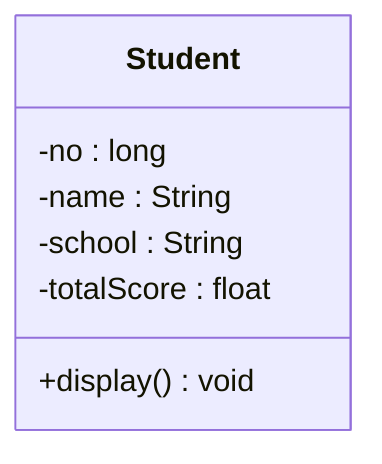

> 类图用 3 个矩形拼接表示，最上面的部分标识类的名称，中间的部分标识类的属性，最下面的部分标识类的方法。

类图中，需注意以下几点：

- 抽象类或抽象方法用`斜体`表示
- 如果是接口，则在类名上方加 `<<Interface>>`
- 字段和方法返回值的数据类型非必需
- 静态类或静态方法加`下划线`

### 接口

**接口（Interface）是一种特殊的类，它具有类的结构但不可被实例化，只可以被子类实现。**它包含抽象操作，但不包含属性。它描述了类或组件对外可见的动作。在 UML 中，接口使用一个带有名称的小圆圈来进行表示。

如下所示是图形类接口的 UML 表示。

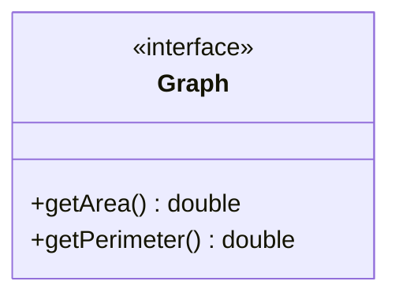

### 类图

**类图（ClassDiagram）是用来显示系统中的类、接口、协作以及它们之间的静态结构和关系的一种静态模型。**它主要用于描述软件系统的结构化设计，帮助人们简化对软件系统的理解，它是系统分析与设计阶段的重要产物，也是系统编码与测试的重要模型依据。

类图中的类可以通过某种编程语言直接实现。类图在软件系统开发的整个生命周期都是有效的，它是面向对象系统的建模中最常见的图。如下所示是“计算长方形和圆形的周长与面积”的类图，图形接口有计算面积和周长的抽象方法，长方形和圆形实现这两个方法供访问类调用。

#### mermaid类图

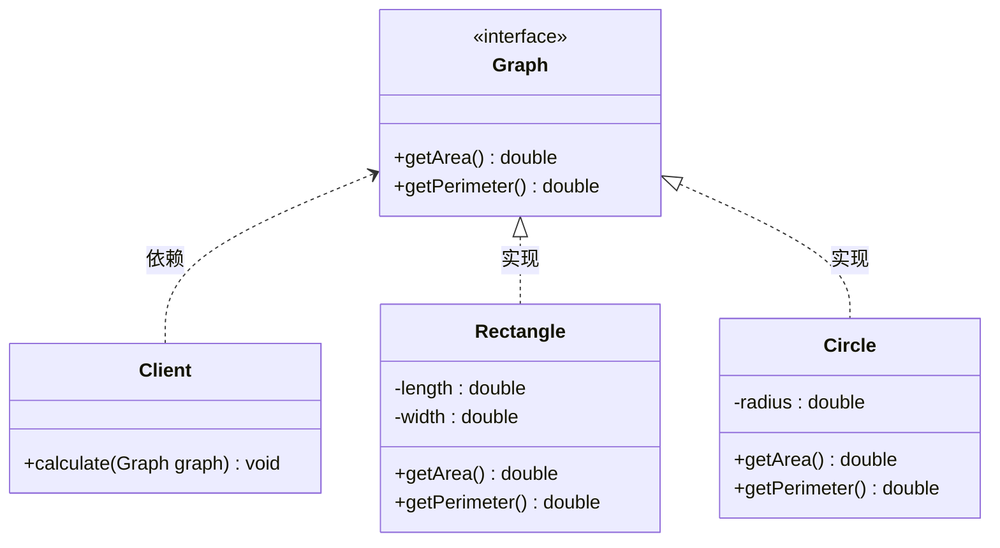

#### plantUml类图

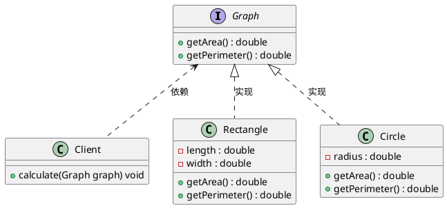

## 类之间的关系

UML 将事物之间的联系归纳为 6 种，并用对应的图形类表示。下面根据类与类之间的耦合度从弱到强排列。

> UML 中的类图有以下几种关系：依赖关系、关联关系、聚合关系、组合关系、泛化关系和实现关系。其中泛化和实现的耦合度相等，它们是最强的。

### 定义关系

- 实线 ：--
- 虚线：..
- 实心三角：< 或 >
- 空心三角：<| 或 |>
- 实心菱形：*
- 空心菱形：o

| 符号  | 英文          | 描述     |
| ----- | ------------- | -------- |
| <\|-- | Inheritance   | 继承     |
| *--   | Composition   | 组合     |
| o--   | Aggregation   | 聚合     |
| -->   | Association   | 单向关联 |
| --    | Link (Solid)  | 双向关联 |
| ..>   | Dependency    | 依赖     |
| ..\|> | Realization   | 实现     |
| ..    | Link (Dashed) |          |

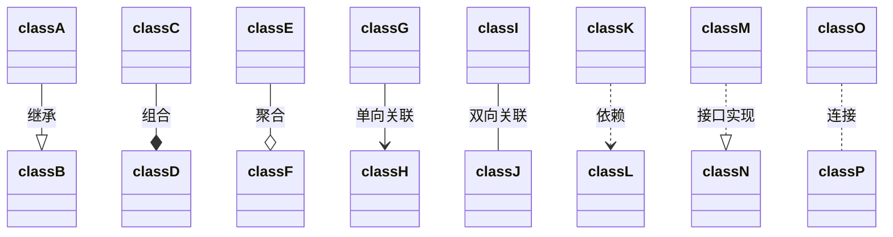


### 依赖关系

**依赖（Dependency）关系是一种使用关系，它是对象之间耦合度最弱的一种关联方式，是临时性的关联。**在代码中，某个类的方法通过`局部变量`、`方法的参数`或者对`静态方法的调用`来访问另一个类（被依赖类）中的某些方法来完成一些职责。

在 UML 类图中，依赖关系使用**带箭头的虚线**来表示，箭头从使用类指向被依赖的类。如下是人与手机的关系图，人通过手机的语音传送方法打电话。

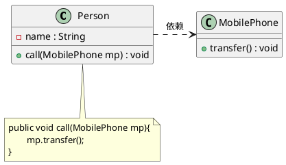

### 关联关系

**关联（Association）关系是对象之间的一种引用关系，用于表示一类对象与另一类对象之间的联系**，如老师和学生、师傅和徒弟、丈夫和妻子等。关联关系是类与类之间最常用的一种关系，分为一般`关联关系`、`聚合关系`和`组合关系`。我们先介绍一般关联。

**关联可以是双向的，也可以是单向的。**在 UML 类图中，双向的关联可以用带**两个箭头或者没有箭头的实线**来表示，单向的关联用带一个箭头的实线来表示，箭头从使用类指向被关联的类。也可以在关联线的两端标注角色名，代表两种不同的角色。

在代码中通常将一个类的对象作为另一个类的成员变量来实现关联关系。如下是老师和学生的关系图，每个老师可以教多个学生，每个学生也可向多个老师学，他们是双向关联。

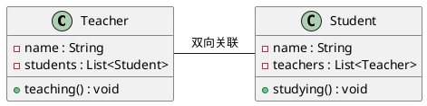

### 聚合关系

聚合（Aggregation）关系是关联关系的一种，是**强关联关系**，是整体和部分之间的关系，是 `has-a` 的关系。

聚合关系也是通过成员对象来实现的，其中成员对象是整体对象的一部分，但是成员对象可以脱离整体对象而独立存在。例如，学校与老师的关系，学校包含老师，但如果学校停办了，老师依然存在。

在 UML 类图中，聚合关系可以用带**空心菱形的实线**来表示，菱形指向整体。如下是大学和教师的关系图。

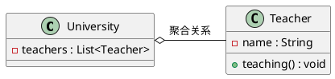

### 组合关系

组合（Composition）关系也是关联关系的一种，也表示类之间的整体与部分的关系，但它是一种更强烈的聚合关系，是 `contains-a` 关系。

在组合关系中，整体对象可以控制部分对象的生命周期，一旦整体对象不存在，部分对象也将不存在，部分对象不能脱离整体对象而存在。例如，头和嘴的关系，没有了头，嘴也就不存在了。

在 UML 类图中，组合关系用**带实心菱形的实线**来表示，菱形指向整体。如下是头和嘴的关系图。

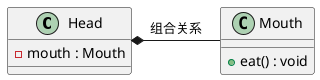

### 泛化关系

**泛化（Generalization）关系是对象之间耦合度最大的一种关系，表示一般与特殊的关系，是父类与子类之间的关系，是一种继承关系，是 `is-a` 的关系。**

在 UML 类图中，泛化关系用带**空心三角箭头的实线**来表示，箭头从子类指向父类。在代码实现时，使用面向对象的`继承机制`来实现泛化关系。例如，Student 类和 Teacher 类都是 Person 类的子类，其类图如下所示。

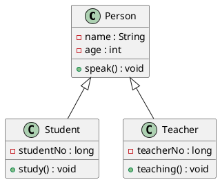

### 实现关系

**实现（Realization）关系是接口与实现类之间的关系。**在这种关系中，类实现了接口，类中的操作实现了接口中所声明的所有的抽象操作。

在 UML 类图中，实现关系使用**带空心三角箭头的虚线**来表示，箭头从实现类指向接口。例如，汽车和船实现了交通工具，其类图如下所示。

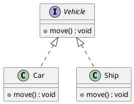

## 符号速记

- 空心三角实线表：泛化（继承）
- 空心三角虚线表：实现
- 箭头实线表：关联
- 箭头虚线表：依赖
- 实心菱形表：组合
- 空心菱形表：聚合

## 类关系速记

| 分类                                                         | 箭头特征                                      | 记忆技巧                                                     |
| ------------------------------------------------------------ | --------------------------------------------- | ------------------------------------------------------------ |
| 箭头方向                                                     | 从子类指向父类                                | 定义子类需要通过 extends 关键字指定父类子类一定是知道父类定义的，但父类并不知道子类的定义只有知道对方信息时才能指向对方箭头的方向是从子类指向父类 |
| 继承/实现                                                    | 用线条连接两个类； 空心三角箭头表示继承或实现 | 实线表示继承，是is-a的关系，表示扩展，不虚，很结实           |
| 虚线表示实现，虚线代表“虚”无实体                             |                                               |                                                              |
| 关联/依赖                                                    | 用线条连接两个类； 普通箭头表示关联或依赖     | 虚线表示依赖关系：临时用一下，若即若离，虚无缥缈，若有若无表示一种使用关系，一个类需要借助另一个类来实现功能一般一个类将另一个类作为参数使用，或作为返回值 |
| 实线表示关联关系：关系稳定，实打实的关系，“铁哥们”表示一个类对象和另一个类对象有关联通常一个类中有另一个类对象作为属性 |                                               |                                                              |
| 组合/聚合                                                    | 用菱形表示：像一个盛东西的器皿（如盘子）      | 聚合：空心菱形，代表空器皿里可以放很多相同的东西，聚集在一起（箭头方向所指的类）整体和局部的关系，两者有独立的生命周期，是 has-a 的关系弱关系，消极的词：弱-空 |
| 组合：实心菱形，代表器皿里已经有实体结构的存在，生死与共整体与局部的关系，和聚合关系对比，关系更加强烈，两者具有相同的生命周期，contains-a 的关系强关系，积极的词；强-满 |                                               |                                                              |

注意：UML 的标准类关系图中，没有实心箭头。有些 Java 编程的 IDE 自带类生成工具可能出现实心箭头，主要目的是降低理解难度。

下面用一个经典案例来加深和巩固对类图的理解。下图是对动物衍生关系描述的类图。这个图非常有技术含量也非常经典，大家可以好好理解一下。


