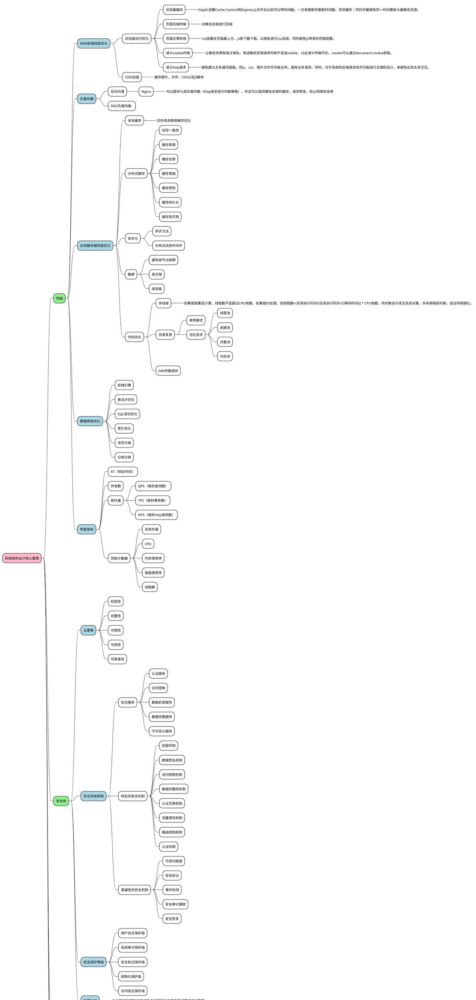

# 系统架构设计核心要素（脑图版）

```plantuml
@startmindmap
<style>
mindmapDiagram {
    node {
        BackgroundColor white
    }
    :depth(0) {
      BackGroundColor #FFBBCC
    }
    :depth(1) {
      BackGroundColor lightGreen
    }
    :depth(2) {
      BackGroundColor lightBlue
    }
}
</style>

* 系统架构设计核心要素

** 性能

*** WEB前端性能优化

**** 浏览器访问优化
***** 浏览器缓存
******_ http头设置Cache-Control和Expires.js文件名比如可以带时间戳。一旦有更新则更新时间戳，否则缓存；同时尽量避免同一时间更新大量静态资源。
***** 页面压缩传输
******_ 对静态资源进行压缩
***** 页面合理布局
******_ css放置在页面最上方，js放下最下面。以提前进行css渲染。同时避免js带来的页面阻塞。
***** 减少cookie传输
******_ 让静态资源有独立域名，发送静态资源请求时候不发送cookie，以此减少传输代价。cookie可以通过document.cookie获取。
***** 减少http请求
******_ 避免建立太多通讯链路。将js、css、图片文件尽可能合并。避免太多请求。同时，对于系统的后端请求也尽可能进行合理的设计，来避免出现太多交互。
      
**** CDN加速
*****_ 缓存图片、文件、CSS以及JS脚本
    
*** 负载均衡
**** 反向代理
***** Nginx
******_ 可以提供七层负载均衡（http请求进行均衡策略），并且可以提供静态资源的缓存，请求转发，防止网络攻击等
**** DNS负载均衡  
    
*** 应用服务器性能优化
**** 本地缓存
*****_ 优先考虑使用缓存优化
**** 分布式缓存
***** 双写一致性
***** 缓存穿透
***** 缓存击穿
***** 缓存雪崩
***** 缓存预热
***** 缓存持久化
***** 缓存高可用

**** 异步化
***** 异步方法
***** 分布式消息中间件

**** 集群
***** 避免单节点故障
***** 高可用
***** 高性能

**** 代码优化
***** 多线程
******_ 如果是密集型计算，线程数不宜超过CPU核数。如果是IO处理，则线程数=[任务执行时间/(任务执行时间-IO等待时间)] * CPU核数。将对象设计成无状态对象，多采用局部对象，适当将锁细化。

***** 资源复用
****** 单例模式
****** 池化技术
******* 线程池
******* 连接池
******* 对象池
******* 内存池

***** JVM参数调优

*** 数据库层优化
**** 存储引擎
**** 表设计优化
**** SQL语句优化
**** 索引优化
**** 读写分离
**** 分库分表

*** 性能指标
**** RT（响应时间）
**** 并发数
**** 吞吐量
***** QPS（每秒查询数）
***** TPS（每秒事务数）
***** HPS（每秒http请求数）

**** 性能计数器
***** 系统负载
***** CPU
***** 内存使用率
***** 磁盘使用率
***** 线程数

** 安全性
*** 五要素
**** 机密性
**** 完整性
**** 可用性
**** 可控性
**** 可审查性

*** 安全系统架构
**** 安全服务
***** 认证服务
***** 访问控制
***** 数据机密服务
***** 数据完整服务
***** 不可否认服务

**** 特定的安全机制
***** 加密机制
***** 数据签名机制
***** 访问控制机制
***** 数据完整性机制
***** 认证交换机制
***** 流量填充机制
***** 路由控制机制
***** 公证机制

**** 普遍性的安全机制
***** 可信功能度
***** 安全标记
***** 事件检测
***** 安全审计跟踪
***** 安全恢复

*** 安全保护等级
**** 用户自主保护级
**** 系统审计保护级
**** 安全标记保护级
**** 结构化保护级
**** 访问验证保护级

*** 衡量标准
****_ 针对现存和潜在的各种攻击和窃密手段是否有可靠的应对策略

** 可用性
*** 冗余
*** 集群
*** 分布式

** 伸缩性
*** 横向分离
****_ 将不同的业务模块分离部署，实现系统的伸缩性
*** 纵向分离
****_ 将业务处理流程上得不同部分分离部署，实现系统的伸缩性


** 拓展性
***_ 指对现有系统影响最小的情况下，系统功能可持续扩展或提升的能力
*** 事件驱动架构
****_ 消息队列实现，通过这种方式将消息生产和处理逻辑分隔开
*** 分布式服务
****_ 将业务和可复用服务分离开来，通过分布式服务框架调用

@endmindmap
```

